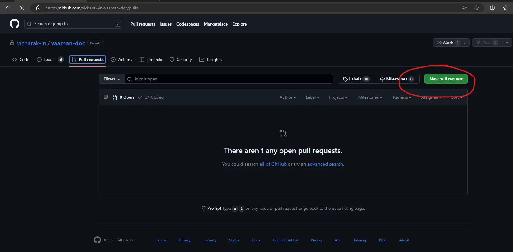
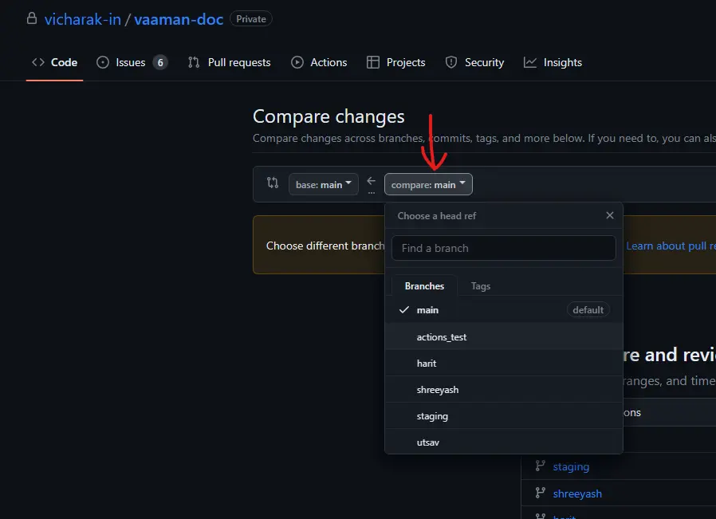
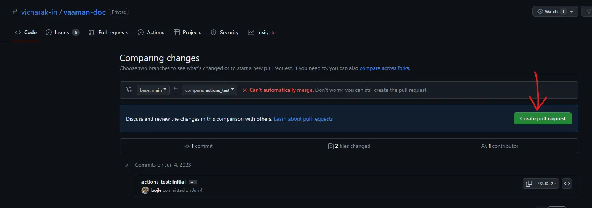
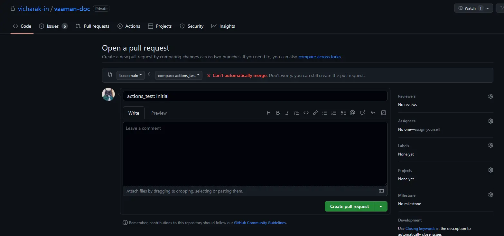

# How to edit or modify vaaman-doc

Taking in consideration that there exists a maintainer of each major section
of this documentation repository.

For example a person dedicated for `linux kernel` should not commit changes for the section that is not `linux kernel`.
If the changes are important then instead create a **patch** for the changes and send that patch over to the designated maintainer to pick and merge on his/her branch.

This will allow this repository to be conflicts free and thus easier to maintain.

## Cloning the repository

Clone the fresh copy of this repository.
```
git clone https://github.com/vicharak-in/vaaman-doc -b main
cd vaaman-doc
```

If there already exists a local clone then do this instead
```
cd <path/to/vaaman-doc>
git fetch origin main
git checkout FETCH_HEAD
```

---

## Modifying and updating the source

Create or edit `.rst` files in **source/** directory as per your requirements and changes.

**Learn about rst** [**here**](https://www.sphinx-doc.org/en/master/usage/restructuredtext/basics.html#restructuredtext-primer).

**Always make sure to compile the source before committing**

Create the virtual environment and build the source with your changes.
Make sure you have followed the INSTALLATION guide for python environment setup.

**For Linux users**
```bash
pipenv update
pipenv shell make html -j $(nproc --all)
```

**For Windows users**
```bash
python -m pipenv update
python -m pipenv shell ./make.bat html
```

---

## View the updated documentation

### View the compiled source on your local computer using

**For Linux users**
```bash
${BROWSER} _build/html/index.html
```

> :warning: **Replace ${BROWSER} with your browser name.**\
> Example: `firefox _build/html/index.html`

**For Windows users**

1. Open the repository in file explorer.
2. Enter the `_build/html` folder
3. Open the `index.html` file in any web browser.

**If the changes are satisfied then, commit your local changes.**

```bash
git add source/
git commit
```

**While committing make sure to write a well described commit message and commit title.**

Some examples on how to write good commit messages:
- vaaman-doc: Introduce documentation for fgpa write.
- README: Add usage documentation for windows users.
- vaaman-doc: linux: Document different vaaman kernel revisions.

**To check the list of modified files:**
```bash
git status
```

---

## Use spellchecker to find mistakes in your changes

Read the [Spellchecker Guide](./SPELLING.md)

---

## Pushing the modifications to GitHub

If your branch doesn't exists then the first step will be to create your new dedicated branch.

To create a new branch use following command.
```bash
git checkout -b <your_name>
```
Example: `git checkout -b utsav`

Confirm the branch using `git branch -a`.

**If your branch already exists then directly push your changes over to your branch.**

```bash
git push -u origin <your_branch>
```
Example: `git push origin utsav`

---

## Creating pull request for your modifications

Pull requests are required in order to review the modifications that the developers are doing.
Reviewing can include typo/spelling errors, indentation errors, compilation errors, etc.

### Creating pull request using web browser

#### Go to [vaaman-doc GitHub](https://github.com/vicharak-in/vaaman-doc)


#### Click on pull request



#### Select your branch over the base branch (`main`)



#### Create pull request



#### Fill up the details on pull request

Describe the pull request on this page. You should properly title your pull request and write details about this pull request.

Select a Reviewer from the right window
> :warning: Select the person who is suitable for reviewing your documentation\
> Hardware documentation should be reviewed by the hardware head. Similarly software lead should review software related pull request.

On the development tab in the right window, you must select the `issue id` that your pull request closes or fixes.\
This step is very important and must be followed to close the `issue` automatically upon merge.



---

### Creating pull request using GitHub CLI (`gh` tool)

Make sure you have pushed the commits to your branch and also check if your current branch is updated with your latest changes.

```bash
gh pr create -R https://github.com/vicharak-in/vaaman-doc
```

Complete the instructions and pull request should be created on GitHub.