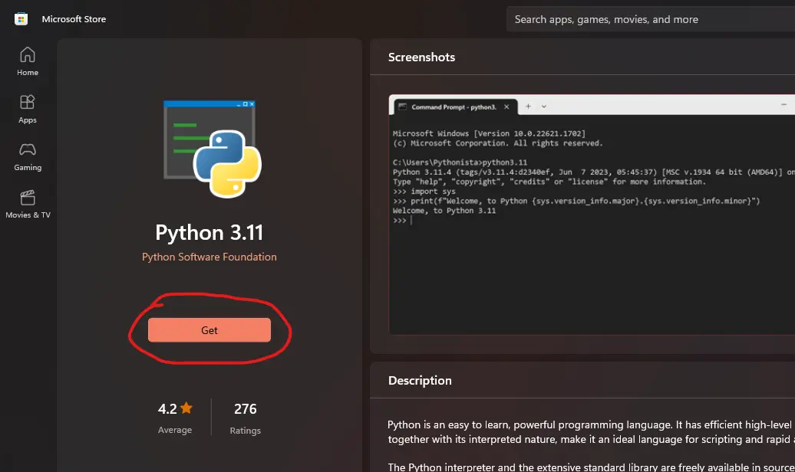
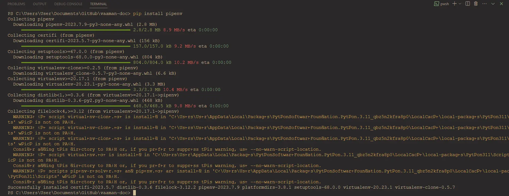
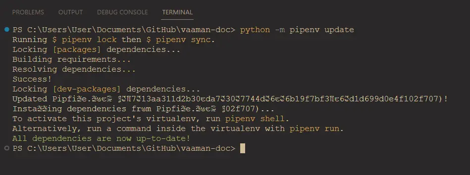
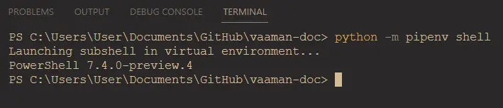

# Windows Installation Guide

## Prerequisites

### Install Python from Microsoft Store

To install python on Windows you can:

1. Write `python` in a windows terminal. This will automatically open python in Microsoft Store.
2. You can directly open Microsoft Store and search python.
3. Install the latest python that you can find.



### Install pipenv using pip

For installing `pipenv` on your system use the following command.

```bash
pip install pipenv
```



### Install the dependencies inside python virtual environment

> :warning: You can also directly use ./make.bat to setup virtualenv on your windows terminal. \
> Skip the following steps below if you are using ./make.bat to setup virtualenv

Use following command to setup python virtual environment for building docs.

```bash
python -m pipenv update
```



### Enter the python virtual environment

Use following command to enter python virtual environment.

```bash
python -m pipenv shell
```



---

After successfully following the setup you have proper environment setup to build vicharak-docs.

Follow the [Editing Guide](./EDITING.md) for more information.
