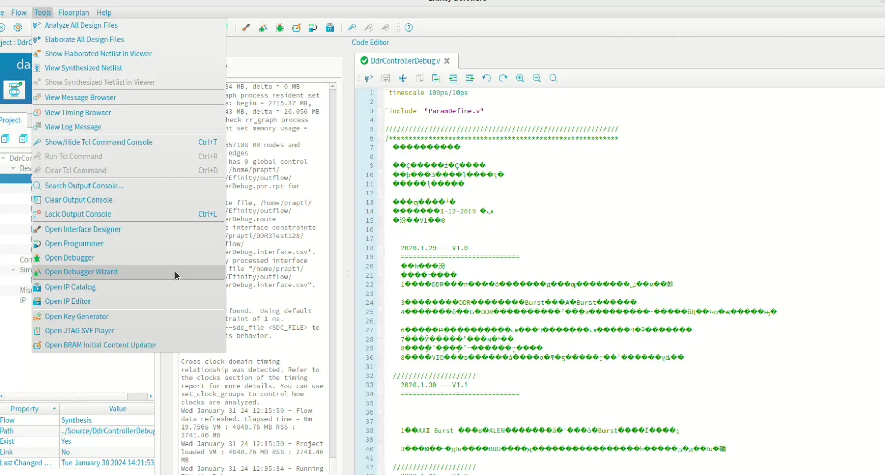
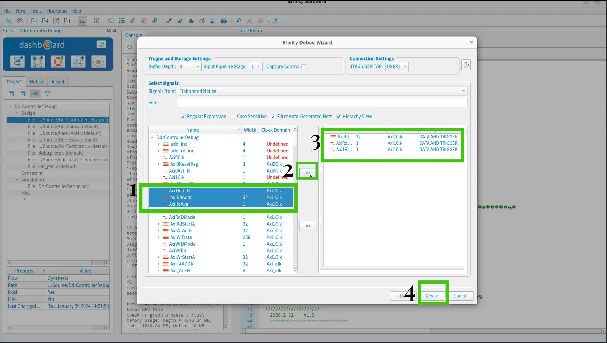
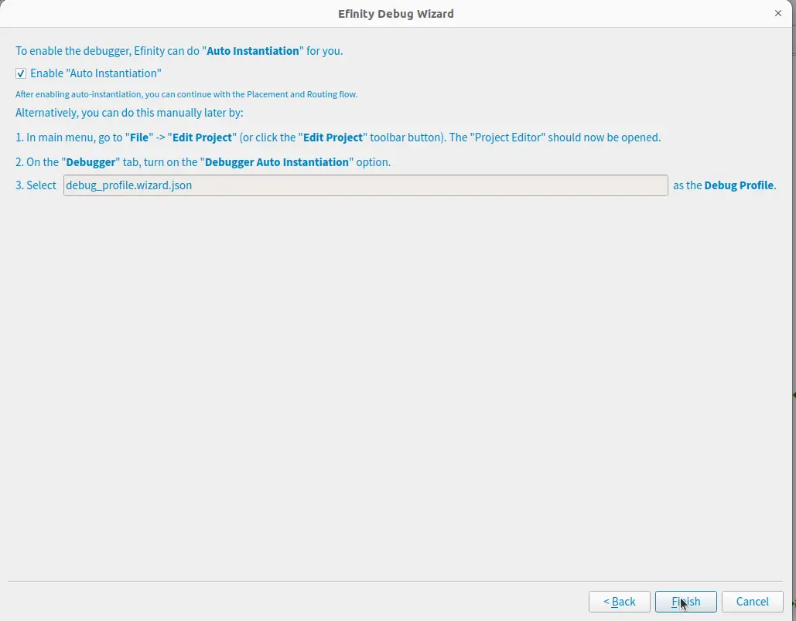
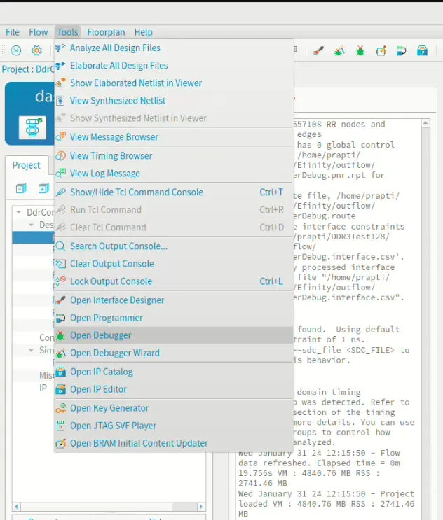
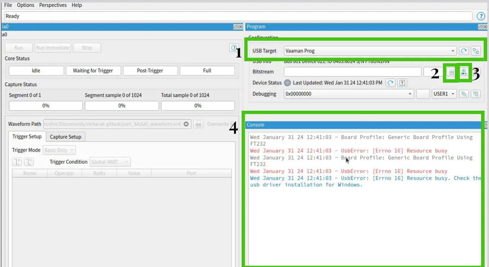

===================
How to use Debugger 
===================

The Efinity software features a hardware Debugger, facilitating signal probing in FPGA designs through the JTAG interface.
The Debugger encompasses two debug cores:

- Configure Virtual I/O (vio) cores using a manual flow and the Profile Editor.
- Configure Logic Analyzer (la) cores either through a manual flow or the automated flow of the Debug Wizard.

The subsequent sections provide detailed guidance on both the automated and manual flows.

***********************************************
**Automated debugger** 
***********************************************
Create a Debug Profile:

1. Open the project.
2. Synthesize the design.
3. Launch the Debug Wizard by clicking its icon in the main icon bar.

4. Choose "Elaborated Netlist" or "Post-Map" in the Signals from list.
5. Select led and counter buses from the left list and move them to the right using the >> button.

6. Keep the Probe Type as default, DATA AND TRIGGER.
7. Proceed to the next step. The wizard generates a debug profile.
8. Ensure "Auto Instantiation" is enabled to integrate the debug profile into your project. Click Finish.

9. The software prompts for recompilation. Click OK.
10. Perform a full compile.

==============================
Programming  FPGA for debugger 
==============================

1. Launch the Debugger by choosing Tools > Open Debugger. 

2. Ensure the Board is recognized as the USB Target. If not, connect the board and click Refresh USB Targets.
3. Click the Select Image File button.
4. Navigate to the outflow directory and choose bitstream file.
5. Click Start Programming. The console will display programming messages.

====================================
Observing Probed Signals in Debugger
====================================

1. Initiate Debugger connection.
2. In Trigger Setup tab, add desired nets.
3. Specify trigger conditions (e.g., value).
4. Start Debugger to capture data upon trigger.
5. Upon completion, GTKWave opens automatically to display waveform.
6. Disconnect Debugger to halt operation.

*******************************************
**Manual Debugger**
*******************************************

*****************************
Create Debugger Profile: 
*****************************

To configure Virtual I/O and Logic Analyzer debug cores in a profile:

1. Open the project.
2. Launch the Debugger via Tools > Open Debugger. Since no debug profile exists, the Profile Editor perspective opens.
3. Add a Virtual I/O core (VIO) using Add Debug Core > Virtual I/O. Configure Probes(input) and source(output) signals as specified (i.e name and width).
4. Add a Logic Analyzer core (LA) via Add Debug Core > Logic Analyzer. Configure probes to capture signals matching VIO settings. the vio0 tab to view captured data in the Value fields.
5. Generate Debug RTL to create necessary debug files.
6. Open debug_top.v and rename "edb_top" as "edb_top_manual."
7. Close the debugger.

**********************************
Add Debug core in your project:  
**********************************

To integrate debug code into your project and compile it:

1. Open the Efinity main window and go to the Project tab.
2. In the Interface Designer, add the JTAG User Tap block, configure it, and generate SDC constraints.
3. Close the Interface Designer.
4. Modify design file by uncommenting specific lines to enable debug code and instantiate debug_top module.
5. Save your changes.
6. Compile the design.

**********************************
Programm the FPGA:  
**********************************

To program the FPGA:

1. Open Debugger by choosing Tools > Open Debugger.
2. Confirm the Trion T20 Development Board is recognized as the USB Target; refresh if necessary.
3. Select the FPGA configuration file (bitstream) from the outflow directory using the Select Image File button.
4. Initiate programming by clicking Start Programming, and monitor programming messages in the console.

**********************************
Run the Debugger:  
**********************************

Observing Probed Signals in Debugger:

1. Connect Debugger and navigate to the la0 tab for trigger setup.
2. Add the desire trigger condition.
3. If want the change the vio0 values and Run the debugger.
4. Then its wait for thrigger, after applying trigger open the GTKWave for checking the debug signal.
5. Disconnect Debugger to stop capturing data.
