.. _vaaman fpga:  ../vaaman-fpga.html

Starting with efinity IDE
=========================

**To run your code on  the FPGA, follow these steps:**

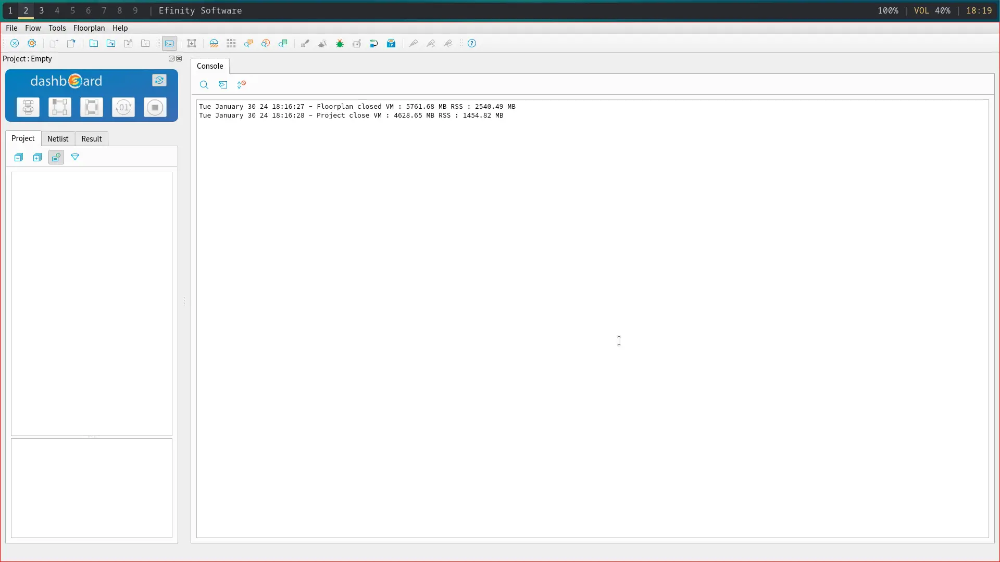

.. image:: ../ _static/images/Create_Project.webp 
   :width: 100%

After starting the IDE click on files and create a project. Write your project name 
and select trion family  and fpga T120F324. Timing model C4 would be automatically selected.

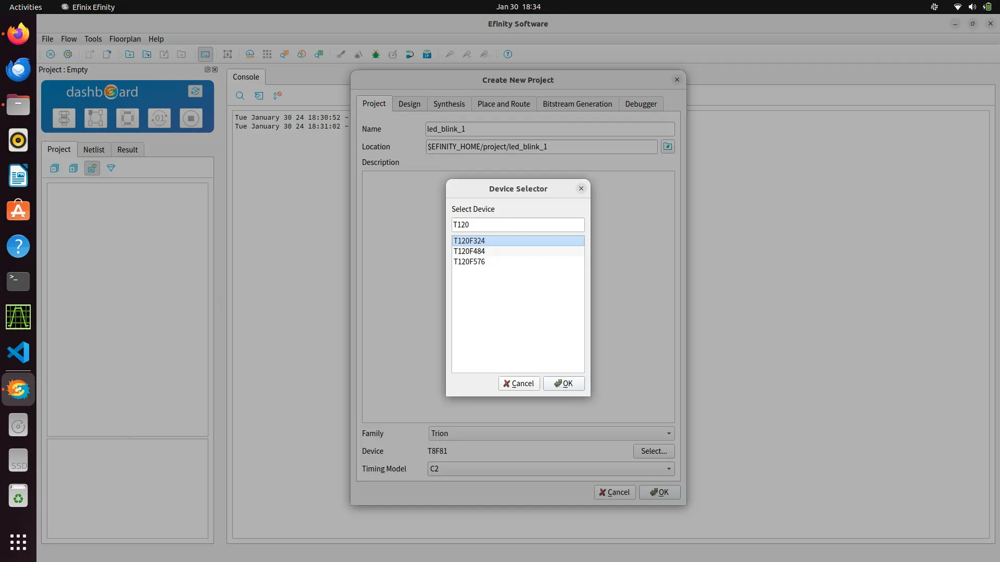

In the design tab you can select the your HDL, verilog ,systemverilog and VHDL are supported. Default is verilog.
You can also add your rtl code while the creation of project and specify the top module.

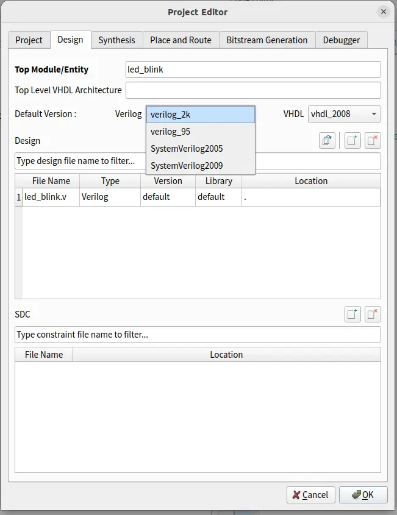

In Dashboard , you can add/create your verilog files by right-clicking on design tab under your project.

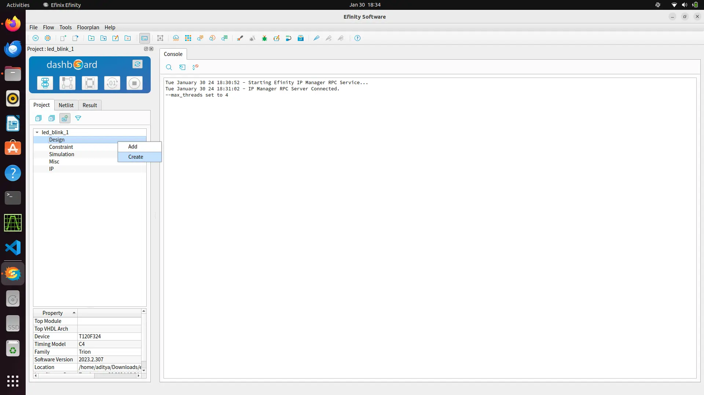

.. image:: ../_static/images/verilog_creation.webp
   :width: 100%

Default gedit editor will pop-up on right side on which you can write your code. Save the code.
`led blinking demo code <https://github.com/vicharak-in/LED_BLINKING_DEMO.git>`_. 

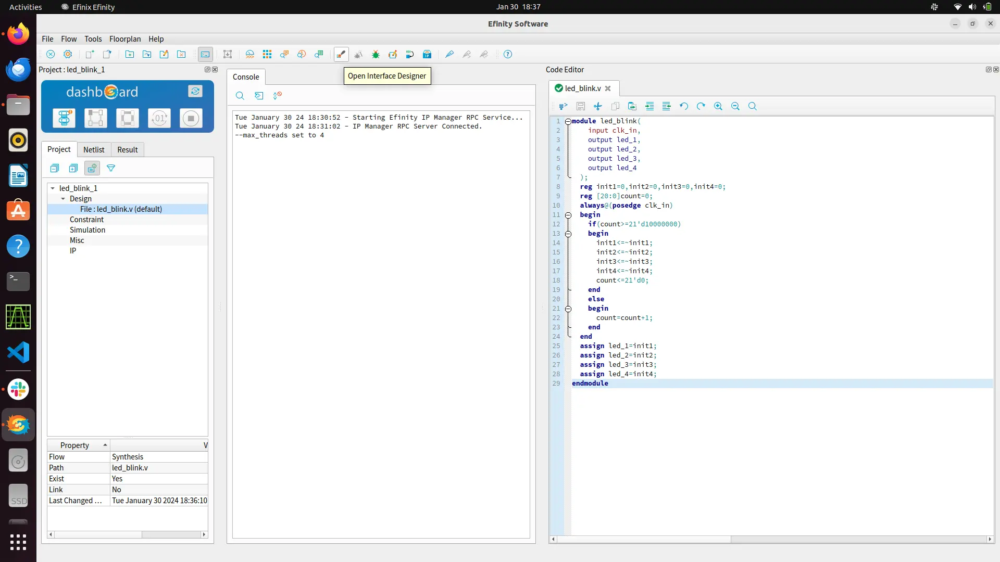

Now you need to  open inferace designer to map your signals to the fpga boards GPIO.

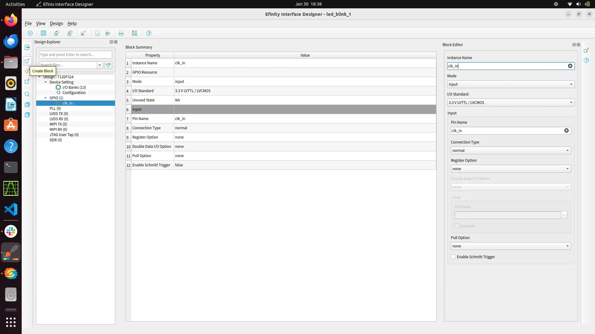

Create a gpio block and configure  your  pins as input/output  mode as per your design

**Setting PLL**

The FPGA have crystall oscillators  which can give frequency upto 74.5Mhz. You can use this crystall oscillators as source
clock and generate the desired frequency via PLL.

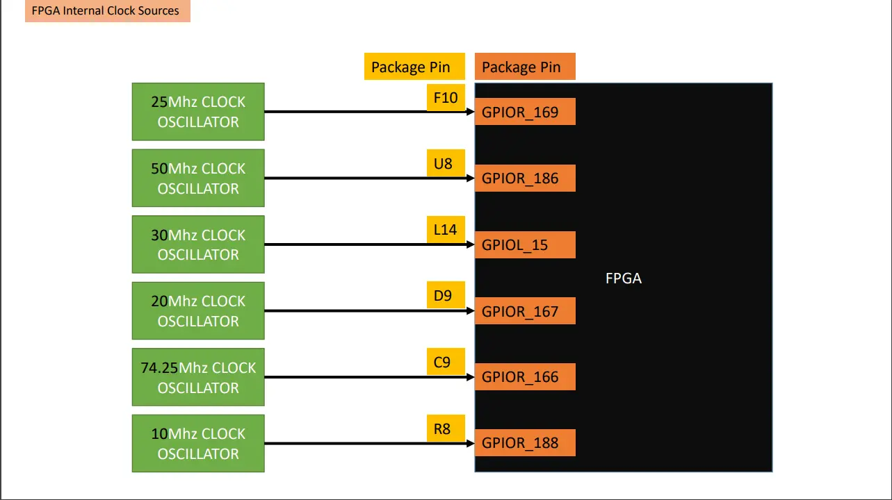

While creating the gpio block for source clock you need to change its connectio type from normal to PLL_CLK_IN. and give this pin any crystall oscillator
in resouce assigner.

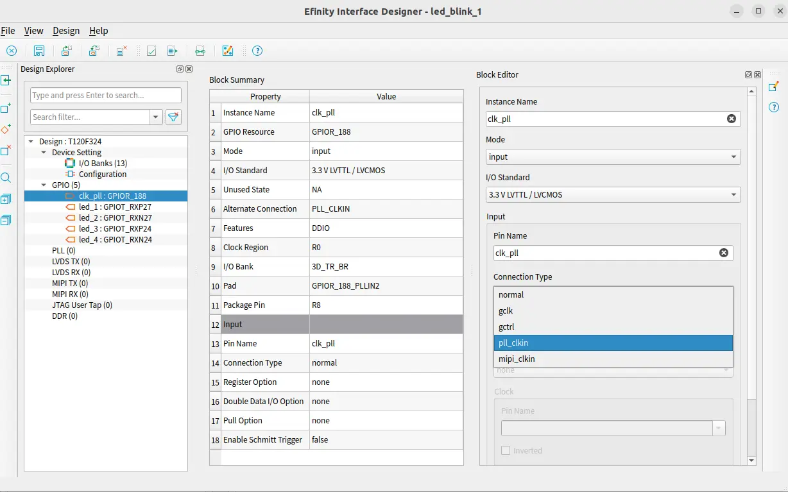

For PLL  you need to create a PLL block as done for gpio. Select the source clk. The selected source clk instance name would
be shown below once selected.

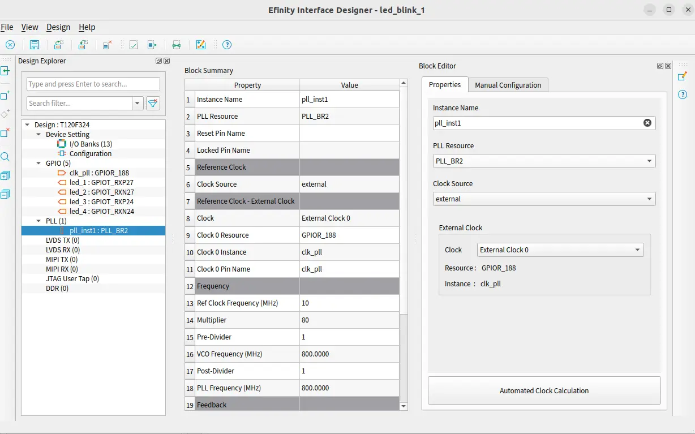

Here both automated calculation and manual calculation options are available for setting the  PLL. You can choose any of these
as per your convenience. Here you have to mention your actual clock input which will be fed in the design.

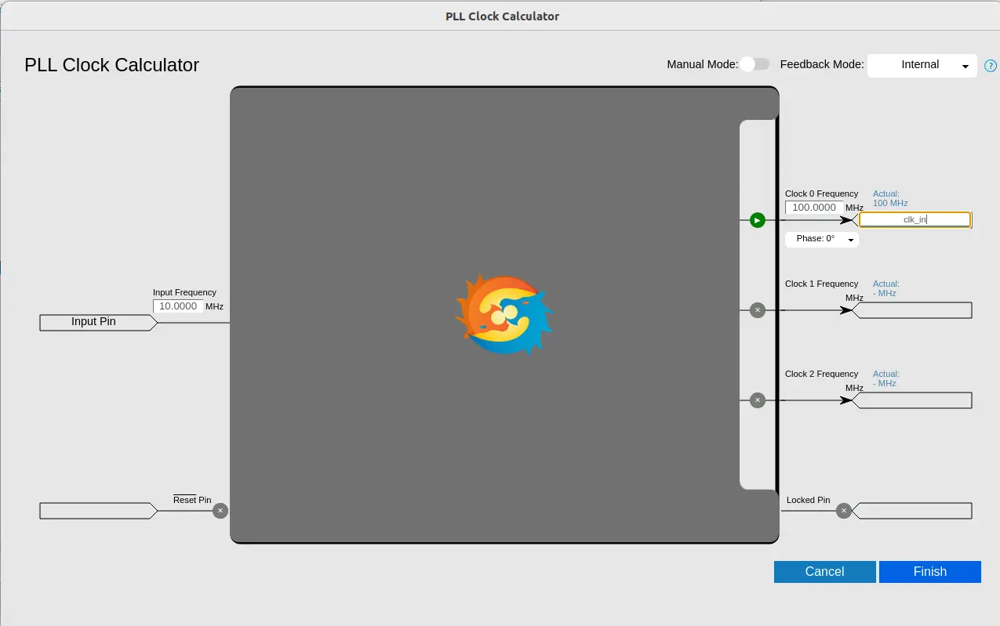

Navigate to the resource assigner to map the pins on board. You can refer to `datasheet <../_static/files/Vaaman0.3_Pinout_Guide_Rev0.3.pdf>`_. for mapping. By entering the 
package pin the rest of the colums would be to auto-fill

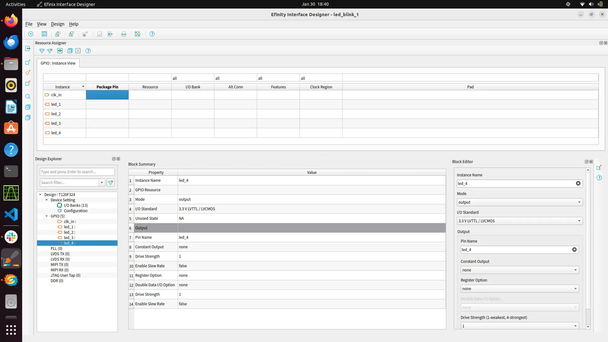

Now check for design issue. It throws error if there's any error in mapping the pins. Now save the interface design.

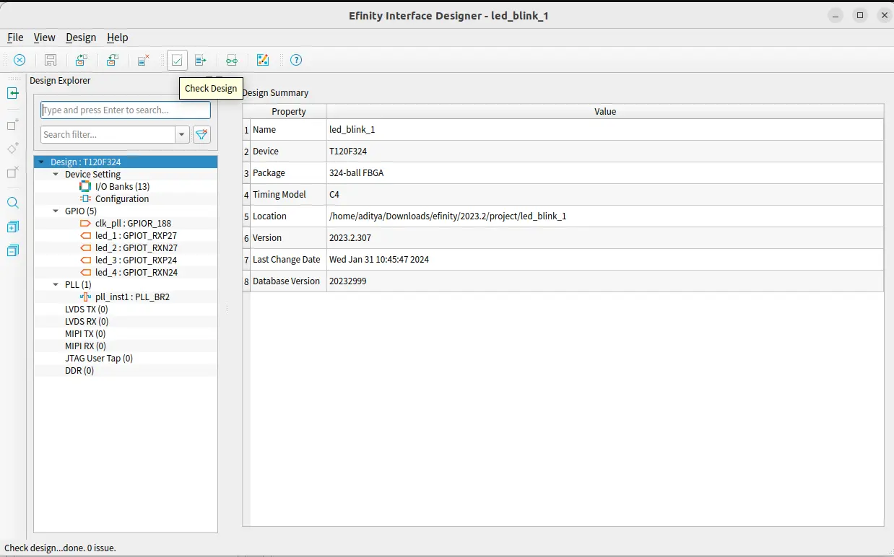

You can also give constrains for your design by creating a constrain file with .sdc extension.

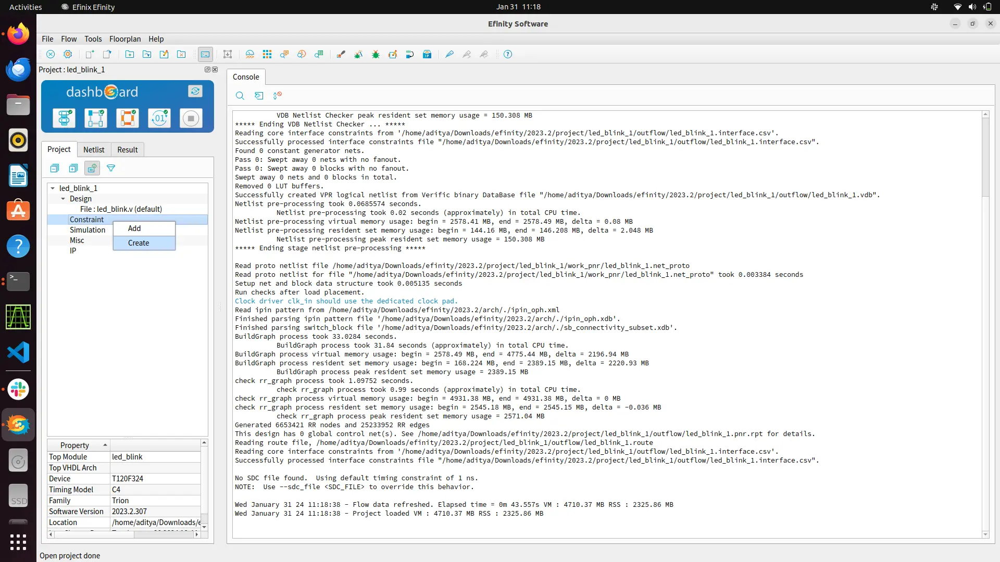

Here you can mention your virtual clock or mention the input/output delay. According to the constrain the software will
perform the placement and routing to meet the desired perfomance.
   
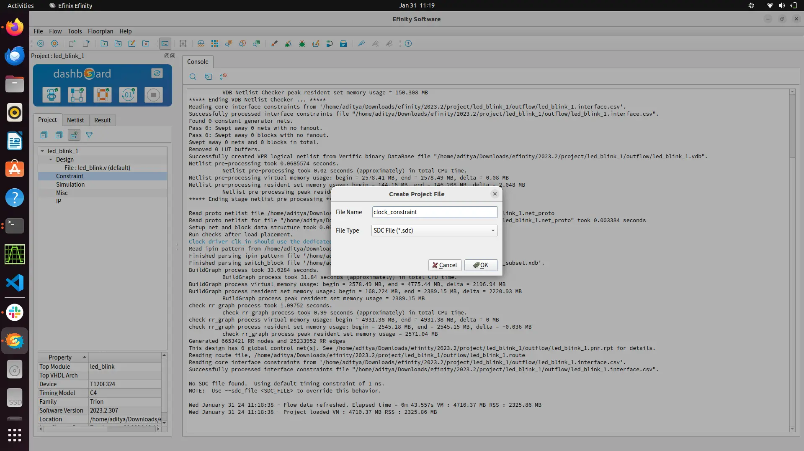

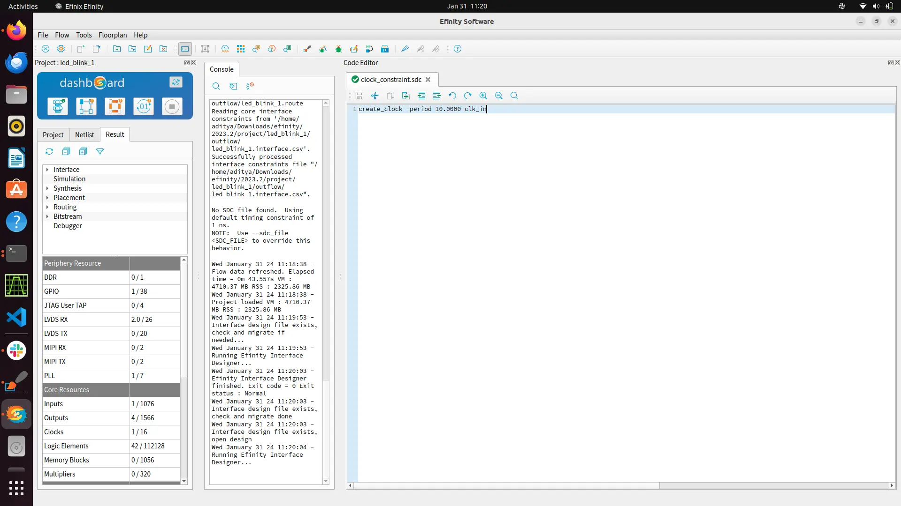

Now just press synthesis option to run your entire flow. By default it will run the entire flow of synthesis, placement ,routing and bitsream generation.
You can toggle it off for running one flow at time. After running the entire flow in project directory and outflow/ directory will
generated containing all the generated files at each step.

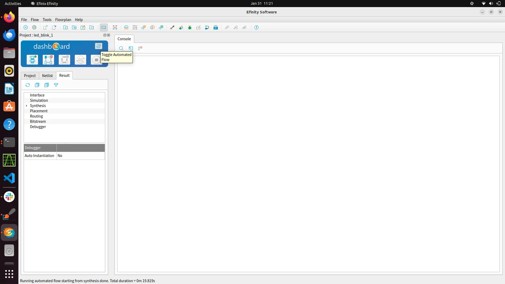

Now follow the steps  on `vaaman fpga`_  to dump your  generated bitstream on FPGA.
