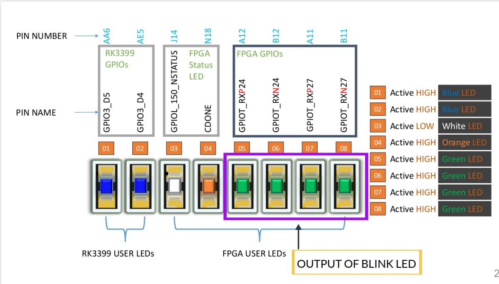
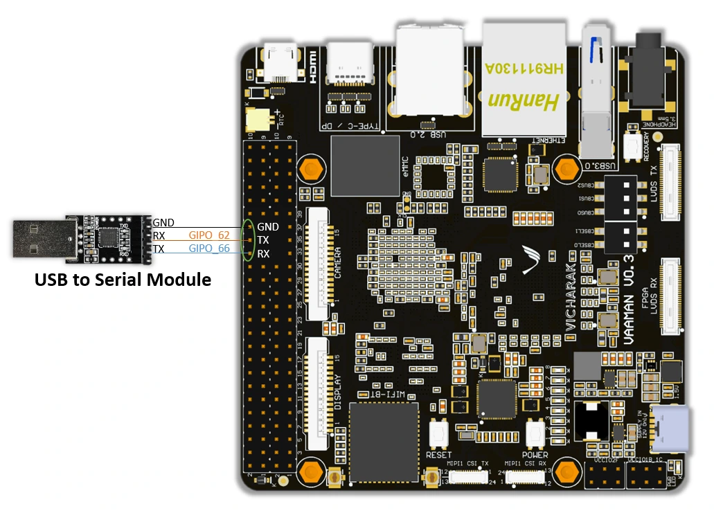

Examples
########

There are two sample programs to get started with:

1. LED blinking.
2. Using the UART to pass data.

Steps For Testing And Cloning The Project
=========================================

1. Clone the project

For the LED blinking project:

.. code::

  git clone https://github.com/vicharak-in/LED_BLINKING_DEMO

For the UART demo project:

.. code::

  git clone https://github.com/vicharak-in/UART_RX_TX_DEMO

2. Before you open the .xml file in the Efinix tool, make sure to follow
   detailed instructions for setting up Efinity and creating a project. 

For comprehensive guidance on setting up Efinity and initiating a project,
please consult the Vaaman FPGA Installation Guide:
:ref:`vaaman_fpga_install`.

3. Open the .xml file of the project and follow the steps of interface design to
   set the desired PLL clock.

.. note::

   You do not need to configure GPIO pins in both projects. A .peri.xml file in
   the repository already includes the project's input and output pins.

4. Make sure to establish the correct wiring connections on the Vaaman board as
   depicted in the image below. To do so, refer to the `Download Pinouts
   <../../_static/files/Vaaman0.3_Pinout_Guide_Rev0.3.pdf>`_.

 In the led blinking, GPIOR_188 for clock, 4 user leds are used for checking
 output, that is, GPIOT_RXN27, GPIOT_RXP27, GPIOT_RXP24, and GPIOT_RXN24.

 
 In the UART test, GPIOR_188 sets the clock to 100 MHz and connects the UART RX
 to the Tx on the Vaaman board, which is GPIOL_62, as well as the UART Tx to the
 Rx on the Vaaman board, which is GPIOL_66.
 

5. Synthesize the design, follow the Efinity programmer steps for loading the
   bitstream, and run the project on the Vaaman board.

6. After programming the Vaaman board with the bitstream, the LED BLINK
   project's output is immediately displayed through blinking the board's user
   LEDs. For UART output, launch GTKTERM, which is the serial communication
   tool, to view the data being transmitted and reflected in the serial
   terminal.
