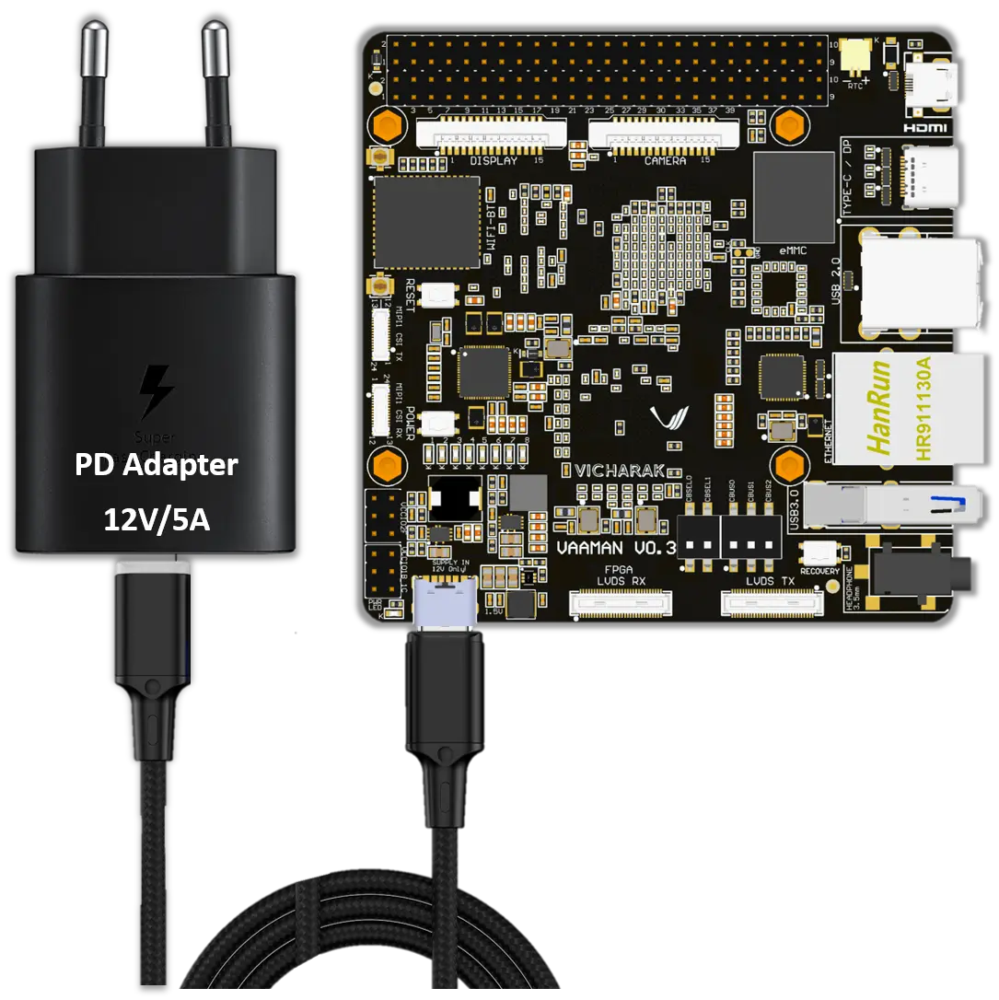
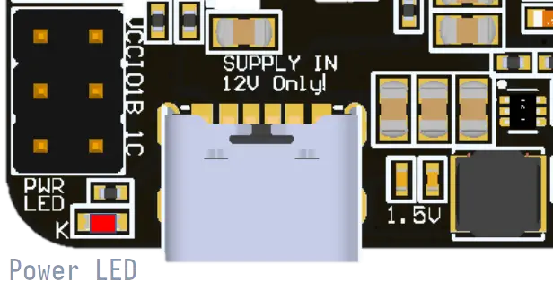
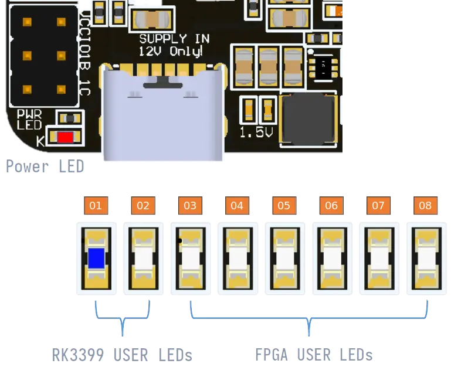
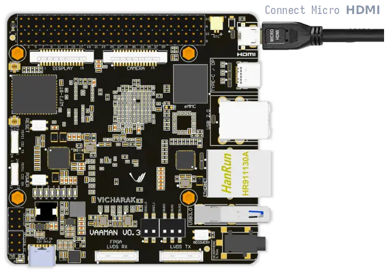

.. _getting-started:

Getting Started
###############

For Vaaman SBC, Vicharak has provided all the necessary accessories and
information to get started with the board. This section will guide you through
the initial setup process and provide you with the necessary information to get
started with Vaaman SBC.

What's in the box?
==================

**1. Vaaman SBC**
    The Vaaman SBC is a single-board computer with on-board FPGA support.
    It is powered by the Rockchip RK3399 SoC, which features a dual-core
    Cortex-A72 processor and a quad-core Cortex-A53 processor. The board also
    features a 4GB LPDDR4 RAM, 16GB eMMC storage, and a 40-pin GPIO header.
    The board is pre-installed with Debian 11 (``Bullseye``) on its eMMC storage.

**2. 12V/5A Power Adapter with PD cable**
    The 12V/5A Power Adapter with PD cable is used to power the Vaaman SBC.
    The power adapter has a USB-C connector, which is connected to the
    Vaaman SBC using the PD cable.

**3. Pre-installed eMMC**
    The Vaaman SBC comes with a pre-installed eMMC storage, which is used to
    store the operating system and other files.
    The eMMC storage is pre-installed with Debian 11 (``Bullseye``).

**4. Heat Sink and Fan**
    The Vaaman SBC comes with a heat sink and fan,
    which is used to dissipate the heat generated by the board.
    The heat sink and fan are attached to the board using the screws provided
    in the box.

What else do you need?
======================

**1. Micro HDMI to HDMI cable or adapter**
    A good quality Micro HDMI to HDMI cable is required to connect the Vaaman
    SBC to a monitor. The cable is not included in the box, and you need to
    purchase it separately. This is essential for the initial setup process
    when you need to connect the Vaaman SBC to a monitor.

    `Get cable from here <https://amzn.eu/d/9OHoLZ7>`_

**2. USB Keyboard and Mouse**
    A USB keyboard and mouse are required to interact with the Vaaman SBC.
    We recommend using a wireless keyboard and mouse for easier access.
    This is essential for the initial setup process when you need to interact
    with the Vaaman SBC using the display.

    `Get the combo from here <https://amzn.eu/d/97mZY2c>`_

**3. Monitor with HDMI input**
    A monitor with HDMI input is required to connect the Vaaman SBC.
    The monitor is not included in the box, and you need to purchase it
    separately. This is essential for the initial setup process when you need
    to connect the Vaaman SBC to a monitor.

    `Get 1080p monitor from here <https://amzn.eu/d/doCOT5P>`_

**4. USB-C to USB-A Male cable (optional)**
    A USB-C to USB-A Male cable is required to connect the Vaaman SBC to your
    computer. This is optional and is only required if you want to connect
    the Vaaman SBC to your computer.
    This is essential for the configuration and development process.

    `Buy from here <https://amzn.eu/d/efC0NtA>`_

**5. SD-card (optional)**
    An SD-card is required to flash the Vaaman SBC with the latest image.
    This is optional as we already provide eMMC storage option.

    Get at least a 16GB SD-card. We recommend using a good quality SD-card that
    supports **UHS-I** interface and has a read speed of at least 100MB/s.

    `Get 32GB UHS-I card from here <https://amzn.eu/d/48KqdA5>`_

**6. Internet Connection (optional)**
    An internet connection is required to download the latest image and
    packages. Use a LAN cable or the existing on-board Wi-Fi module to connect
    the Vaaman SBC to the internet.

    This is optional as you can download the image and packages
    from another computer and transfer them to the Vaaman SBC.

**7. USB to TTL Serial Cable (optional)**
    A USB to TTL Serial Cable is required to connect the Vaaman SBC to your
    computer to access the serial console. This is optional and is only
    required if you want to access the serial console for debugging purposes.

    Get Vaaman compatible FTDI from the `Vaaman Store <#>`_

.. note::
    | The items listed above are not included in the box.
    | You can purchase them from the :ref:`accessories` page.

Available Boot Modes
====================

Vaaman SBC is pre-installed with **Debian 11** (``Bullseye``) on its eMMC
storage and supports multiple boot modes, including ``SD-card`` and ``NVMe``.
If users wants to run different operating systems, they need to use the
corresponding firmware to program the board.

``NVMe`` has the highest priority, followed by ``SD-card`` and ``eMMC``.
So, if you have an NVMe drive connected to Vaaman SBC, it will first try to
boot from the ``NVMe drive``.
If there is no ``NVMe drive`` connected, it will boot from the ``SD-card``.
If there is no ``SD-card`` inserted, it will boot from the ``eMMC``.

For this guide, we will be using the pre-installed Debian 11 (``Bullseye``) on
the eMMC storage. So, we will not be covering the ``NVMe`` and ``SD-card`` boot
here.

**If you want to boot from NVMe or SD-card.**

.. admonition:: **You can refer to the**
    :class: tip

    :doc:`sdcard-boot`

    :doc:`nvme-boot`

Getting Started with eMMC
=========================

Turning board on
----------------

Connect the PD cable to the Vaaman SBC and the PD adapter to the power socket.
Once the power is connected, the board will automatically turn on.

.. danger::
    12V Power Input only! Do not use 5V power input.



Verify the power LED
--------------------

Vaaman is pre-installed with Debian 11 (``Bullseye``) on its eMMC storage.
So, when you power on the board, it will boot from the eMMC storage by default.

.. warning::
   Remove SD-card if inserted

When the power cable is connected, the **Red LED** will be activated,
and you can observe its illumination in the image displayed below.



Verify the status LED
---------------------

Once the booting process is finished, you will notice the activation of the
**blue LED**, indicated by a blinking pattern,
as demonstrated in the image provided below.



How to access your Vaaman board ?
=================================

There are multiple ways to access your Vaaman SBC. You can connect the Vaaman
SBC to a monitor using the **micro HDMI port**, or you can connect it to your
computer headless using **SSH** or **serial console**.

For the initial setup process, we recommend connecting the Vaaman SBC to a
monitor using the **micro HDMI port**. Once the initial setup is complete, you can
connect the Vaaman SBC to your computer using the USB-C port.

.. note::
    If you want to access the **serial console**,
    Skip to the :ref:`Serial Console <serial-console>` section.

    or

    If you want to access the **Vaaman SBC using SSH**,
    Skip to the :ref:`SSH <ssh>` section.

1 - Using Micro HDMI port
-------------------------

Vaaman SBC is equipped with a **micro HDMI port**, which allows for easy
connection to a display. By using a micro HDMI to HDMI cable or adapter, users
can connect Vaaman to a monitor or TV with an HDMI input.

This enables direct visual access to the graphical user interface (GUI) or
command-line interface (CLI) on the connected display.



.. caution::
   | Only single Video port is available on Vaaman board.
   | Which means you can either use HDMI or DisplayPort or MIPI-DSI port at a
     time.

   eDP port is already used internally for the MIPI to eDP bridge.

Connect the Micro HDMI to HDMI cable to the Vaaman SBC and the monitor.
Once the cable is connected, the Vaaman SBC will automatically detect the
monitor and display the output.

.. admonition:: Check out Linux Start Guide
   :class: tip

   Once the Vaaman SBC is connected to the monitor, you can follow the
   :ref:`Linux Start Guide <linux-start-guide>` to complete the initial setup.

.. _serial-console:

2 - Using Serial Console
------------------------

Vaaman also provides a serial interface, typically in the form of UART
(Universal Asynchronous Receiver-Transmitter) pins.

Users can access the system's console or terminal interface by connecting to
these serial pins using a serial cable or adapter. This method is often used
for debugging, troubleshooting, or accessing the system when other interfaces
are not available.

Preparation
```````````

To access Vaaman SBC through the serial interface, you will need the following:

- A computer with a serial terminal application installed
  (such as PuTTY or minicom).
- A USB to TTL serial cable or adapter (such as FTDI or PL2303).
- Micro USB or USB-C cable.
- A 4-pin jumper wire

Hardware Setup
``````````````

1. Connect the USB to TTL serial cable or adapter to your computer.

2. Connect the serial cable or adapter to the Vaaman SBC.

.. list-table::
   :widths: 20 40 130
   :header-rows: 1
   :class: feature-table

   * - **Serial FTDI Pin**
     - **Header GPIO Pin**
     - **Schematic Name**
   * - GND
     - Pin 6
     - GND
   * - TX
     - Pin 8 (GPIO4_C4)
     - UART2DBG_TX
   * - RX
     - Pin 10 (GPIO4_C3)
     - UART2DBG_RX

.. image:: _static/images/vaaman-serial-uart-pins.webp
   :width: 50%

.. note::
    When accessing Vaaman SBC through the serial interface, it is important to
    configure the serial parameters correctly. For RK3399-based systems,
    the following parameters are typically used:

    Baud rate: `1500000`

    Data bit: `8`

    Stop bit: `1`

    Parity check: `none`

    Flow control: `none`

Running the Serial Console Program
``````````````````````````````````

.. tab-set::

    .. tab-item:: PuTTY (GUI)

        1. Download and install the `PuTTY <https://www.putty.org/>`_ program.

        2. Open the PuTTY program and configure the serial parameters as shown
            in the image below.

        .. image:: _static/images/Putty_step.webp
           :width: 50%

        3. Click on the **Open** button to open the serial console.

        4. You will now be able to access the serial console.

    .. tab-item:: TeraTerm (GUI)

        1. Download and install the
            `TeraTerm <https://ttssh2.osdn.jp/index.html.en>`_ program.

        2. Open the TeraTerm program and configure the serial parameters.

        - On the **Setup** menu, click on **Serial port**.
        - Select the serial port number and configure the serial parameters
          as shown in the image below.

        .. image:: _static/images/teraterm-configuration.webp
           :width: 50%

        3. Click on the **OK** button to open the serial console.

        4. You will now be able to access the serial console.

    .. tab-item:: Linux GTK-Term (GUI)

        1. Install the GTK-Term program using the following command:

        .. code-block:: bash

            sudo apt-get install gtkterm

        2. Open the GTK-Term program and configure the serial parameters.

        - On the **File** menu, click on **Port**.
        - Select the serial port number and configure the serial parameters as
          shown in the image below.

        .. image:: _static/images/gtkterm-configuration.webp
           :width: 50%

        3. Click on the **OK** button to open the serial console.

        4. You will now be able to access the serial console.

    .. tab-item:: Minicom (CLI)

        .. note::
            Read minicom configuration from
            :ref:`Linux Minicom guide <minicom-guide>`.

.. _ssh:

3 - Using SSH
-------------

Vaaman supports **SSH (Secure Shell)**, which allows for secure remote access
to the system. By establishing an SSH connection, users can remotely connect to
Vaaman from another device, such as a computer or smartphone, over a network.
This method provides a secure command-line interface to administer, configure,
and execute commands on the Vaaman SBC.

Install OpenSSH server
``````````````````````

You can install both OpenSSH components on Windows devices using the
**Windows Settings**.

To install the OpenSSH components, follow these steps:

1. Open the Settings menu and click on Apps, then select **Optional Features**.
2. Look through the list to check if OpenSSH is already installed.
   If it's not, at the top of the page, click on **Add a feature** and then:

    - Find OpenSSH Client and click on Install.
    - Find OpenSSH Server and click on Install.
3. After the installation process is complete, go back to
   **Apps and Optional Features** to verify that **OpenSSH** is listed.
4. Open the Services desktop app. (``Click on Start, type services.msc in the
   search box, and then click on the Service app or press ENTER.``)
5. In the details pane, double-click on **OpenSSH SSH Server**.
6. On the General tab, choose **Automatic** from the Startup type drop-down
   menu.
7. To start the service, click on **Start**.


Verify OpenSSH server
`````````````````````

Once installed, you can connect to **OpenSSH Server** from a Windows device
with the **OpenSSH client** installed.

From a PowerShell prompt, run the following command.

.. code-block:: powershell

    ssh username@ip_address

Example:

.. code-block:: powershell

    ssh vicharak@192.168.29.69

Set up automatic Wi-Fi connection on boot
`````````````````````````````````````````

In the following example, we will set up automatic Wi-Fi connection on boot
for the **wlan0** interface. This will be useful if you are using a
headless system. That means you will not need to connect a monitor, keyboard,
or mouse to your system to connect to WiFi.

**1. Edit the** ``/userdata/before.txt`` **file and add the following lines:**

::

    connect-wi-fi <network name> <password>

Example:

::

    connect-wi-fi my-wifi-network my-wifi-password

**2. Reboot the system.**


Accessing Vaaman SBC through SSH
````````````````````````````````

To access Vaaman SBC through SSH, you can use either of the following commands:

|

1. SSH using the IP address

::

    ssh username@ip_address

.. tip::
    Replace **"username"** with the appropriate username for Vaaman and
    **"ip_address"** with the actual IP address assigned to Vaaman on the
    network.

2. SSH using the PC name (hostname)

::

    ssh username@pc-name.local

.. tip::
    Replace **"username"** with the appropriate username for Vaaman and
    **"pc-name"** with the actual PC name assigned to Vaaman on the network.

Vaaman Boot modes
=================

.. list-table::
   :widths: 20 40
   :header-rows: 1

   * - **Boot Mode**
     - **Description**
   * - Normal Mode
     - Normal boot mode is the default boot mode. In this mode, the board boots
       from the `eMMC` or `SD-card`. Each partition loads in order and enters
       the system normally.
   * - Loader Mode
     - Loader mode is used to upgrade the `bootloader`. In this mode, the
       bootloader will wait for the host command for `firmware upgrade`.
       On success, the board boots from the `eMMC` or `SD-card`,
       and the board enters the system normally.
   * - Maskrom Mode
     - | Maskrom mode is used to `repair` the board. In a situation where the
         bootloader is damaged, the board can enter the maskrom mode.
         In general, there is no need to enter `Maskrom` mode.
         In this mode, the bootrom code waits for the host to transmit the
         bootloader code through the USB-C port, load and run it.
       | Learn more are maskrom mode :ref:`here <vaaman-maskrom-mode>`.

.. seealso::
    :ref:`vaaman-applications`

    :ref:`downloads`

    :doc:`vaaman-linux/index`

    :doc:`vaaman-fpga`
