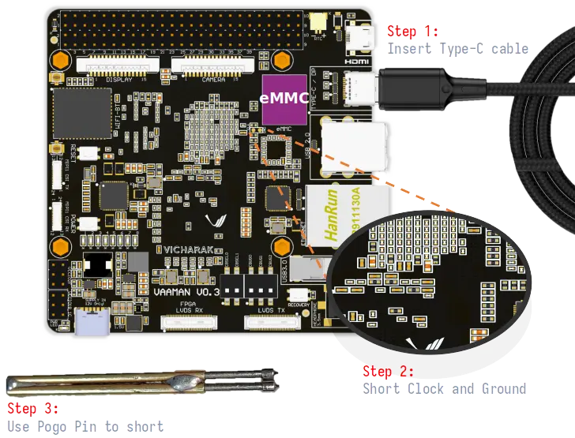
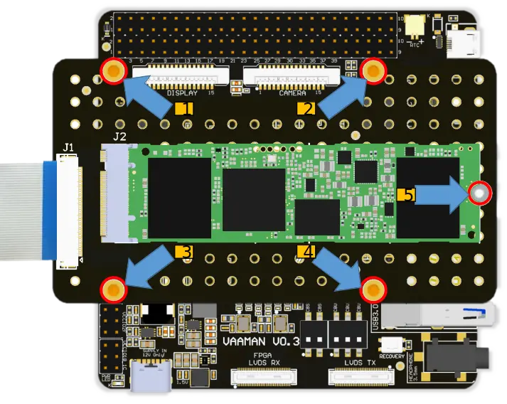
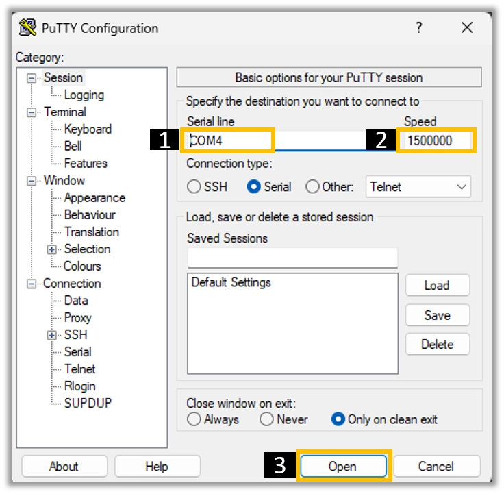

.. _getting-started:

Getting Started
###############

Turning board on
================

- **PD Adapter + PD cable** required with operating 12V/5A

.. danger::
    12V Power Input only!

.. image:: _static/images/Power_option.webp
   :width: 50%

Boot Modes Description
======================

Vaaman SBC is pre-installed with **Debian 11** (`Bullseye`) and supports multiple boot modes, including `SD- Card`, `eMMC`, and `NVMe`.
If users wants to run different operating systems, they need to use the corresponding firmware to program the board.

The boot priority of Vaaman SBC is as follows:

1. NVMe
2. SD Card
3. eMMC

`NVMe` is the highest priority, followed by `SD-Card` and `eMMC`. So, if you have an NVMe drive connected to Vaaman SBC, it will boot from the NVMe drive. If there is no NVMe drive connected, it will boot from the SD-Card. If there is no SD card inserted, it will boot from the eMMC.

.. tip::
    | If the accident happened during the flashing or upgrading process, you can use the maskrom mode to recover the board. Check out the :ref:`Maskrom Mode <maskrom-mode>` section for more information.

Firmware Download
=================

For Vaaman SBC, you can download the latest bootable image from the :ref:`downloads` page.

.. note::
    | For more information on how to flash the image to the eMMC or SD-Card, check out the :doc:`Linux Usage Guide <vaaman-linux/linux-usage-guide/index>`.

Booting from SD Card
====================

.. image:: _static/images/vaaman-sdcard-insert.webp
   :width: 50%

**To make an SD card bootable, follow these steps:**

1. Format the SD card using a suitable file system (such as FAT32).
2. Obtain the bootable image or operating system files for your desired platform.

3. Use a disk imaging tool (e.g., Etcher, Win32 Disk Imager) to write the bootable image onto the SD card.
4. Safely eject the SD card from your computer.
5. Insert the bootable SD card into the SD-Card socket.
6. Power on the device to initiate the boot process from the SD card.

.. note::
    | For Linux users, you can use the **dd** command to write the image to the SD card.
    | Check out the :ref:`rockchip-develop-tool` for more information.

Booting from eMMC
=================

.. warning::
   Remove SD Card if inserted

.. _maskrom-mode:

.. note::
   | Make sure you have flashed the eMMC with the latest image.
   | You can find the latest image on the `Downloads <downloads>`_ page.
   | Flashing instructions can be found in the :ref:`rockchip-develop-tool`.

When the power cable is connected, the **red LED** will be activated, and you can observe its illumination in the image displayed below.

.. image:: _static/images/vaaman-power-led.webp
    :width: 50%

Once the booting process is finished, you will notice the activation of the **blue LED**, indicated by a blinking pattern, as demonstrated in the image provided below.

.. image:: _static/images/vaaman-leds.webp
    :width: 50%

.. note::
    | Check out the :doc:`Linux Usage Guide <vaaman-linux/linux-usage-guide/index>` for more information.

Booting from NVMe
=================

To connect an NVMe drive to Vaaman, follow the steps shown in the image below:

.. image:: _static/images/vaaman-nvme-pcie-interface.webp
   :width: 800

Place the NVMe board on top of Vaaman and secure it by tightening the nuts.

.. note::
   | Flashing instructions can be found in the :ref:`rockchip-develop-tool`.

Vaaman Boot modes
=================

.. list-table::
   :widths: 20 40
   :header-rows: 1

   * - **Boot Mode**
     - **Description**
   * - Normal Mode
     - Normal boot mode is the default boot mode. In this mode, the board boots from the `eMMC` or `SD-Card`. Each partition loads in order and enters the system normally.
   * - Loader Mode
     - Loader mode is used to upgrade the `bootloader`. In this mode, the bootloader will wait for the host command for `firmware upgrade`. On success, the board boots from the `eMMC` or `SD-Card`, and the board enters the system normally.
   * - Maskrom Mode
     - Maskrom mode is used to `repair` the board. In a situation where the bootloader is damaged, the board can enter the maskrom mode. In general, there is no need to enter `Maskrom` mode. In this mode, the bootrom code waits for the host to transmit the bootloader code through the USB-C port, load and run it.

How to access your Vaaman board
===============================

Using Micro HDMI
----------------

Vaaman SBC is equipped with a micro HDMI port, which allows for easy connection to a display. By using a micro HDMI to HDMI cable or adapter, users can connect Vaaman to a monitor or TV with an HDMI input. This enables direct visual access to the graphical user interface (GUI) or command-line interface (CLI) on the connected display.

.. image:: _static/images/vaaman-hdmi.webp
    :width: 50%

.. _using-serial-console:

Using Serial Console
--------------------

Vaaman also provides a serial interface, typically in the form of UART (Universal Asynchronous Receiver-Transmitter) pins.

Users can access the system's console or terminal interface by connecting to these serial pins using a serial cable or adapter. This method is often used for debugging, troubleshooting, or accessing the system when other interfaces are not available.

|

**Preparation**

To access Vaaman SBC through the serial interface, you will need the following:

- A USB to TTL serial cable or adapter `CP2102 USB to TTL Convertor <https://www.amazon.com/HiLetgo-CP2102-Converter-Adapter-Downloader/dp/B00LODGRV8/ref=sr_1_8?keywords=usb+to+ttl+adapter&qid=1689597979&sprefix=usb+to+tt%2Caps%2C293&sr=8-8>`_

**Hardware Setup**

1. Connect the USB to TTL serial cable or adapter to your computer.

2. Connect the serial cable or adapter to the Vaaman SBC.

.. list-table::
   :widths: 20 40 130
   :header-rows: 1

   * - **Serial FTDI Pin**
     - **Header GPIO Pin**
     - **Schematic Name**
   * - GND
     - Pin 6
     - GND
   * - TX
     - Pin 8 (GPIO4_C4)
     - UART2DBG_TX
   * - RX
     - Pin 10 (GPIO4_C3)
     - UART2DBG_RX

.. image:: _static/images/vaaman-serial-uart-pins.webp
    :width: 50%

.. note::
    When accessing Vaaman SBC through the serial interface, it is important to configure the serial parameters correctly. For RK3399-based systems, the following parameters are typically used:

    Baud rate: `1500000`

    Data bit: `8`

    Stop bit: `1`

    Parity check: `none`

    Flow control: `none`

.. tip::
    For Windows users, you can download `PuTTY <https://www.putty.org/>`_, to access the serial console.

**Serial Console Program**

.. note:: Linux Users check out the :ref:`linux-uart-serial-console` for more information.

Using SSH
---------

Vaaman supports **SSH (Secure Shell)**, which allows for secure remote access to the system. By establishing an SSH connection, users can remotely connect to Vaaman from another device, such as a computer or smartphone, over a network. This method provides a secure command-line interface to administer, configure, and execute commands on the Vaaman SBC.

**Install OpenSSH server**

You can install both OpenSSH components on Windows devices using the **Windows Settings**.

To install the OpenSSH components, follow these steps:

1. Open the Settings menu and click on Apps, then select **Optional Features**.
2. Look through the list to check if OpenSSH is already installed. If it's not, at the top of the page, click on **Add a feature** and then:
    - Find OpenSSH Client and click on Install.
    - Find OpenSSH Server and click on Install.
3. After the installation process is complete, go back to **Apps and Optional Features** to verify that **OpenSSH** is listed.
4. Open the Services desktop app. (`Click on Start, type services.msc in the search box, and then click on the Service app or press ENTER.`)
5. In the details pane, double-click on **OpenSSH SSH Server**.
6. On the General tab, choose **Automatic** from the Startup type drop-down menu.
7. To start the service, click on **Start**.

**Verify OpenSSH server**

Once installed, you can connect to **OpenSSH Server** from a Windows device with the **OpenSSH client** installed.
From a PowerShell prompt, run the following command.

.. code-block:: powershell

    ssh username@ip_address

Example:

.. code-block:: powershell

    ssh vicharak@192.168.29.69

**Access Vaaman SBC through SSH**

To access Vaaman SBC through SSH, you can use either of the following commands:

|

1. SSH using the IP address

::

    ssh username@ip_address

.. tip::
    Replace **"username"** with the appropriate username for Vaaman and **"ip_address"** with the actual IP address assigned to Vaaman on the network.

2. SSH using the PC name (hostname)

::

    ssh username@pc-name.local

.. tip::
    Replace **"username"** with the appropriate username for Vaaman and **"pc-name"** with the actual PC name assigned to Vaaman on the network.

.. seealso::
    :ref:`Vaaman Applications <vaaman-applications>`

    :ref:`Downloads <Downloads>`

    :doc:`Vaaman Linux Documentation <vaaman-linux/index>`

    :doc:`Vaaman FPGA Documentation <vaaman-fpga>`
