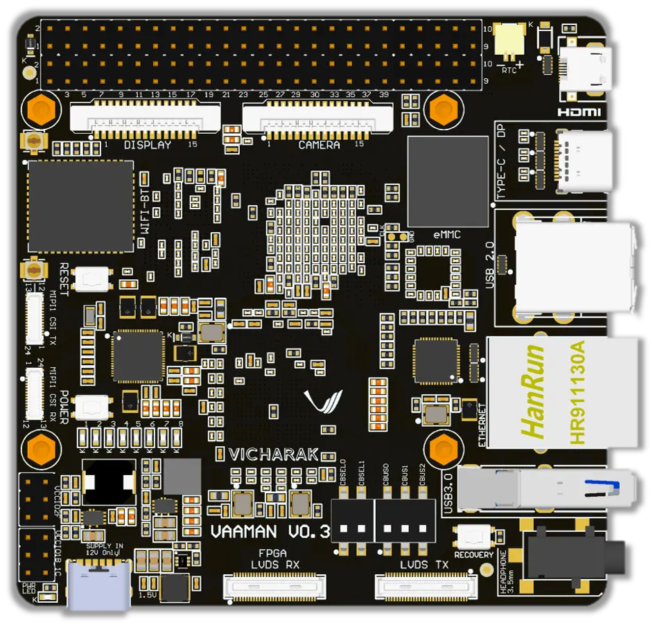
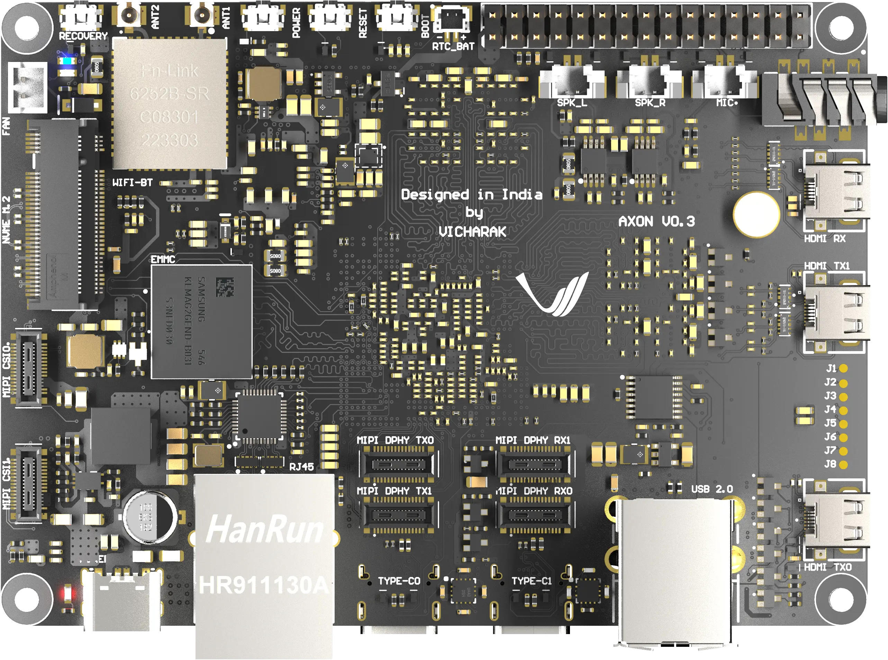
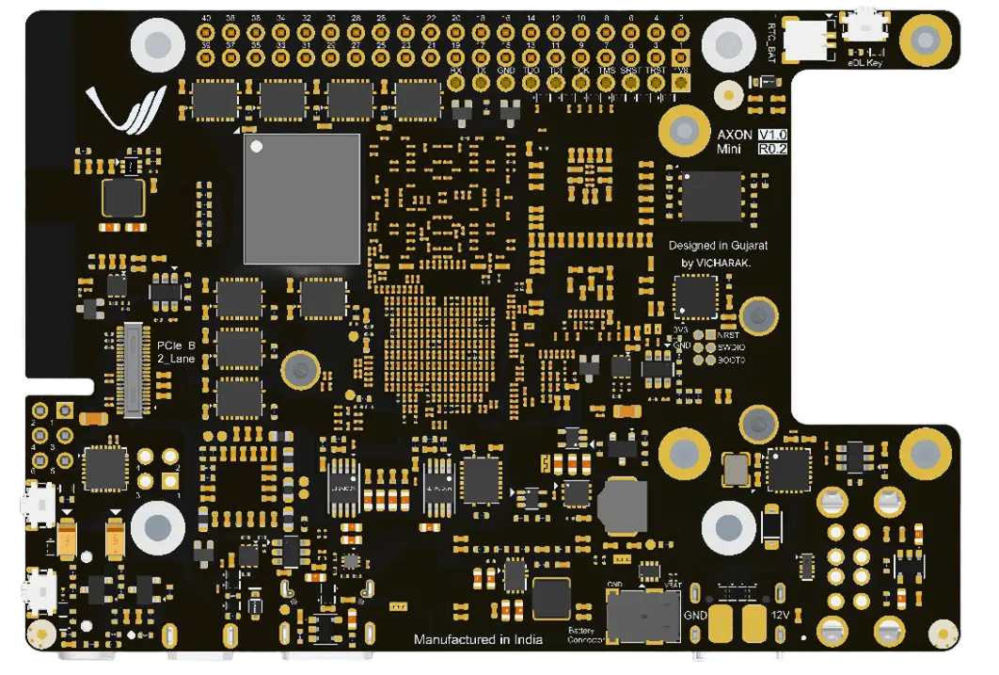

.. _vicharak-linux:

..
   Vicharak master file, created by
   sphinx-quickstart on Tue May  9 19:32:34 2023.
   You can adapt this file completely to your liking, but it should at least
   contain the root `toctree` directive.

.. rst-class:: lead

####################################
Welcome to Vicharak's documentation!
####################################

Vicharak offers a comprehensive range of single-board computers (SBCs) across the Vaaman and Axon families, powered by leading processors including the rk3399, rk3588, and QCS6490. Designed for both hobbyists and professionals, our SBCs deliver exceptional performance and versatility for applications spanning IoT, AI/ML, embedded systems, and multimedia processing.

.. grid:: 1 1 2 3

    .. grid-item-card:: Vaaman SBC
       :link: vicharak_sbcs/vaaman/vaaman-home
       :link-type: doc
       :shadow: md

       |vaaman_top|

    .. grid-item-card:: Axon SBC
       :link: vicharak_sbcs/axon/axon-home
       :link-type: doc
       :shadow: md

       |axon_top|

    .. grid-item-card:: Axon-Mini SBC
       :link: vicharak_sbcs/axon_mini/axon-mini-home
       :link-type: doc
       :shadow: md

       |axon_mini_top|

.. toctree::
   :glob:
   :caption: Contents
   :titlesonly:
   :maxdepth: 5

   Vaaman SBC <vicharak_sbcs/vaaman/vaaman-home>
   Axon SBC <vicharak_sbcs/axon/axon-home>
   Axon-Mini SBC <vicharak_sbcs/axon_mini/axon-mini-home>

.. toctree::
   :glob:
   :titlesonly:
   :caption: Downloads

   Vaaman Downloads <vicharak_sbcs/vaaman/vaaman-downloads>
   Axon Downloads <vicharak_sbcs/axon/axon-downloads>

.. toctree::
   :glob:
   :caption: Accessories
   :titlesonly:

   Vaaman Accessories <vicharak_sbcs/vaaman/vaaman-accessories> 
   Axon Accessories <vicharak_sbcs/axon/axon-accessories>

.. toctree::
   :glob:
   :caption: Explore Accessories
   :titlesonly:

   Vicharak Store <https://store.vicharak.in>

.. note::

   We welcome feedback and bug reports through our `Support
   discussion <https://discuss.vicharak.in>`_.
