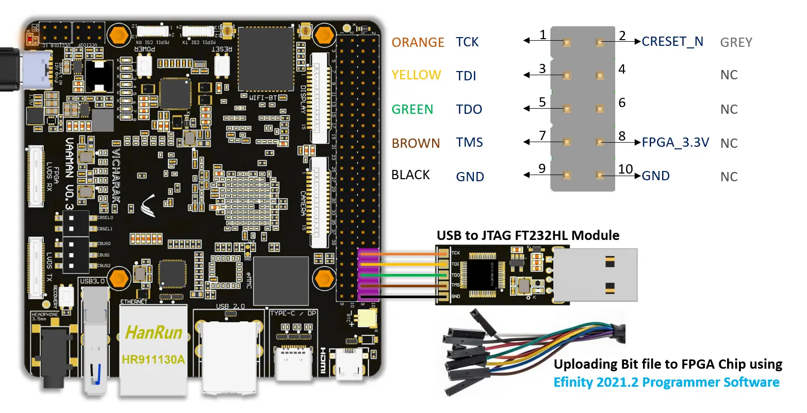
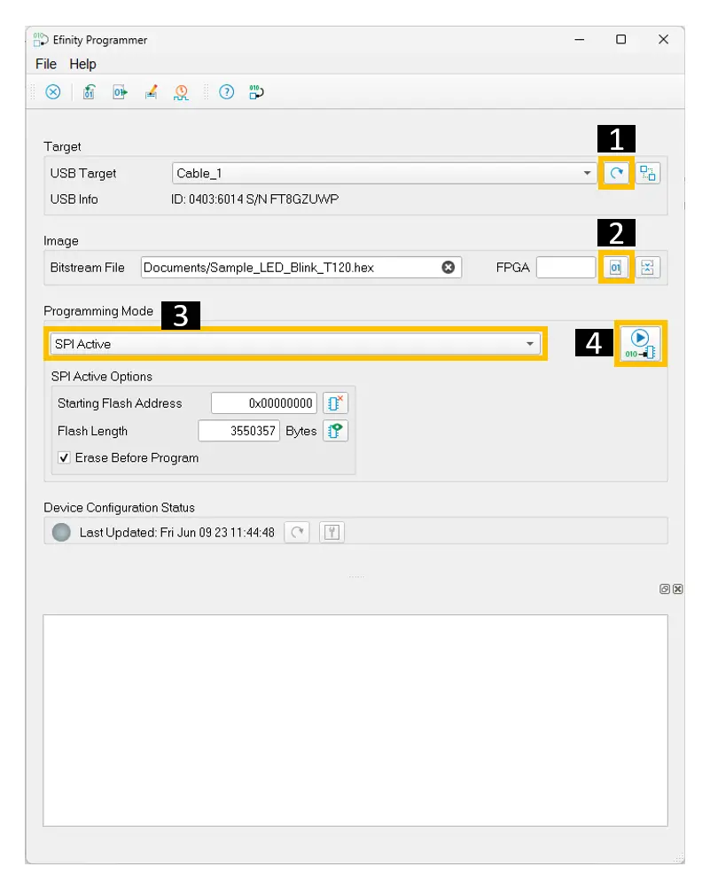
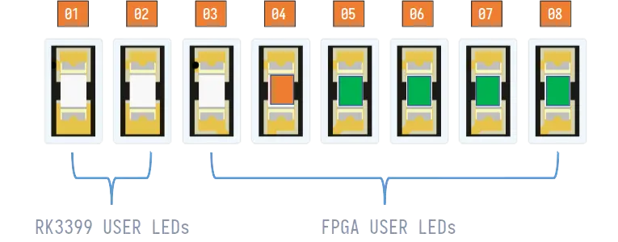
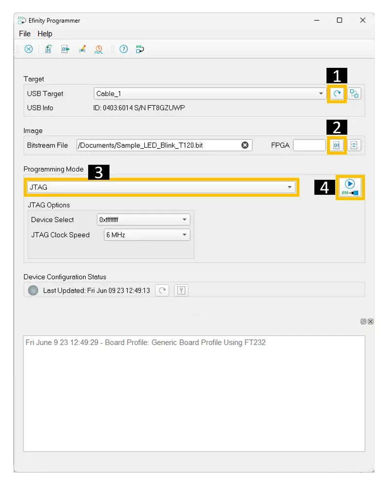

.. _vaaman-fpga:

#########################
 Vaaman FPGA Programming
#########################

The FPGA configuration is stored in a flash IC on the board. The flash
IC is Win-bond's W25Q128. The flash IC is connected to the FPGA via a
SPI bus.

The flash IC can be programmed internally using the `flashcp` tool. This
tool is available in the Vaaman Linux System Images.

or

The flash IC can be programmed externally using the JTAG or SPI
interface. This requires the `USB-to-JTAG` or `USB-to-SPI` Module.

*********************************
 Uploading HEX files to Flash IC
*********************************

**To configure the FPGA using the flash IC, follow these steps:**

Hardware Connections
====================

Locate the 10-pin headers on the Vaaman board. These can be found from
the schematic.

Ensure the Vaaman board is powered On.

Connect the USB-to-SPI Module to the Vaaman board.

While connecting the Programmer module, make sure to follow the
indicated color code as shown in the image.

Download the HEX file
=====================

Download the DEMO HEX file from the :ref:`downloads` page.

Unzip the downloaded file.

Programming the Flash IC using Efinity
======================================

Open Efinity 2021.2 or later.

Inside the Efinity IDE

-  Refresh USB Target as shown in the image.
-  Select the Bitstream file to be programmed. (The bitstream file is
   available in the unzipped folder)
-  Select the SPI Flash Programming mode. (SPI Active)
-  Start the programming process.

Wait for the programming to complete. When the programming is complete,
the FPGA will be configured with the bitstream.

Verify the FPGA configuration
=============================

Once the programming is complete, you will observe the orange LED on the
Vaaman board blinking.

This indicates that the FPGA is configured with the bitstream.

.. tip::

   Additionally, you will notice that the four green LEDs on the Vaaman
   board will be blinking in a sequence.

*********************************
 Uploading BIT files to Flash IC
*********************************

To upload the BIT file to the flash IC, follow the steps mentioned
below:

Hardware Connections
====================

Locate the 10-pin headers on the Vaaman board. These can be found from
the schematic.

Ensure the Vaaman board is powered On.

Connect the USB-to-JTAG Module to the Vaaman board.

While connecting the Programmer module, make sure to follow the
indicated color code as shown in the image.

.. image:: _static/images/vaaman-fpga-jtag-flash-programming.webp
   :width: 50%

Download the BIT file
=====================

Download the DEMO BIT file from the :ref:`downloads` page.

Unzip the downloaded file.

Programming the Flash using Efinity
===================================

Open Efinity 2021.2 or later.

Inside the Efinity IDE

-  Refresh USB Target as shown in the image.
-  Select the Bitstream file to be programmed. (The bitstream file is
   available in the unzipped folder)
-  Select the JTAG Programming mode.
-  Start the programming process.

Wait for the programming to complete. When the programming is complete,
the FPGA will be configured with the bitstream.

Verify the FPGA configuration
=============================

Once the programming is complete, you will observe the orange LED on the
Vaaman board blinking.

This indicates that the FPGA is configured with the bitstream.

.. tip::

   Additionally, you will notice that the four green LEDs on the Vaaman
   board will be blinking in a sequence.
