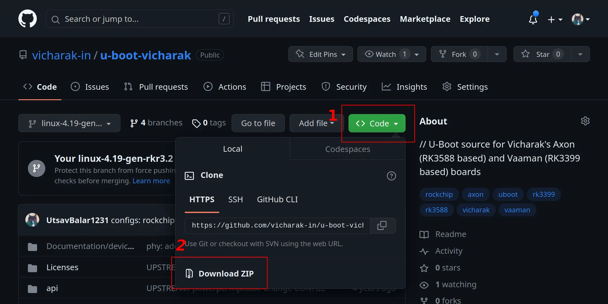

# Build Vicharak Vaaman U-Boot from source

:::{note}
Vicharak provides two different source for u-boot:

1. Vendor specific u-boot source.
2. Mainline u-boot source.

There are separate methods to compile and flash u-boot for these above sources.
:::

## Installing the system dependencies

```bash
sudo apt-get install build-essential python libssl-dev git-core \
gcc-arm-linux-gnueabihf u-boot-tools device-tree-compiler gcc-aarch64-linux-gnu mtools parted pv
```

## Getting the source

The source code for u-boot has been published to our [GitHub organisation](https://github.com/vicharak-in).

### Clone the repository using git

```bash
git clone https://github.com/vicharak/u-boot-vicharak
```

:::{tip}
Use `git clone --depth=1` to shallow clone the repository
:::

### Download the source code from github



**Follow the steps in above image or else try downloading from terminal.**

```bash
wget https://github.com/vicharak-in/u-boot-vicharak/archive/refs/heads/master.zip

unzip u-boot-vicharak-master.zip
```

## Building u-boot

### Enter the u-boot directory

```bash
cd <u-boot-directory>
```

### Compile u-boot

#### Compile using Rockchip u-boot script

```bash
./make.sh rk3399-vaaman
```

#### Compile using Vicharak u-boot script

```bash
./build-uboot.sh vaaman
```

Output files will be inside `vaaman/` folder. Make sure `idbloader`, `u-boot` and `trust` images are there.

#### Compile manually using commands

```bash
make ARCH=arm rk3399-vaaman_defconfig
make ARCH=arm CROSS_COMPILE=aarch64-linux-gnu- -j$(nproc --all)
```

:::{card} Confirm these files in the current directory

idblock.bin

idbloader.img

uboot.img

trust.img

rk3399_loader_v1.xx.xxx.bin
:::

## How to flash or update u-boot

Once you have successfully compiled the u-boot. You are now ready to flash it on your vaaman board.

For Vicharak EMMC builds you can follow the `Linux Upgrade Tool` guide
:::{admonition} Refer to
[Flash u-boot to eMMC](../linux-usage-guide/rockchip-upgrade-tool-misc.rst#flashing-u-boot-img)
:::

or

You can manually flash the images using unix `dd` utility.

**Primary loader <idbloader>**

```bash
sudo dd if=idblock.bin of=/dev/mmcblk1 seek=64; sync
```

:::{warning}
The block device `/dev/mmcblk1` may be different as per the board's storage configuration.

Confirm the block device using `parted /dev/mmcblk<X>`.
:::

**Secondary loader <u-boot>**

```bash
sudo dd if=uboot.img of=/dev/mmcblk1p1; sync
```

**Trust image <trust>**

```bash
sudo dd if=trust.img of=/dev/mmcblk1p2; sync
```

Finally reboot the board.

```bash
sudo reboot
```

:::{seealso}
[How to build linux kernel](./build-linux-kernel.md)
:::
