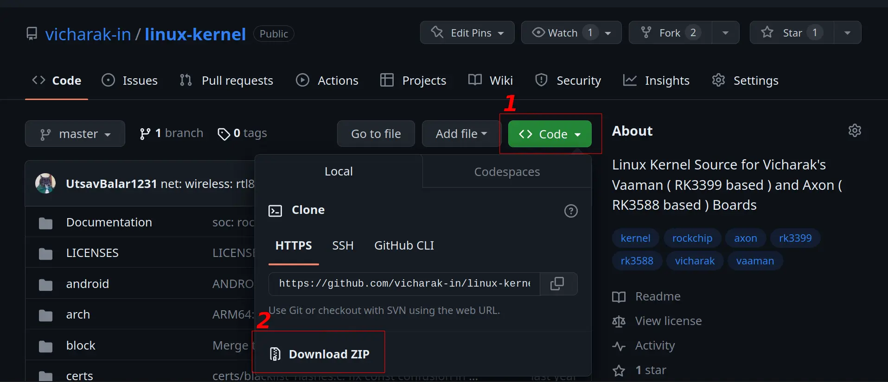

(build-linux-kernel)=

# Build Vicharak Kernel from source

Vicharak provides multiple revisions of Linux kernels for Vaaman board. There
are several differences across the revisions, mostly bug fixes and upstream
improvements. But, the hardware functionality is the same.

## Types of kernels available for Vaaman

Vicharak offers four version of linux kernels for Vaaman board.
Each kernel is based on a different version of the Linux kernel.

These kernel revisions are based on the sources of Rockchip RK3399 SoC with
necessary changes and optimizations for Vaaman.

Rockchip is responsible for updating the `RK3399` SoC support in the
Linux kernel. They have provided support for Linux Kernel **4.4, 4.19 and 5.10**.
Additionally Vicharak has introduced the support for the Mainline Linux Kernel.

```{list-table}
:header-rows: 1
:class: feature-table

* - Kernel version
  - Status
  - Git Link

* - Kernel 4.4
  - Stable but deprecated
  - https://github.com/vicharak-in/linux-kernel/tree/vaaman-4.4

* - Kernel 4.19
  - Stable but deprecated
  - https://github.com/vicharak-in/linux-kernel/tree/vaaman-4.19

* - Kernel 5.10
  - Stable
  - https://github.com/vicharak-in/linux-kernel/tree/vicharak-5.10

* - Kernel Mainline
  - Experimental
  - https://github.com/vicharak-in/linux-kernel/tree/vicharak-mainline
```

:::{warning}
Some of the kernel versions might not contain all the features supported or required by Vaaman.
Please take a look at the [Vaaman Kernel Status](vaaman-kernel-status) table
for the status of the different kernels available for Vaaman.
:::


## Build Linux Kernel

### Installing the system dependencies

```bash
sudo apt-get update

sudo apt-get install build-essential python libssl-dev git-core \
gcc-arm-linux-gnueabihf u-boot-tools device-tree-compiler \
gcc-aarch64-linux-gnu mtools parted pv
```

:::{warning}
It is recommended to use **Ubuntu 20.04** and Higher or **Debian 11**
and Higher environment for building.
:::

### Getting the kernel source

Download the kernel source from
[Vicharak's GitHub](https://github.com/vicharak-in/linux-kernel)

#### Download using Git Clone

```bash
git clone https://github.com/vicharak-in/linux-kernel -b <branch>
```

#### Download the kernel as archive



**Follow the steps in above image or else try downloading from terminal.**

```bash
wget https://github.com/vicharak-in/linux-kernel/archive/refs/heads/master.zip

unzip master.zip
mv linux-kernel-master linux-kernel
```

### Compiling the Linux kernel

#### Enter the kernel directory

```bash
cd linux-kernel
```

#### Compile Rockchip Linux config

```bash
export CROSS_COMPILE=aarch64-linux-gnu-

make O=out ARCH=arm64 rockchip_linux_defconfig
```

:::{tip} You can also use custom toolchain for compilation.

1. Clone your custom toolchain from the internet.

2. Export LD_LIBRARY_PATH and PATH variables

```bash
export LD_LIBRARY_PATH=<path-to-custom-toolchain>/lib:$LD_LIBRARY_PATH
export PATH=<path-to-custom-toolchain>/bin:$PATH
```

3. Build the kernel using the normal steps
   :::

#### Copy vaaman specific configs to .config

```bash
./scripts/kconfig/merge_config.sh -m out/.config arch/arm64/configs/rk3399_vaaman.config
```

or

```bash
cat arch/arm64/configs/rk3399_vaaman.config >> out/.config
```

:::{warning}
When using Vaaman kernel version **4.4**, please note that the file
`arch/arm64/configs/rk3399_vaaman.config` will not be available.

Consequently, you should refrain from using the provided commands to merge
Vaaman-specific configurations into the .config file.
:::

#### Finally compile the kernel

```bash
make O=out ARCH=arm64 CROSS_COMPILE=aarch64-linux-gnu -j$(nproc --all)
```

**Upon successful compilation, confirm that you have following files.**

:::{card}

- out/arch/arm64/boot/dts/rockchip/rk3399-vaaman-linux.dtb
- out/arch/arm64/boot/Image
  :::

:::{warning}
On Vaaman kernel version 4.4 you will not have
`out/arch/arm64/boot/dts/rockchip/rk3399-vaaman-linux.dtb`.
Instead you might find `rk3399-vaaman.dtb` which is perfectly fine to use.
:::

## Vicharak's Kernel build script

**To enable support for Vicharak kernel build scripts, use the following command:**

```bash
git submodule update --init
```

:::{note}
Git submodule seemed to be best approach to enable support for Vicharak kernel build scripts.
It allows carefree updates to the kernel source.
:::

:::{admonition} Refer to
[Vicharak kernel building script](#vicharak-kernel-script)
to compile and test the kernel with ease.
:::

## Compiling Kernel Modules

```bash
make O=out ARCH=arm64 modules_install INSTALL_MOD_DIR=out/modules -j$(nproc --all)
```

**Confirm the modules files in `out/modules/lib` folder**

:::{tip}
Set the specific driver that you want to build as module to `CONFIG_<XXXX>=m` inside .config
:::

:::{seealso}
[How to compile u-boot from source](#build-u-boot)

[How to flash compiled kernel](#flash-custom-kernel)

[How to flash u-boot](#flash-u-boot)
:::
