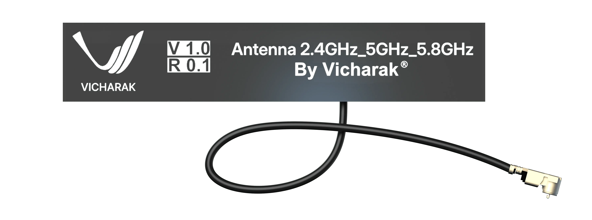

:orphan:

#############################
 Wi-Fi and Bluetooth Antenna
#############################

Vicharak Axon Lite comes with a combined Wi-Fi and Bluetooth antenna. The antenna is
connected to the board via a U.FL connector. The combined antenna supports both 
Bluetooth 5.3 and Wi-Fi (2.4GHz, 5GHz, 5.8GHz) and is 
compatible with 802.11 b/g/n Wi-Fi.
