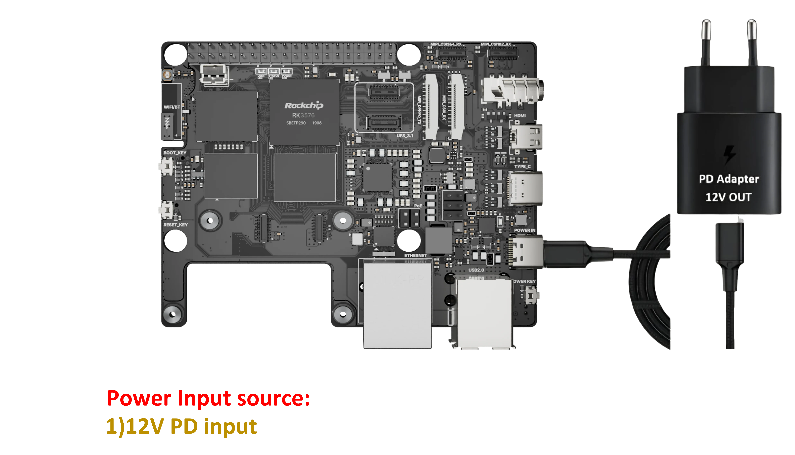
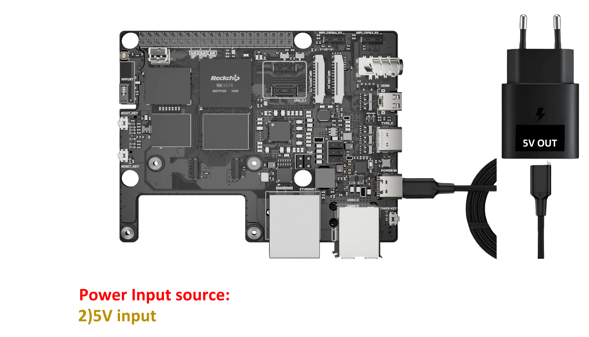
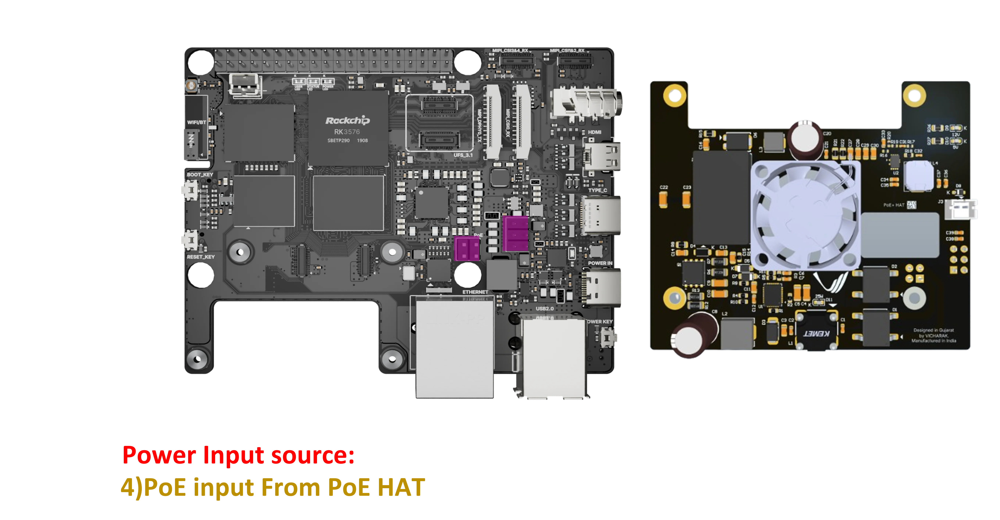
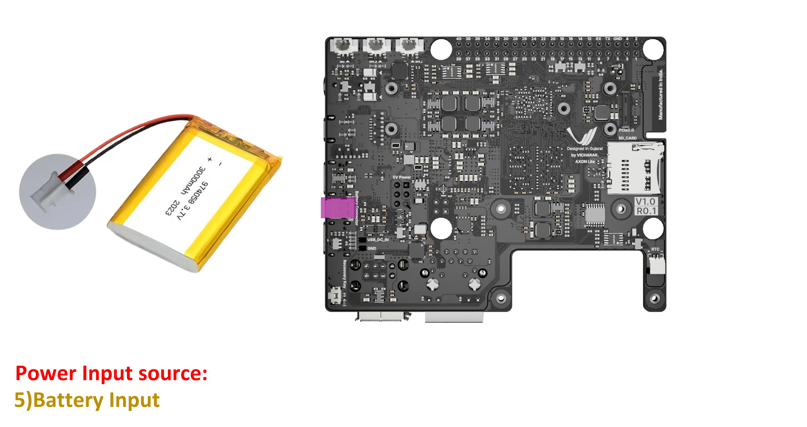
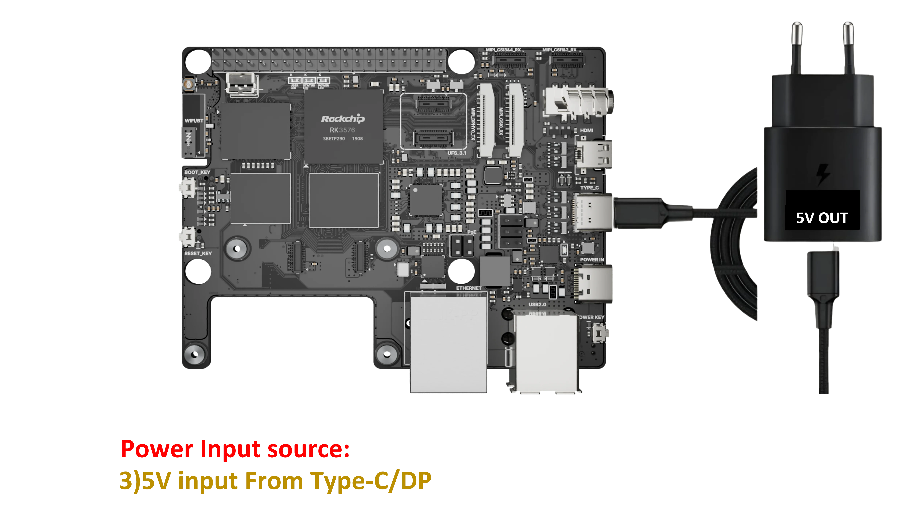

.. _axon-lite-power-sources:

Power Sources
=============

The Axon Lite board offers multiple versatile power options to suit various use cases. Below are the 5 supported power sources:

1. 12V Power Source (Dedicated Type-C PD Port)
----------------------------------------------
You can power the board using a 12V adapter through the dedicated Type-C PD port.

2. 5V Power Source (Dedicated Type-C PD Port)
---------------------------------------------
The same dedicated Type-C PD port can also accept a 5V power source.

3. Power Over Ethernet (PoE)
----------------------------
Axon Lite supports Power over Ethernet (PoE), allowing you to deliver both data and power over a single Ethernet cable. This is highly useful for deployments where electrical outlets are scarce, such as remote camera installations, IoT gateways, and headless servers.

4. Battery Power
----------------
For portable or backup power applications, the board features a 3.7V battery connector.

5. Type-C/DP Port Power
-----------------------
The standard Type-C/DP port can also be used to power the board with a standard PD adapter.

