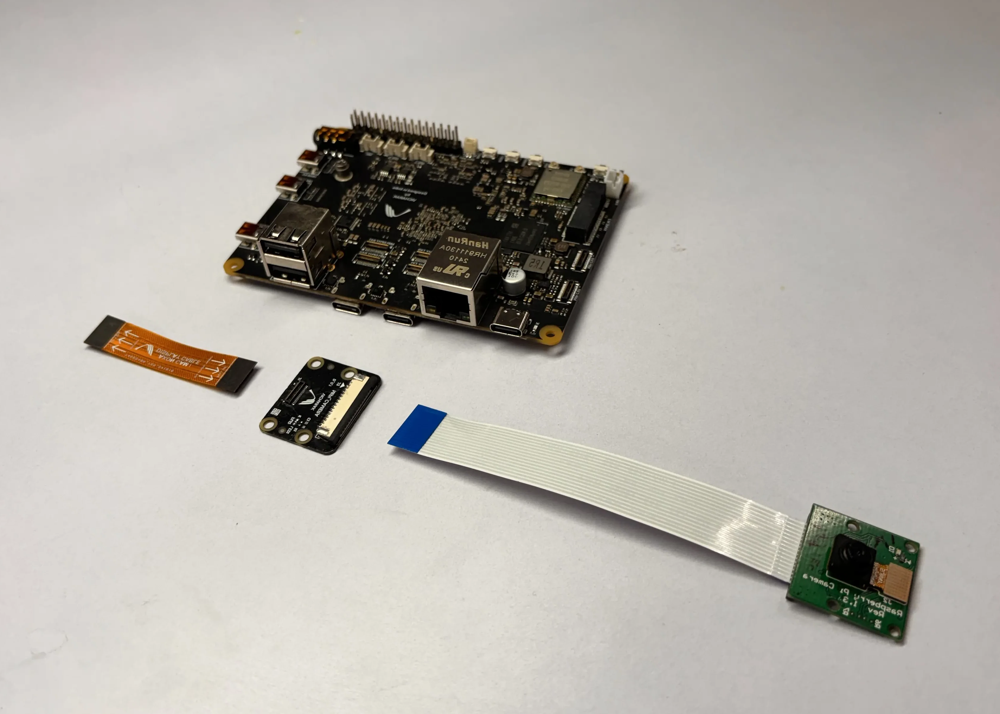
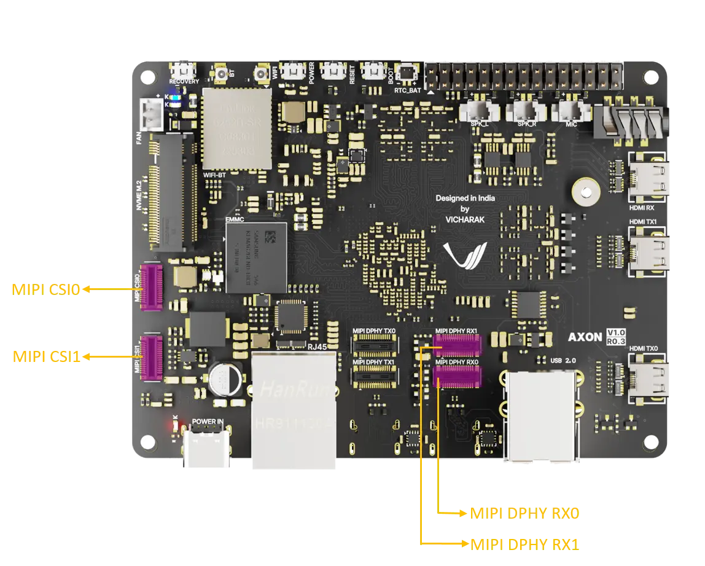
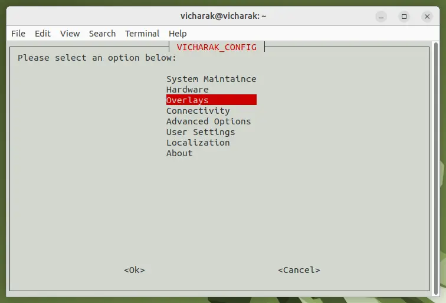
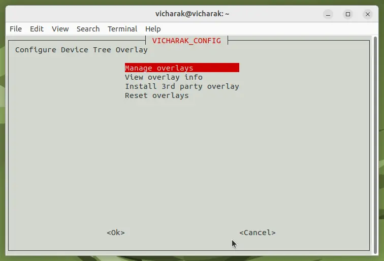
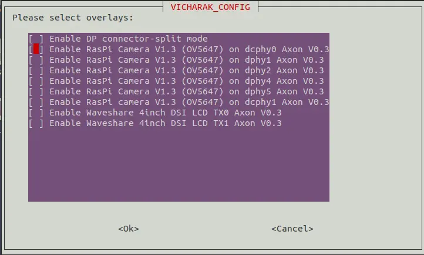
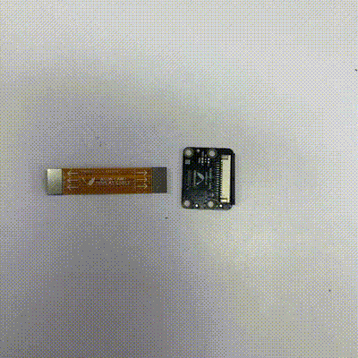

:orphan:

############################
 Raspberry Pi Camera Module
############################

You can use the Raspberry Pi Camera Module ``v1`` and ``v2`` with the
Vicharak Axon. The ``raspi`` camera module is a small circuit board
that connects to the CSI connector on the Axon and allows you to take
photos and videos.

We do not build or design the camera module, but we do test it for
compatibility with our Axon. We recommend buying the original camera
module from the Raspberry Pi Foundation, or from one of our authorized
resellers.

You can find more information about the camera module on the `Raspberry
Pi Camera documentation
<https://www.raspberrypi.com/documentation/accessories/camera.html>`_.

Buy the `Raspberry Pi Camera Module v2
<https://www.raspberrypi.com/products/camera-module-v2/>`_.

|
#######################
Axon Camera Guide
#######################

1. Enable overlays options sutiable for your camera.
2. You can setup camera using python source.

Pre-Requisites
---------------
- Camera ( OV5647  )
- Vicharak Flex Cable 30 Pin 0.4mm Pitch Cable (Golden Color)
- Vicharak Camera PCB 
- FPC50 15 Pin 1mm Pitch Cable

Enable Overlays In Axon 
------------------------

Here, you can find which overlay should be turned on for each MIPI Connector.

+---------------+-------+---------------+
| **MIPI Connector**    | **Overlays**  |
+---------------+-------+---------------+
|     MIPI_DPHY_RX0     |   dcphy0      |
+---------------+-------+---------------+
|     MIPI_DPHY_RX1     |   dcphy1      |
+---------------+-------+---------------+
|     MIPI_CSI0_RX1     |   dphy1       |
+---------------+-------+---------------+
|     MIPI_CSI0_RX2     |   dphy2       |
+---------------+-------+---------------+
|     MIPI_CSI1_RX4     |   dphy4       |
+---------------+-------+---------------+
|     MIPI_CSI1_RX5     |   dphy5       |
+---------------+-------+---------------+

**Steps to follow for Configuration**
    
1. Open a terminal window(``Ctrl+Alt+T``).

2. Run command ``sudo vicharak-config`` in it.

3. Select ``Overlays`` options in it by pressing ``enter`` key.
           

4. You will see Warning Page, click on ``yes`` and select ``Manage Overlays`` options.

    
5. Select overlays as per your camera part number ``( OV5647 )`` by pressing ``spacebar`` on keyboard, then select ``Ok``.
    

    
6. To return back to terminal, press the ``Esc`` key until you exit from it.

7. In order to enable your configuration, Restart your computer or Run command ``sudo reboot`` in terminal.

.. note::
   Make sure that whenever you are going to connect Camera, Device should be power off.
 

How to attach camare to Axon
----------------------------

1. First, Connect Vicharak Flex Cable To Vicharak CAM PCB Connector.
    

   
.. note::
        Make sure to connect the Vicharak flex cable's AXON PCB side connector to the AXON board, and the display/camera side connector to the Vicharak CAM PCB.

2. Attach Camera Module To FPC50 15 Pin 1mm Pitch Cable.

3. Connect Camera To Vicharak CAM PCB Connector. 

.. image::  ./../../../_static/images/rk3588-axon/axon-camera-3.gif
    :width: 40%

   
4. Connect Axon Side Vicharak Flex Cable to Axon.

.. image::  ./../../../_static/images/rk3588-axon/axon-camera-5.gif
    :width: 40%

5. After Using Camera, User can remove camera using twizer.

.. image::  ./../../../_static/images/rk3588-axon/axon-camera-6.gif
    :width: 40%

Run Camera Using Python Script
-------------------------------
 
1. Install Python if not already installed. You can download Python from the official website: `Python Downloads <https://www.python.org/downloads/>`__.
    
for Debian-based systems (like Ubuntu):   

.. code-block::

           sudo apt update
           sudo apt install python3-pip

2. Install the OpenCV library using pip
            
for Debian-based systems (like Ubuntu):

.. code-block::

           pip install opencv-python
            
Setup
------
    .. tab-set::
    
        .. tab-item:: 
1. Open a terminal window(``Ctrl+Alt+T``).

2. To create a (``.py``) file in vim editor, Run command ``vim <file_name>.py`` in terminal. 

3. Copy this below content into the file and paste it by pressing ``Ctrl + Shift + v``, then press ``Esc`` and to save this file, type ``:wq``.

.. code-block::
   :emphasize-lines: 3

                # !/bin/env python3
                import cv2
                cap = cv2.VideoCapture(<camera_device_number>)
                while True:
                    ret, frame = cap.read()
                    cv2.imshow('frame', frame)
                    if cv2.waitKey(1) & 0xFF == ord('q'):
                        break
                # After the loop release the cap object
                cap.release()
                # Destroy all the windows
                cv2.destroyAllWindows()
               
   
.. note::
        You can get <camera_device> Number by running below command :

        ls -l /dev/video*

        e.g. - 11, 31 etc.

4. Open a terminal window(``Ctrl+Alt+T``).

5. Navigate to the directory where your Python program is located using the ``cd`` command.

6. Run Python program using the following command:

.. code-block::

             python3 <file_name>.py

If you have multiple versions of Python installed, ensure you use ``python3`` to run the program for Python 3.x.
 
 
|
**Troubleshooting**

- If you encounter any errors related to missing modules or libraries, ensure that Python and OpenCV are properly installed on your system.
- If the camera frame does not open or the program does not behave as expected, check for any
  errors in the terminal output and review your program for potential issues.
- Check Camera I2C address is detected or not.

.. note::
    sudo i2cdetect -y <i2c_bus_number>
 
 I2C Bus number is mentioned in Camera DTS node in device tree file

- Camera Device can be find by :
    
.. note::
    ls -l /dev/video*

..
    Enable Overlays In Axon / Axon
    ------------------------
    
    **Steps to follow for Configuration**
    
    1. Open a terminal window(``Ctrl+Alt+T``).
    
    2. Run command ``sudo vicharak-config`` in it.
    
    3. Select ``Overlays`` options in it by pressing ``enter`` key.
           
           .. image:: ./../../../_static/images/rk3399-vaaman/Overlays_1.webp
                   :width: 50%
    
    4. You will see Warning Page, click on ``yes`` and select ``Manage Overlays`` options.
    
       .. image:: ./../../../_static/images/rk3399-vaaman/Overlays_2.webp
                   :width: 50%
    
    5. Select overlays as per your camera part number ``( OV5647 / IMX219 )`` by pressing ``spacebar`` on keyboard, then select ``Ok``.
    
       .. image:: ./../../../_static/images/rk3399-vaaman/Overlays_3.webp
                   :width: 50%
    
    6. To return back to terminal, press the ``Esc`` key until you exit from it.
    
    7. In order to enable your configuration, Restart your computer or Run command ``sudo reboot`` in terminal.
    
    .. note::
       Make sure that whenever you are going to connect Camera, Device should be power off.
    
    Setup
    ------
    .. tab-set::
    
        .. tab-item:: Cheese Application
    
            1. Attach the camera along with FPC50 15 Pin 1mm pitch cable to the CSI connector.
    
                .. image:: ./../../../_static/images/rk3399-vaaman/Camera_guide_0.webp
                    :width:  50%
            
            2. Open the Cheese application in your Ubuntu Linux operating system.
    
                .. image:: ./../../../_static/images/rk3399-vaaman/Camera_1.webp
                   :width: 50%
    
            3. You will be shown Cheese camera interface.
    
            4. You have to click on hamburger button located at top right side. 
    
            5. Click on ``Preferences`` and select ``rkisp_mainpath`` in Device option.
    
                .. image:: ./../../../_static/images/rk3399-vaaman/Camera_2.webp
                   :width: 50%
    
    
                .. image:: ./../../../_static/images/rk3399-vaaman/Camera_3.webp
                   :width: 50%
    
            6. Click on a webcam button in the middle of the bottom panel, or press the ``spacebar`` key, to take the photo.
            
                .. image:: ./../../../_static/images/rk3399-vaaman/Camera_4.webp
                   :width: 50%
    
            7. There will be a short countdown, followed by a flash, and the photo will appear in the photo stream.
    
            8. You can use camera as Photo mode and Video mode as well. 
    
                .. note::
         
                    In case above steps do not work, Follow below steps.
    
                    1. Open a terminal window(``Ctrl+Alt+T``).
    
                    2. To open cheese application, Run command ``sudo cheese``.
    
    
        .. tab-item:: Python Source
    
            |
            **Introduction**
            
            This documentation provides instructions on how to run the Python to open the camera frame and capture an image using OpenCV.
            
            |
            **Pre-Requisites**
            
           
            1. Python3 installed on your system.
            
            2. OpenCV library installed (`opencv-python`).  
            
            3. Any Text Editor Software like, Vim, gedit, nano etc.
    
            
                To Install Vim:
                
                .. code-block::
            
                    sudo apt update
                    sudo apt install vim
                
                To Install Gedit:
    
                .. code-block::
                    
                    sudo apt update
                    sudo apt-get install gedit
    
            |    
            **Setup**
     
    
            1. Attach the camera along with FPC50 15 Pin 1mm pitch cable to the CSI connector.
             
                .. image:: ./../../../_static/images/rk3399-vaaman/Camera_guide_0.webp
                    :width:  50%
            
            2. Install Python if not already installed. You can download Python from the official website: `Python Downloads <https://www.python.org/downloads/>`__.
    
                 for Debian-based systems (like Ubuntu):   
    
                 .. code-block::
    
                            sudo apt update
                            sudo apt install python3-pip
            
            3. Install the OpenCV library using pip
            
                 for Debian-based systems (like Ubuntu):
                 
                 .. code-block::
    
                            pip install opencv-python
            
            |
            **Execution of Program**
    
            1. Open a terminal window(``Ctrl+Alt+T``).
      
            2. To create a (``.py``) file in vim editor, Run command ``vim <file_name>.py`` in terminal. 
    
            3. Copy this below content into the file and paste it by pressing ``Ctrl + Shift + v``, then press ``Esc`` and to save this file, type ``:wq``.
    
            
               .. code-block::
    
                            # !/bin/env python3
                            import cv2
                            cap = cv2.VideoCapture(0)
                            while True:
                                ret, frame = cap.read()
                                cv2.imshow('frame', frame)
                                if cv2.waitKey(1) & 0xFF == ord('q'):
                                    break
                            # After the loop release the cap object
                            cap.release()
                            # Destroy all the windows
                            cv2.destroyAllWindows()
                           
            4. Open a terminal window(``Ctrl+Alt+T``).
    
            5. Navigate to the directory where your Python program is located using the ``cd`` command.
    
            6. Run Python program using the following command:
    
               .. code-block::
    
                            python3 <file_name>.py
    
               If you have multiple versions of Python installed, ensure you use ``python3`` to run the program for Python 3.x.
            
        
            |
            **Expected Behavior**
    
    
            1. Upon running the program, the camera frame will open.
    
               .. image:: ./../../../_static/images/rk3399-vaaman/python-script-camera-frame.webp
                  :alt: Image Description
                  :width: 650
            
            2. Press the ``Ctrl+S`` key on your keyboard to capture an image.
    
               .. image:: ./../../../_static/images/rk3399-vaaman/python-script-save-image.webp
                  :alt: Image Description
                  :width: 650
    
            3. The captured image will be saved in the current directory unless the directory location has been changed.
    
            4. Press the key ``Q`` on your keyboard to exit the camera frame.
            
    
            |
            **Troubleshooting**
            
    
            - If you encounter any errors related to missing modules or libraries, ensure that Python and OpenCV are properly installed on your system.
            - If the camera frame does not open or the program does not behave as expected, check for any
              errors in the terminal output and review your program for potential issues.
    .
