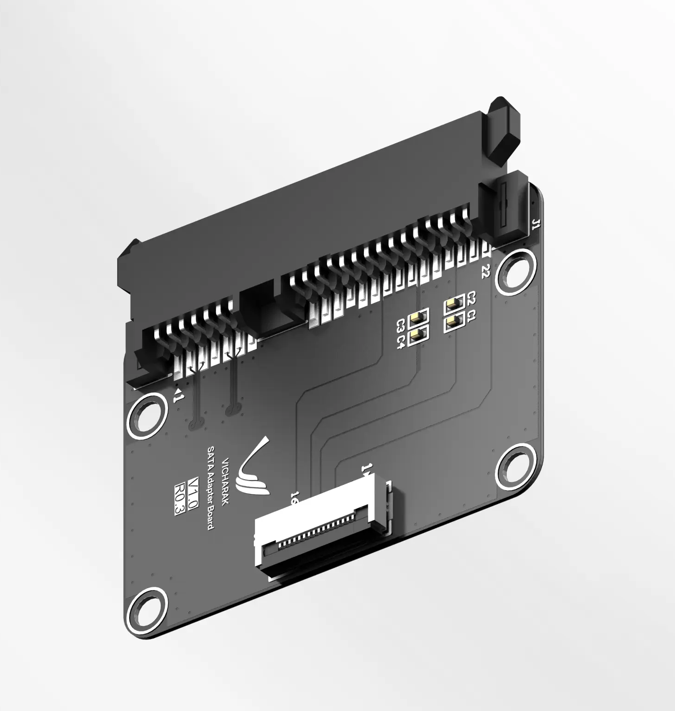

:orphan:

######################
Axon SATA Adapter
######################

.. note::

   Connect Expansion board while Axon is powered off to avoid any damage and SATA enumeration can only be done during bootup, it not hot-pluggable.

Axon SATA Hat is compatible with Axon and can be easily installed to enable SATA connectivity. It allows you to connect SATA hard drives or solid-state drives (SSDs) to your Axon SBC, providing additional storage capacity for your projects.

Specifications:
----------------

- 16 Pin FPC Cable
- SATA 3.0 Interface

`Using guide in Linux </vicharak_sbcs/axon/storage/sata>`_

`Available on Vicharak Store <https://store.vicharak.in/?product_cat=accessories&v=13b5bfe96f3e>`_
