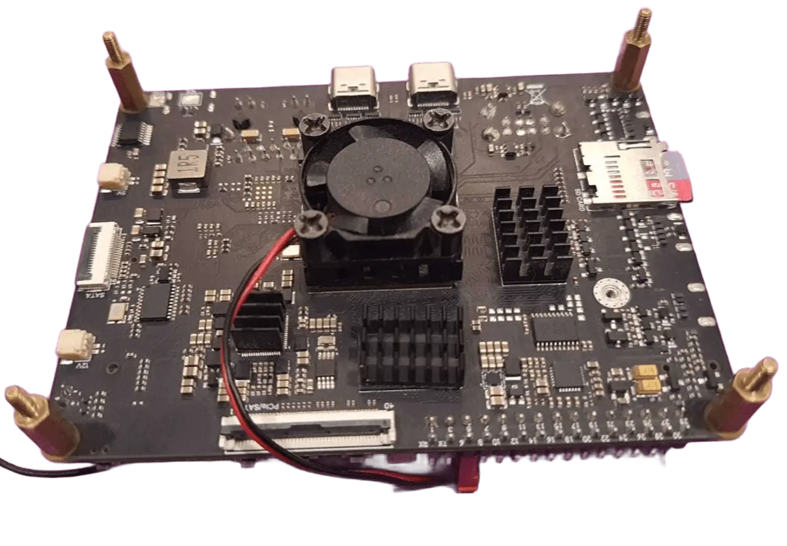

:orphan:

###########################################
Active Heat Sink
###########################################

After removing the protective film from the heatsink, install it on processor, immediately without touching the contact surface, ensuring proper alignment and even pressure for optimal thermal performance.

Active heat sink can be run on `5V` through GPIO Header pins available on Axon.

.. tip::
  
  `Axon GPIO Header Pin <https://docs.vicharak.in/vicharak_sbcs/axon/axon-gpio-description/#axon-gpios-header>`_

.. list-table::
   :widths: 20 40
   :header-rows: 1
   :class: feature-table

   * - **Axon Pin**
     - **Fan Pin**
   * - Pin 5/7
     - 5 V
   * - Pin 6/8 
     - GND 

Additionally, you can purchase this accessory separately from the `Vicharak Store <https://store.vicharak.in/?v=13b5bfe96f3e>`_.

.. warning::

   If you have already attached passive heatsink, then Generally, First blow hot air to loosen the existing heatsink, then carefully remove it. After that, simply remove previous heatsink gum and attach the new heatsink—whether active or passive.

