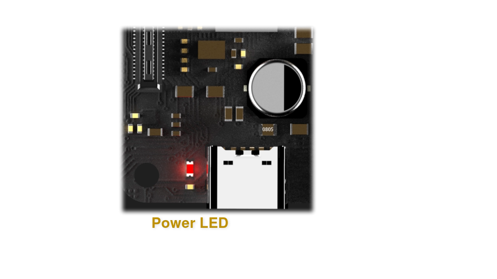
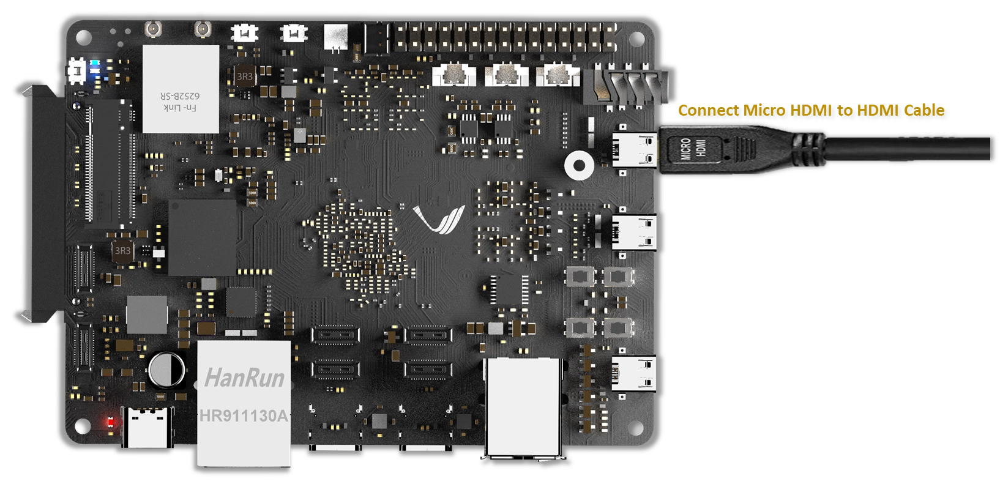

.. _axon-getting-started:

Getting Started
###############

For Axon, Vicharak has provided all the necessary accessories and
information to get started with the board. This section will guide you through
the initial setup process and provide you with the necessary information to get
started with Axon.

.. TODO: Modify this for Axon

What's in the box?
==================

1. **Axon**
    - Single-board computer optimized for high-performance computing and AI.
    - Powered by Rockchip RK3588 SoC (octa-core CPU: quad-core Cortex-A76 and quad-core Cortex-A55).
    - 8GB/16GB/32GB LPDDR4x RAM, 32GB eMMC storage, 30-pin GPIO header.
    - Pre-installed with Ubuntu 22.04 (Jammy).

2. **PD Cable**
    - Supplies power to Axon.
    - Ensures stable and efficient power delivery via USB-C with Power Delivery technology.

3. **Wi-Fi and Bluetooth Antennas**
    - Includes custom made pcb antennas for both Wi-Fi ( 2.4 & 5Ghz ) and Bluetooth connectivity.
    - These antennas ensure greater signal range and reliable connectivity for Wi-Fi and Bluetooth devices.

What else do you need?
======================

**1. 12V PD power adapter ( 20-60W )**

**2. Micro HDMI or Type-C DP cable to drive Display Monitor**
 
**3. USB2.0 Keyboard and Mouse**
 
**4. Monitor with HDMI/Type-C DP input**

**5. USB-C to USB-A Male cable (optional)**

**6. SD-card (optional)**

**7. Internet Connection (optional)**

**8. USB to TTL Serial Cable (optional)**

.. note::
    | The items listed above are not included in the box.
    | You can purchase them from the :ref:`axon-accessories` page.

Axon OS Images
==============

    :ref:`axon-downloads`

Axon OS Credentials
========================

.. note::
    Username : vicharak

    Password : 12345

Axon Button Guide
=================

.. image::  ../../_static/images/rk3588-axon/axon-button-guide.webp
    :width: 50%


1. Recovery Button
    Recovery Button mainly for Android OS to help you boot in recovery mode by holding it down when you apply power to
    Axon. If you don’t have Android OS installed on your machine then it probably does nothing.
    It also works as Volume Up Button in both Android and Linux System.

2. Power Button
    You can turn on Axon with the power button if it is currently off. When the cpu is powered off the red LED will on to
    let you know that the board has proper power supply ( 12 V ), If you press the power button ( for 1-2 seconds ) then white and blue LED will be on and start booting
    up with blinking white LED.

3. Reset Button
    You can reboot Axon by pressing reset button.

4. Boot Button
    Boot button mainly to get Axon into MaskRom Mode.

.. note::
    | *To get Axon in MaskRom Mode*, Need to press reset button 2-3 times with holding boot button.

    `Watch Video tutorial to get Board in MaskRom Mode <https://www.youtube.com/watch?si=S16kUwBRBZ8dWCqf&v=rW-R1MJhBGA&feature=youtu.be>`_

Getting Started with eMMC
=========================

Turning board on
----------------

Axon comes pre-loaded with **Ubuntu** (``Jammy``) operating system on
its ``eMMC`` (embedded MultiMediaCard) storage, and it offers support for
``SD-card`` boot mode.

If users wish to explore different operating systems, they must utilize the
appropriate firmware to program the board accordingly.

In the boot priority, ``SD-card`` takes the highest precedence, followed by
``eMMC``. In practical terms, if there's a SD-card attached to Axon,
it will initiate the boot process from it. In the absence of an SD-card,
the default boot destination becomes the eMMC storage.

For the purpose of this guide, we will focus on the ``eMMC`` storage and the
pre-installed ``Ubuntu (Jammy)``, omitting detailed instructions for
``SD-card`` boot configurations.

Connect the PD cable to the Axon board and the PD adapter to the power socket.
Once the power is connected, the board will automatically turn on.

.. danger::
    |
    | **12V Power Input only! Do not use 5V power input.**
    |
    | Using a 12V power input is crucial for the proper functioning of the Axon.
    | The board is designed to operate with a 12V power supply, and using a 5V power
    | input may lead to instability and potential damage.

.. image:: ../../_static/images/rk3588-axon/axon-power-details.webp
   :width: 60%

Axon is pre-installed with Ubuntu (``Jammy``) on its eMMC storage.
So, when you power on the board, it will boot from the eMMC storage by default.

.. warning::
   Remove SD-card if inserted

Verify the power LED
--------------------

Upon connecting the power cable, the activation of the **Red LED** serves as an
immediate visual indicator of the board's power status. This LED signifies that
the Axon is receiving power, and its illumination provides users with a
tangible confirmation of the successful power connection.



Verify the status LED
---------------------

The activation of the **white LED**, marked by a blinking pattern, signifies
the completion of the booting process. This visual cue assures users that the
Axon has successfully booted from its storage medium and is ready for further
configuration.

.. image:: ../../_static/images/rk3588-axon/axon-leds.webp
    :width: 50%

.. warning::
   |
   | Please ensure you wait for the system to complete its reboot.
   | This is necessary because the system requires configuration adjustments
   | before you proceed to the next step. Taking the time to allow the system to
   | finish restarting ensures that it is fully set up for the subsequent tasks.

Available Boot Modes
====================


.. TODO: Add Axon SD card boot doc

Booting from SD card
--------------------
To boot from SD card, please follow below document.

    :doc:`axon-sdcard-boot`

.. TODO: Add suppoprt for Axon 

How to access your Axon board ?
=================================
There are multiple ways to access your Axon. You can connect the Axon
SBC to a monitor using the **micro HDMI port**, or you can connect it to your
computer headless using **SSH** or **serial console**.

For the initial setup process, we recommend connecting the Axon to a
monitor using the **micro HDMI port**. Once the initial setup is complete, you can
connect the Axon to your computer using the USB-C port.

.. note::
    If you want to access the **serial console**,
    Skip to the :ref:`Serial Console <axon-serial-console>` section.

    If you want to access the **Axon using SSH**,
    Skip to the :ref:`SSH <axon-ssh>` section.

.. TODO: Add axon start guide

1. Using Micro HDMI port
-------------------------

Axon is equipped with two **micro HDMI ports**, which allows for easy
connection to a display. By using a micro HDMI to HDMI cable or adapter, users
can connect Axon to a monitor or TV with an HDMI input.

This enables direct visual access to the graphical user interface (GUI) or
command-line interface (CLI) on the connected display.



Connect the Micro HDMI to HDMI cable to the Axon and the monitor.
Once the cable is connected, the Axon will automatically detect the
monitor and display the output.

.. admonition:: Check out Linux Start Guide
   :class: tip

   Once the Axon is connected to the monitor, you can follow the
   :ref:`Linux Start Guide <axon-linux-start-guide>` to complete the initial setup.

.. _axon-serial-console:

2. Using Serial Console
------------------------

Axon also provides a serial interface, typically in the form of UART
(Universal Asynchronous Receiver-Transmitter) pins.

Users can access the system's console or terminal interface by connecting to
these serial pins using a serial cable or adapter. This method is often used
for debugging, troubleshooting, or accessing the system when other interfaces
are not available.

Preparation
```````````

To access Axon through the serial interface, you will need the following:

- A computer with a serial terminal application installed
  (such as PuTTY or minicom).
- A USB to UART serial cable or adapter (such as FTDI or PL2303).
- Micro USB or USB-C cable.

Hardware Setup
``````````````

1. Connect the USB to UART serial cable or adapter to your computer.

2. Connect the serial cable or adapter to Axon.

.. list-table::
   :widths: 20 40 130
   :header-rows: 1
   :class: feature-table

   * - **Serial FTDI Pin**
     - **Header GPIO Pin**
     - **Schematic Name**
   * - GND
     - Pin 6
     - GND
   * - TX
     - Pin 4 (GPIO0_B5)
     - UART2_TX_M0_DEBUG
   * - RX
     - Pin 2 (GPIO0_B6)
     - UART2_RX_M0_DEBUG

.. image:: ../../_static/images/rk3588-axon/axon-serial-uart-pins.webp
   :width: 50%

.. note::
    When accessing Axon through the serial interface, it is important to
    configure the serial parameters correctly. For RK3588-based systems,
    the following parameters are typically used:

    | Baud rate: `1500000`
    | Data bit: `8`
    | Stop bit: `1`
    | Parity check: `none`
    | Flow control: `none`

.. warning::
   |
   | During the first boot you will see a warning on your serial console.
   | So, please ensure that you wait for the system to complete its reboot.
   | This is necessary because the system requires configuration adjustments
   | before you proceed to the next step. Taking the time to allow the system to
   | finish restarting ensures that it is fully set up for the subsequent tasks.

Running the Serial Console Program
``````````````````````````````````

.. include:: ../common/common-serial-console-program.rst

.. _axon-ssh:

3. Using SSH
-------------

.. include:: ../common/common-ssh.rst

4. Set up automatic Wi-Fi connection on boot
--------------------------------------------

In the following example, we will set up automatic Wi-Fi connection on boot
for the **wlan0** interface. This will be useful if you are using a
headless system. That means you will not need to connect a monitor, keyboard,
or mouse to your system to connect to WiFi.

**1. Edit the ** ``/usr/lib/vicharak-config/conf.d/before.txt`` ** file and add
the following lines:**

::

    connect-wi-fi <network name> <password>

Example:

::

    connect-wi-fi vicharak_5g vcaa_g123

**2. Reboot the system.**

Axon Boot modes
=================
.. TODO: Add axon-maskrom-mode document
.. list-table::
   :widths: 20 40
   :header-rows: 1

   * - **Boot Mode**
     - **Description**
   * - Normal Mode
     - Normal boot mode is the default boot mode. In this mode, the board boots
       from the `eMMC` or `SD-card`. Each partition loads in order and enters
       the system normally.
   * - Loader Mode
     - Loader mode is used to upgrade the `bootloader`. In this mode, the
       bootloader will wait for the host command for `firmware upgrade`.
       On success, the board boots from the `eMMC` or `SD-card`,
       and the board enters the system normally.
   * - Maskrom Mode
     - | Maskrom mode is used to `repair` the board. In a situation where the
         bootloader is damaged, the board can enter the maskrom mode.
         In general, there is no need to enter `Maskrom` mode.
         In this mode, the bootrom code waits for the host to transmit the
         bootloader code through the USB-C port, load and run it.

.. seealso::

    :ref:`axon-downloads`
