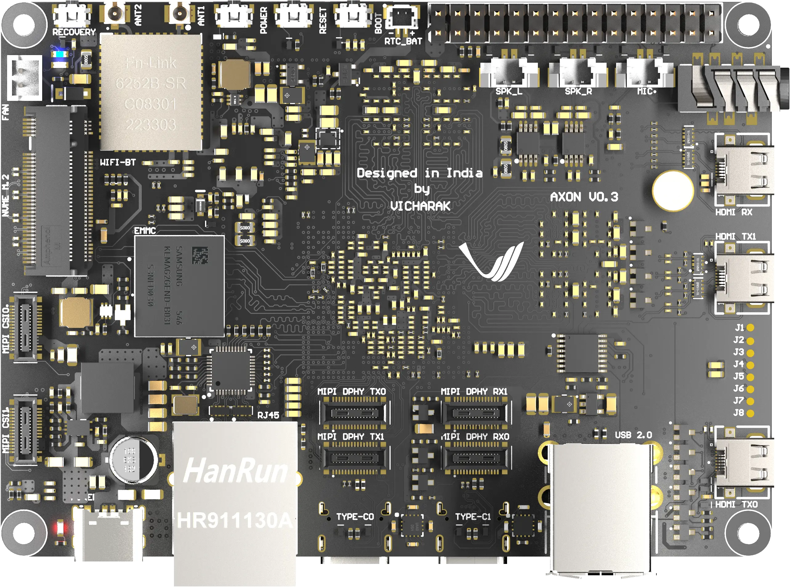

.. _axon-linux:

####################################
 Welcome to Axon's documentation!
####################################

The **Axon Board Computer** (SBC) is powered by rockchip's **RK3588**

.. toctree::
   :glob:
   :caption: Contents
   :maxdepth: 3
   :titlesonly:

   Overview <axon-overview>
   Getting Started <axon-getting-started>
   Connectivity <connectivity/index>
   Storage <storage/index>
   Peripherals <peripherals/index> 
   Display Interface  <display/index>
   Camera Module  <camera/index>
   Frequently Asked Questions <axon-faq>

.. toctree::
   :glob:
   :titlesonly:
   :caption: Downloads

   Axon Downloads <axon-downloads>

.. toctree::
   :glob:
   :caption: Accessorie
   :titlesonly:

   Axon Accessories <axon-accessories>

.. note::

   We welcome contributions and bug reports through our `GitHub
   repository <https://github.com/vicharak-in/>`_.
