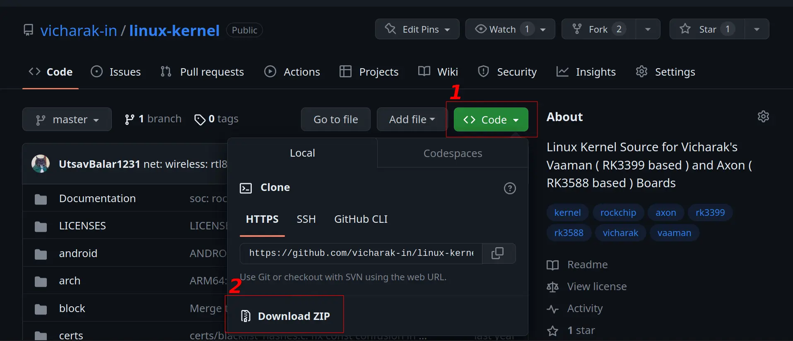

(build-axon-linux-kernel)=

# Build Vicharak Kernel from source

Vicharak provides multiple revisions of Linux kernels for the Axon board. These
revisions incorporate bug fixes, upstream improvements, and specific
optimizations for Axon (RK3588).

## Types of kernels available for Axon

Vicharak offers multiple versions of the Linux kernel for the Axon board,
with each version based on a higher iteration of the Linux kernel.

These kernel revisions are based on the sources of Rockchip RK3588 SoC with
necessary changes and optimizations for Axon. Take a look at the following
table for the available kernels.

```{list-table}
:header-rows: 1
:class: feature-table

* - Kernel version
  - Status
  - Git Link

* - Kernel 5.10
  - Stable
  - https://github.com/vicharak-in/rockchip-linux-kernel/tree/master

* - Kernel 6.1
  - Stable (Recommended)
  - https://github.com/vicharak-in/rockchip-linux-kernel/tree/6.1

* - Kernel 6.1 Xenomai
  - Experimental (Real-time)
  - https://github.com/vicharak-in/rockchip-linux-kernel/tree/6.1-xenomai
```

:::{tip}
For Xenomai real-time support on Axon, see the
[Xenomai Support](../../axon-other-system/xenomai.rst) guide.
:::

## Build Linux Kernel

### Installing the system dependencies

To build the Linux kernel successfully, your system needs certain dependencies.
These tools and libraries are essential for compiling, linking, and generating
the necessary files to create a functional kernel for your Axon board.

Ensure that your system has the following dependencies installed...

:::{warning}
It is recommended to use **Ubuntu 20.04** and Higher or **Debian 11**
and Higher environment for building.

You can build on the Axon device itself, so there is no need to transfer
files from your system to Axon via scp.
:::

```bash
sudo apt-get update

sudo apt-get install build-essential python3 python-is-python3 libssl-dev \
git-core gcc-arm-linux-gnueabihf u-boot-tools device-tree-compiler \
gcc-aarch64-linux-gnu mtools parted llvm clang pv bc bison flex gawk
```

### Getting the kernel source

You can obtain the kernel source either by cloning the repository using
Git, allowing easy updates, or by downloading it as an archive, providing a
snapshot of the source code at a specific point in time.

Download the kernel source from
[Vicharak's GitHub](https://github.com/vicharak-in/rockchip-linux-kernel)

::::{tab-set}

:::{tab-item} Using Git Clone

```bash
git clone https://github.com/vicharak-in/rockchip-linux-kernel -b 6.1 --recursive
```

:::

:::{tab-item} Using Web browser



**Follow the steps in above image.**

1. Open the [GitHub page](https://github.com/vicharak-in/rockchip-linux-kernel)
   and click on the `< > Code` button.

2. Select the "Download ZIP" option. Prefer the **6.1** branch for Axon.

3. After successful download, unpack the archive using any archiver tool
   (7zip, unzip, etc).

:::

:::{tab-item} Using Terminal

```bash
wget https://github.com/vicharak-in/rockchip-linux-kernel/archive/refs/heads/6.1.zip

unzip 6.1.zip
mv rockchip-linux-kernel-6.1 linux-kernel
```

:::
::::

### Compiling the Linux kernel

#### Enter the kernel directory

```bash
cd rockchip-linux-kernel
```

#### Compile Rockchip Linux config

Before compiling the Linux kernel, it's crucial to set up the Rockchip
Linux config. This configuration specifies the parameters required for the
Linux kernel to run on the Rockchip RK3588 SoC, ensuring compatibility with
your Axon board.

:::{tip}
Instead of configuring and building the kernel manually, use the
[Vicharak Kernel build script](#vicharaks-kernel-build-script). It picks the
Axon board profile and builds everything for you in just a few commands.
:::

```bash
export CROSS_COMPILE=aarch64-linux-gnu-

make O=out ARCH=arm64 rockchip_linux_defconfig
```

:::{note}
When building **natively on the Axon device**, you can skip setting
`CROSS_COMPILE`. A native build produces binaries for the board directly,
so you do not need to copy files over scp.
:::

:::{tip}

You can also use custom toolchain for compilation.

1. Clone your custom toolchain from the internet.

2. Export `LD_LIBRARY_PATH` and `PATH` variables

```bash
export LD_LIBRARY_PATH=<path-to-custom-toolchain>/lib:$LD_LIBRARY_PATH
export PATH=<path-to-custom-toolchain>/bin:$PATH
```

3. Build the kernel using the normal steps

:::

#### Copy Axon specific configs to .config

To customize the kernel for Axon, it's essential to merge Axon-specific
configurations into the existing `.config` file. This ensures that the kernel
is tailored to the hardware specifications of your Axon board.

```bash
./scripts/kconfig/merge_config.sh -m out/.config arch/arm64/configs/rk3588_axon.config
```

or

```bash
cat arch/arm64/configs/rk3588_axon.config >> out/.config
```

#### Finally compile the kernel

```bash
make O=out ARCH=arm64 CROSS_COMPILE=aarch64-linux-gnu- -j$(nproc --all)
```

**Upon successful compilation, confirm that you have following files.**

```bash
out/arch/arm64/boot/dts/rockchip/rk3588-axon-linux.dtb
out/arch/arm64/boot/Image
```

## Vicharak's Kernel build script

Vicharak's Kernel build script simplifies the compilation process and ensures
that your kernel is built with the correct configurations.

Enabling support for this script using the provided command allows for
effortless updates to the kernel source and smoother integration with
Vicharak's development environment.

```bash
git submodule update --init
```

Select the Axon device profile:

```bash
./vicharak/build.sh lunch
```

:::{card} Example output

```text
    Processing option: lunch
----------------------------------------------------------------
1) galactos_ubuntu.mk
2) rk3399_vaaman.mk
3) rk3588_axon.mk
4) rk3588_axon_mainline.mk
Select device: 3
----------------------------------------------------------------
```

When prompted, enter ``3`` to select ``rk3588_axon.mk``.
:::

Then build the kernel:

```bash
./vicharak/build.sh kernel
```

:::{card} Example output

```text
    Processing option: kernel
----------------------------------------------------------------
    Building with Clang
----------------------------------------------------------------
----------------------------------------------------------------
    Using standalone clang toolchain: 17
----------------------------------------------------------------
----------------------------------------------------------------
    Build successful!
----------------------------------------------------------------
```
:::

**Upon successful build, confirm the following output files.**

```text
out/arch/arm64/boot/Image
out/arch/arm64/boot/dts/rockchip/rk3588-axon-linux.dtb
out/modules_rk3588_axon/lib/modules/
```

:::{admonition} Reference
:class: tip

More information on
[Vicharak kernel building script](../../../vaaman/vaaman-linux/linux-usage-guide/vicharak-kernel-building-script.md).
:::

## Compiling Kernel Modules

In addition to compiling the Linux kernel, you can also build kernel modules.
These modules are pieces of code that can be loaded and unloaded into the
kernel as needed, allowing you to add or remove specific functionalities
without recompiling the entire kernel.

This section guides you through the process of compiling and installing
these modules for your Axon board.

```bash
make O=out ARCH=arm64 modules_install INSTALL_MOD_PATH=modules -j$(nproc --all)
```

**Confirm the modules files in `out/modules/lib` folder**

:::{tip}
Set the specific driver that you want to build as module to `CONFIG_<XXXX>=m` inside .config
:::

:::{warning}
If your kernel source has local changes (untagged / dirty working tree), the
build appends a ``+`` to the kernel release, for example ``6.1.75+`` instead
of ``6.1.75``.

In that case, always update **both** the kernel ``Image`` and the matching
**modules**. Installing only the Image (or only the modules) will leave the
running kernel and modules out of sync and can cause load failures or boot
issues.
:::

## How to flash compiled Linux Kernel

::::{tab-set}

:::{tab-item} Copy images to boot partition

### Back up the current kernel

First back up the kernel with a different name. Check which kernel you are
using by running the following command on the Axon board.

```bash
uname -r
```

Example output: `6.1.75-axon`

Then go to the device `/boot` partition and run:

```bash
sudo mv Image-6.1.75-axon bak-Image-6.1.75-axon
```

```{note}
Replace `6.1.75-axon` with the output of `uname -r` on your board.
```

### Copy the compiled kernel images to the device

<br/>

If you built the kernel on a host PC, copy the artifacts to Axon over SSH:

```bash
scp out/arch/arm64/boot/Image <user>@<device-ip>:~/
scp out/arch/arm64/boot/dts/rockchip/rk3588-axon-linux.dtb <user>@<device-ip>:~/
scp -r out/arch/arm64/boot/dts/rockchip/overlays <user>@<device-ip>:~/
scp out/modules_rk3588_axon.tar.gz <user>@<device-ip>:~/
```

```{tip}
Replace `user` with the appropriate username for Axon and
`device-ip` with the actual IP address of your board.

You can find your username using `whoami` command and, hostname using
`cat /etc/hostname`

If you built the kernel **on the Axon device itself**, skip the `scp`
steps and use the paths under `out/` directly when copying into `/boot`.
```

### Flash the kernel image

1. **ssh** login into the device or open the terminal on the device running linux
   system and run the following commands

```bash
sudo cp Image /boot/Image-6.1.75-axon
sudo cp rk3588-axon-linux.dtb /boot/rk3588-axon-linux-6.1.75-axon.dtb
sudo cp -r overlays /boot/overlays-$(uname -r)/
```

2. Copy modules to the device (if you packaged them)

```bash
sudo tar -xvf modules_rk3588_axon.tar.gz -C /
```

### Reboot the device

```bash
sudo reboot
```

:::

:::{tab-item} Installing as a debian package

```{note}
You can also install the linux kernel as a debian package
```

Vicharak has created a custom debian package configuration for building a fully
functional debian package for the linux kernel.

Assuming that you have compiled the kernel as a debian package, you can install
it using the following command.

```{seealso}
Refer to [How to build linux kernel debian package](#build-linux-kernel-debian-package)
```

```bash
sudo apt install ./linux-image-rk3588-axon-XXXXXX.deb
```

After successful installation you can safely reboot your board.

### Reboot the device

```bash
sudo reboot
```

:::

:::{tab-item} Flashing using **dd** tool

#### You can also flash the boot image using the following commands

Assuming that you have compiled the kernel using the
[Vicharak kernel building scripts](../../../vaaman/vaaman-linux/linux-usage-guide/vicharak-kernel-building-script.md)
as it will generate a boot image in the `out/` folder. You can install it using
the following command.

```{seealso}
Refer to [How to build linux kernel image](#build-linux-kernel-image)
```

```bash
sudo dd if=boot.img of=/dev/mmcblkXp4 status=progress; sync
```

```{note}
Here `mmcblkXp4` is the boot partition of the device. Replace `X` with the device number

0. SD-card
1. eMMC
```

:::
::::

:::{seealso}
For flashing images using Rockchip upgrade tool refer to
[Linux Upgrade Tool](../linux-usage-guide/linux-axon-upgrade-tool.md)
:::

:::{seealso}

[How to compile u-boot from source](#build-axon-u-boot)

[Updating U-Boot Version Using APT](u-boot/axon-u-boot.md)

:::
