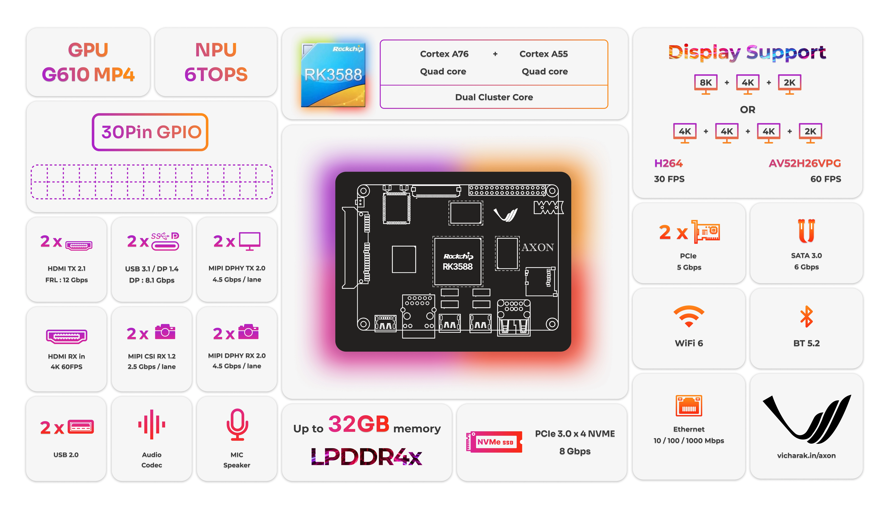
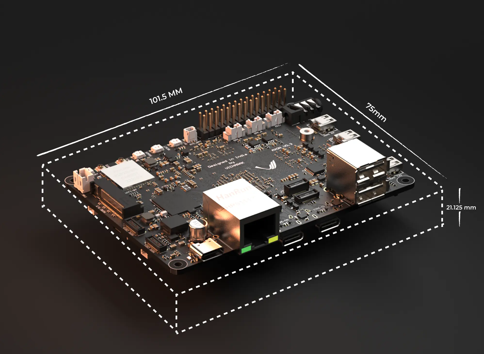

Overview
========

Axon is designed to cater to a diverse audience, including but not limited to:

**Software Developers:**
    - **Leverage**: Octa-core CPU ( 4x, Arm Cortex A76 ( 2.4 Ghz ) & 4x, Arm Cortex A55 ), multi-OS support
    - **Ideal For**: Application development, performance optimization, AI-driven software
    - **Cache**: 64KB L1 data & instruction cache ( seperate ), 512KB L2 Cache for Cortex A76 also 32KB L1 data & instruction cache ( seperate ) , 128KB L2 cache for A55

**Researchers:**
    - **Leverage**: RK3588 SoC, robust NPU, extensive connectivity
    - **Ideal For**: Custom algorithms, experiments, AI and machine learning prototyping

**Hardware Designers:**
    - **Leverage**: 30-pin GPIO header, multiple interfaces
    - **Ideal For**: Developing, testing, and rapid prototyping of hardware designs

**Hobbyist Users:**
    - **Leverage**: Versatile interfaces, compact design
    - **Ideal For**: Robotics, home automation, multimedia centers, DIY electronics

**AI and Machine Learning Enthusiasts:**
    - **Leverage**: 6 TOPS NPU, major deep learning frameworks support
    - **Ideal For**: Machine learning applications, computer vision tasks

**Multimedia Professionals:**
    - **Leverage**: High-definition video, dual HDMI, USB-C for 8K output
    - **Ideal For**: Video editing, streaming, digital signage

**Educators and Students:**
    - **Leverage**: Hands-on learning tool
    - **Ideal For**: Teaching computing technologies, programming, hardware-software integration

**IoT Implementers:**
    - **Leverage**: WiFi 6, Bluetooth 5.2, peripheral interfaces
    - **Ideal For**: IoT projects, sensor integration, smart home solutions

**Gaming and Entertainment:**
    - **Leverage**: ARM Mali-G610 MC4 GPU
    - **Ideal For**: Superior gaming experience, multimedia playback
    - **Drivers**: OpenGL ES 1.1, 2.0 and 3.2, OpenCL 2.2, Vulkan1.2 etc.

Block Diagram
-------------

Features
--------

The Axon Single Board Computer (SBC) offers a range of hardware features, including:

.. list-table::
   :widths: 10 50
   :header-rows: 1
   :class: feature-table

   * - **Type**
     - **Feature**
   * - Display
     - | 2 X HDMI2.1 (maximum support upto `8K@60fps`)
       | 2 X DP1.4a (maximum support upto `8K@30fps`) multiplexed over Type C Alt Mode DisplyPort
       | 2 X MIPI-DPHY TX (maximum support upto `4K@60fps`) 
       | 1 X HDMI-IN (maximum support upto `4K@60fps`), supports HDCP 2.3
   * - Audio
     - | 2 X Analog speaker output 
       | 1 X Headphone stereo output
       | 2 X HDMI audio output
       | 2 X DP audio output
       | 1 X Headphone input
       | 1 X Analog MIC input
   * - Wireless 
     - 6252B-SR Integrated RTL8852BS  WiFi6 2.4GHz/5GHz dual-band and Bluetooth 5.2
   * - Ethernet
     - 1 X RJ45, 10/100/1000Mbps(Realtek RTL8211F)
   * - Camera 
     - | 4 X MIPI CSI [2 lanes] / 2 X MIPI CSI [4 lanes]  (2.5 Gbps)
       | 2 X MIPI DPHY RX [4 lane] (4.5 Gbps)
   * - PCIE     
     - | 1 X PCIE Gen 3 [4 lane] with NVMe M.2 M-key (8Gbps)
       | 2 X PCIE Gen 2 [1 lane] with FPC (5Gbps)
   * - SATA
     - | 1 X SATA3.0 [1 lane] with 22 pin standard connector
       | 1 X SATA3.0 multiplexed with PCIe Gen2 FPC connector
   * - USB 
     - | 2 X USB2.0,
       | 2 X TYPE-C Alt DisplayPort   
   * - Real time clock 
     - RTC support via built-in battery interface

Physical Information
--------------------

.. list-table::
   :header-rows: 1

   * - **Property**
     - **Details**
   * - Weight
     - 69 g
   * - Length
     - 101.5 mm
   * - Width
     - 75 mm
   * - Height
     - 21.125 mm

.. tip::

    For more information on the Axon GPIOs, see :ref:`axon-gpio-description`

|

.. seealso::

    :ref:`Getting Started  with Vicharak Axon <axon-getting-started>`

    :ref:`Downloads section <axon-downloads>`

