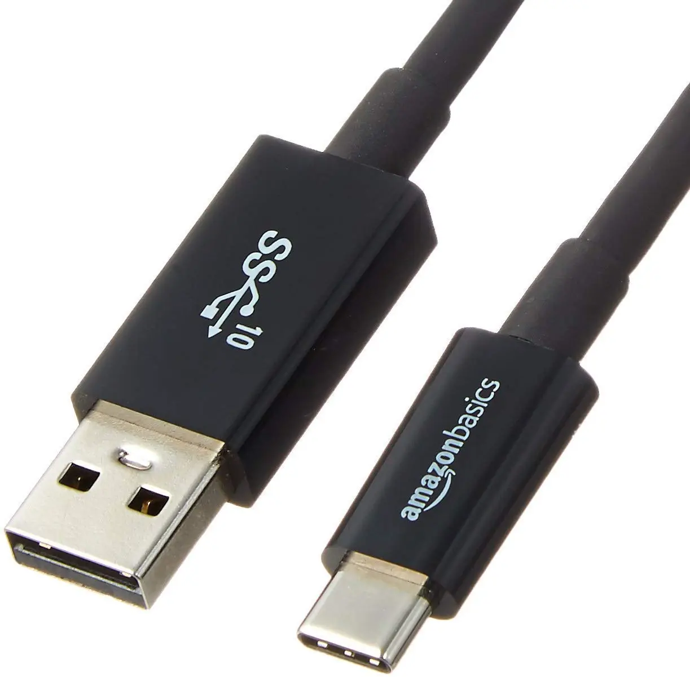

:orphan:

########################
 USB-C to USB-A Adapter
########################

A USB-C to USB-A adapter is required to connect the Vicharak Vaaman
board to the host computer. The adapter is not included in the Vicharak
Vaaman board kit. You can purchase any USB-C-to-USB-A adapter from
anywhere. We recommend the Amazon Basics USB-C to USB-A Male adapter.

You can purchase it from the `following link
<https://amzn.eu/d/gc6JpSL>`_.
