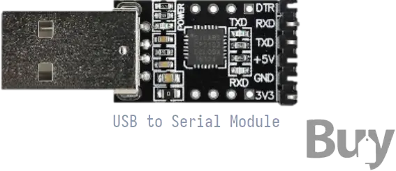

:orphan:

#############################
 USB to UART Serial Converter
#############################

The USB to UART Serial Converter is a module for converting USB interface
to serial interface. It is useful for debugging your Vaaman board.

You can purchase the USB to UART Serial Converter from `Vaaman Store`.
