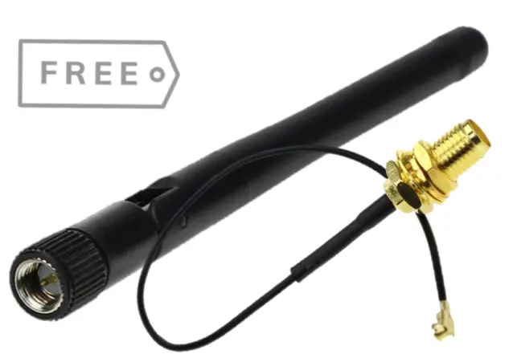

:orphan:

#############################
 Wi-Fi and Bluetooth Antenna
#############################

Vicharak Vaaman comes with a Wi-Fi and Bluetooth antenna. The antenna is
connected to the board via a U.FL connector. The antenna is a 2.4 GHz
antenna and is compatible with 802.11 b/g/n Wi-Fi and Bluetooth 4.
