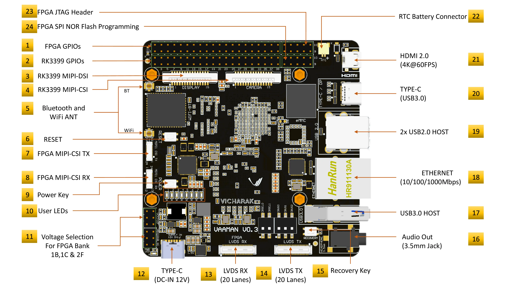
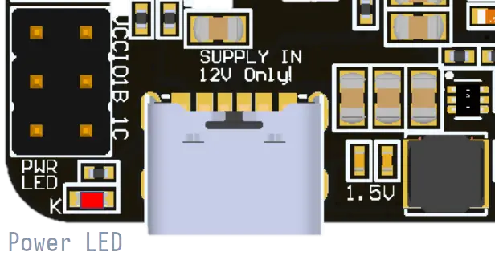
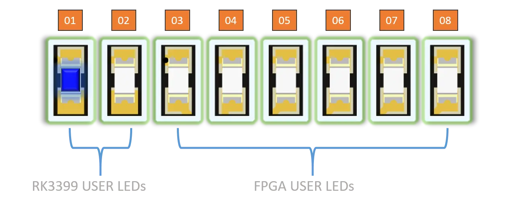
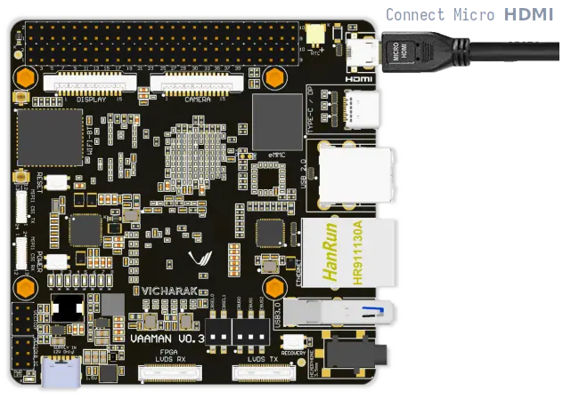
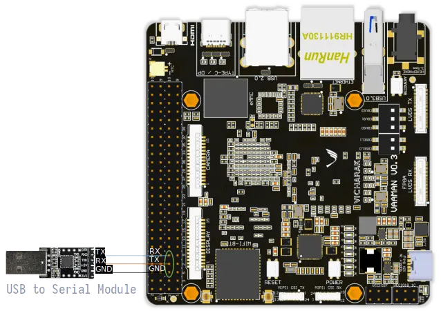

.. _getting-started:

Getting Started
###############

Vicharak provides all necessary accessories and information for setting up Vaaman. This section guides you through the initial setup.

What's in the box?
==================

1. **Vaaman**
    - Single-board computer with on-board FPGA support.
    - Powered by Rockchip RK3399 SoC (dual-core Cortex-A72 and quad-core Cortex-A53).
    - 4GB LPDDR4 RAM, 16GB eMMC storage, 40-pin GPIO header.
    - Pre-installed with Ubuntu 22 (``Jammy``).

2. **PD Cable**
    - Supplies power to Vaaman.
    - Ensures stable and efficient power delivery via USB-C with Power Delivery technology.

3. **Wi-Fi and Bluetooth Antennas**
    - Includes antennas for both Wi-Fi and Bluetooth connectivity.
    - These antennas ensure greater signal range and reliable connectivity for both Wi-Fi and Bluetooth devices.

What else do you need?
======================

- 12V/5A Power Adapter
- Micro HDMI to HDMI cable or adapter
- USB Keyboard and Mouse
- Monitor with HDMI input
- USB-C to USB-A Male cable (optional)
- SD-card (optional)
- Internet Connection (optional)
- USB to UART Serial Cable (optional)

.. note::
    | The items listed above are not included in the box.
    | You can purchase them from the :ref:`accessories` page.

.. warning:: 
    | **You must attach the Wi-Fi antenna for proper Wi-Fi functionality and the Bluetooth antenna for proper Bluetooth functionality on Vaaman.**
    | **Refer to the images given below for correct connector locations.**

    Connections:
        - **Wi-Fi Antenna:** Connect to Wi-Fi antenna connector on reset key side.
        - **Bluetooth Antenna:** Connect to BLE antenna connector on MIPI-DSI connector side.

.. _getting-started-emmc:

Getting Started with Vaaman
===========================



Turning the Board On
--------------------

1. **Connect Power:**
    - Connect the PD cable to the Vaaman board.
    - Plug the PD adapter into a power socket.

2. **Power Source:**
    - Ensure you use the provided 12V/5A Power Adapter with PD cable.
    - **Do not use a 5V power input.**

    .. danger::
        | **12V Power Input only! Do not use 5V power input.**
        | Using a 12V power input is crucial for the proper functioning of the Vaaman.
        | The board is designed to operate with a 12V power supply, and using a 5V power
        | input may lead to instability and potential damage.

3. **Automatic Power On:**
    - Once the power is connected, the board will automatically turn on.

4. **Boot Priority:**
    - **NVMe**: Highest precedence. If an NVMe drive is connected, the board boots from it.
    - **SD-card**: If no NVMe drive, the board attempts to boot from an SD-card.
    - **eMMC**: Default. If no NVMe drive or SD-card, the board boots from eMMC storage.

    .. warning::
       | **Remove SD-card if inserted**
       | This ensures the board boots from the eMMC storage.

.. image:: ../../_static/images/rk3399-vaaman/vaaman-power-details.webp
   :width: 60%
   :alt: Vaaman power connection

Vaaman is pre-installed with Ubuntu 22 (``Jammy``) on its eMMC storage, so it will boot from the eMMC storage by default.


Verify the Power LED
--------------------

- **Red LED**: Indicates that Vaaman is receiving power.
- Check the red LED for immediate visual confirmation of successful power connection.



Verify the Status LED
---------------------

- **Blue LED**: Blinks to indicate the completion of the booting process.
- Check the blue LED to ensure Vaaman has successfully booted and is ready for configuration.



.. warning::
   | Please ensure you wait for the system to complete its reboot.
   | The system requires configuration adjustments before you proceed to the next step.
   | Allowing the system to finish restarting ensures it is fully set up for subsequent tasks.

Available Boot Modes
====================

Booting from SD card
--------------------
To boot from SD card, please follow the below document.

    :doc:`vaaman-sdcard-boot`

Booting from NVMe drive
-----------------------
To boot from NVMe, please follow the below document.

     :doc:`vaaman-nvme-boot`

.. _getting-started-access:

How to Access Your Vaaman Board?
================================

There are multiple ways to access your Vaaman board:

- Connect to a monitor using the **micro HDMI port**.
- Connect headless to your computer using **SSH** or **serial console**.

For the initial setup process, we recommend connecting the Vaaman to a monitor using the **micro HDMI port**. Once the initial setup is complete, you can connect the Vaaman to your computer using the USB-C port.

.. note::
    If you want to access the **serial console**,
    Skip to the :ref:`Serial Console <serial-console>` section.

    If you want to access the **Vaaman using SSH**,
    Skip to the :ref:`SSH <ssh_login>` section.

1. Using Micro HDMI Port
------------------------

- **Micro HDMI Port:** Connect Vaaman to a monitor or TV using a micro HDMI to HDMI cable or adapter.
- **Benefits:** Provides direct visual access to the graphical user interface (GUI) or command-line interface (CLI).



.. caution::
   | Only a single video port is available on the Vaaman board.
   | You can use either HDMI, DisplayPort, or MIPI-DSI port at a time.

**Steps:**

1. Connect the micro HDMI to HDMI cable to the Vaaman and the monitor.

2. The Vaaman will automatically detect the monitor and display the output.

.. admonition:: Check out Linux Start Guide
   :class: tip

   Once the Vaaman is connected to the monitor, you can follow the
   :ref:`Linux Start Guide <linux-start-guide>` to complete the initial setup.

.. _serial-console:

2. Using Serial Console
------------------------

- **Serial Console:** Access the system's console or terminal interface via UART (Universal Asynchronous Receiver-Transmitter) pins.
- **Use Case:** Often used for debugging, troubleshooting, or accessing the system when other interfaces are not available.

**Steps:**

1. Connect to the serial pins using a serial cable or adapter.

2. Access the system's console through the connected serial interface.

.. _ssh_login:

Default Login Credentials
-------------------------

- Username: **vicharak**
- Password: **12345**

These credentials are used for initial login via any access method (HDMI, SSH, Serial Console).

3. Using SSH
------------

- **SSH Access:** Securely access Vaaman over a network.

**Steps:**

1. Ensure Vaaman is connected to the network.
2. Open a terminal on your computer.
3. Use the following command to connect: **ssh vicharak@<Vaaman_IP_address>**
4. Enter the default password **12345** when prompted.

Preparation
-----------

To access Vaaman through the serial interface, you will need:

1. A computer with a serial terminal application installed, such as PuTTY or minicom.
2. A USB to UART serial cable or adapter (e.g., FTDI or PL2303).
3. A Micro USB or USB-C cable.
4. A 4-pin jumper wire.

Hardware Setup
--------------

1. Connect the USB to UART serial cable or adapter to your computer.
2. Connect the serial cable or adapter to Vaaman using the following pin configurations:

.. list-table::
   :widths: 20 40 130
   :header-rows: 1
   :class: feature-table

   * - **Serial FTDI Pin**
     - **Header GPIO Pin**
     - **Schematic Name**
   * - GND
     - Pin 6
     - GND
   * - RX
     - Pin 8 (GPIO4_C4)
     - UART2DBG_TX
   * - TX
     - Pin 10 (GPIO4_C3)
     - UART2DBG_RX



Configuration
--------------

When accessing Vaaman through the serial interface, ensure the following serial parameters are set correctly for RK3399-based systems:

- Baud rate: 1500000
- Data bit: 8
- Stop bit: 1
- Parity check: none
- Flow control: none

.. warning::
   During the first boot, a warning may appear on your serial console. Allow the system to complete its reboot before proceeding. This ensures that the system is fully set up for subsequent tasks.

Running the Serial Console Program
``````````````````````````````````

.. tab-set::

    .. tab-item:: PuTTY (GUI)

        1. Download and install the `PuTTY <https://www.putty.org/>`_ program.

        2. Open the PuTTY program and configure the serial parameters as shown
		   in the image below.

        .. image:: ../../_static/images/Putty_step.webp
           :width: 50%

        3. Click on the **Open** button to open the serial console.

        4. You will now be able to access the serial console.

    .. tab-item:: TeraTerm (GUI)

        1. Download and install the
            `TeraTerm <https://osdn.net/projects/ttssh2/releases/>`_ program.

        2. Open the TeraTerm program and configure the serial parameters.

        - On the **Setup** menu, click on **Serial port**.
        - Select the serial port number and configure the serial parameters
          as shown in the image below.

        .. image:: ../../_static/images/teraterm-configuration.webp
           :width: 50%

        3. Click on the **OK** button to open the serial console.

        4. You will now be able to access the serial console.

    .. tab-item:: Linux GTK-Term (GUI)

        1. Install the GTK-Term program using the following command:

        .. code-block:: bash

            sudo apt-get install gtkterm

        2. Open the GTK-Term program and configure the serial parameters.

        - On the **File** menu, click on **Port**.
        - Select the serial port number and configure the serial parameters as
          shown in the image below.

        .. image:: ../../_static/images/gtkterm-configuration.webp
           :width: 50%

        3. Click on the **OK** button to open the serial console.

        4. You will now be able to access the serial console.

    .. tab-item:: Minicom (CLI)

        .. note::
            Read minicom configuration from
            :ref:`Linux Minicom guide <minicom-guide>`.

.. _ssh:

3. Using SSH
-------------

Vaaman supports **SSH (Secure Shell)**, enabling secure remote access to the system. By establishing an SSH connection, users can remotely connect to Vaaman from another device over a network, such as a computer or smartphone. This method provides a secure command-line interface to administer, configure, and execute commands on Vaaman.

Install OpenSSH server
======================

You can install both OpenSSH components on Windows devices using the **Windows Settings**.

To install the OpenSSH components, follow these steps:

1. Open the Settings menu and click on Apps, then select **Optional Features**.
2. Check if OpenSSH is already installed. If not, at the top of the page, click on **Add a feature**, then:

- Find OpenSSH Client and click on Install.
- Find OpenSSH Server and click on Install.

3. After installation, verify that OpenSSH is listed in **Apps and Optional Features**.
4. Open the Services desktop app (Start > type services.msc in the search box > click on the Service app or press ENTER).
5. In the details pane, double-click on **OpenSSH SSH Server**.
6. On the General tab, choose **Automatic** from the Startup type drop-down menu.
7. To start the service, click on **Start**.

Verify OpenSSH server
=====================

Once installed, you can connect to the OpenSSH Server from a Windows device with the OpenSSH client installed.

From a PowerShell prompt, run the following command:

.. code-block:: powershell

    ssh username@ip_address

Example:

.. code-block:: powershell

    ssh vicharak@192.168.29.69

.. tip::

    To find your IP address on Windows, use the following command: ``ipconfig``.
    For Linux users, use the following command: ``ip a``.

Accessing Vaaman through SSH
============================

To access Vaaman via SSH, you can use either of the following commands:

1. SSH using the IP address

- Replace **ip_address** with the actual IP address assigned to Vaaman on the network.

.. code-block:: bash

    ssh vicharak@ip_address


2. SSH using the PC name (hostname)

- Replace **"pc-name"** with the actual PC name assigned to Vaaman on the network.

.. code-block:: bash

    ssh vicharak@pc-name.local


.. tip::
    The default username is **"vicharak"** and the default password is **"12345"**.

4. Set up automatic Wi-Fi connection on boot
--------------------------------------------

1. Edit the ``/usr/lib/vicharak-config/conf.d/before.txt`` file.

   - Add the following line:
     ``
     connect_wi-fi <network name> <password>
     ``

     Example:
     ``
     connect_wi-fi vicharak_5g vcaa_g123
     ``

2. Reboot the system.

- **Vaaman Boot modes**


.. list-table::
   :widths: 20 40
   :header-rows: 1

   * - **Boot Mode**
     - **Description**
   * - Normal Mode
     - Normal boot mode is the default boot mode. In this mode, the board boots
       from the `eMMC` or `SD-card`. Each partition loads in order and enters
       the system normally.
   * - Loader Mode
     - Loader mode is used to upgrade the `bootloader`. In this mode, the
       bootloader will wait for the host command for `firmware upgrade`.
       On success, the board boots from the `eMMC` or `SD-card`,
       and the board enters the system normally.
   * - Maskrom Mode
     - | Maskrom mode is used to `repair` the board. In a situation where the
         bootloader is damaged, the board can enter the maskrom mode.
         In general, there is no need to enter `Maskrom` mode.
         In this mode, the bootrom code waits for the host to transmit the
         bootloader code through the USB-C port, load and run it.
       | :ref:`Learn more about maskrom mode <vaaman-maskrom-mode>`.
