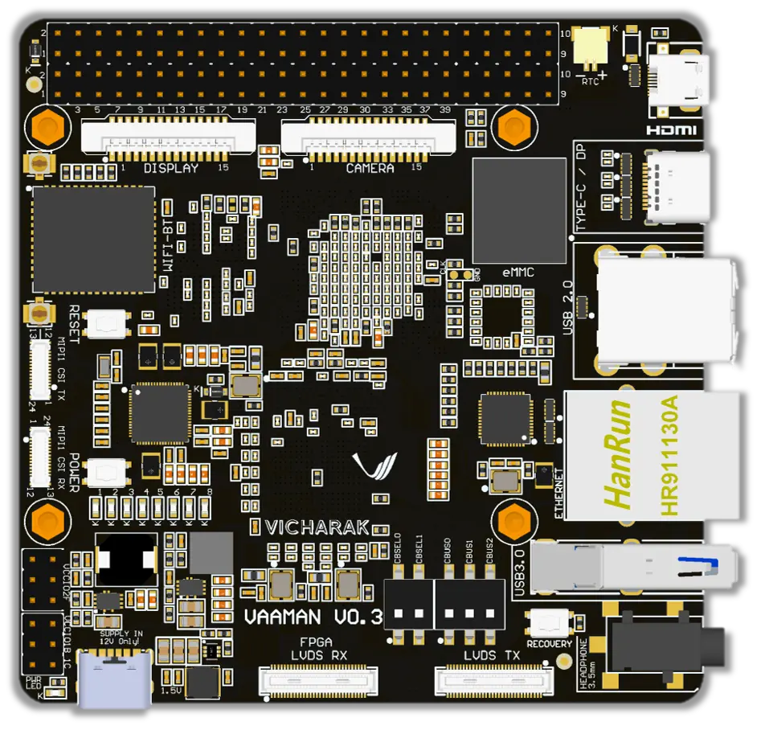

.. _vaaman-linux:

..
   Vicharak master file, created by
   sphinx-quickstart on Tue May  9 19:32:34 2023.
   You can adapt this file completely to your liking, but it should at least
   contain the root `toctree` directive.

.. rst-class:: lead

####################################
 Welcome to Vaaman's documentation!
####################################

The **Vaaman Single Board Computer** (SBC) combines the **RK3399**
processor and **Efinix Trion T120** FPGA. It offers a powerful yet
energy-efficient computing solution for various applications. The RK3399
processor provides high performance and low power consumption, while the
Trion T120 FPGA allows for customizable hardware acceleration.

With its compact size, the Vaaman SBC is suitable for
`space-constrained` environments and offers a range of `connectivity
options`. Overall, it empowers developers to create innovative solutions
that require both processing power and hardware customization.

.. toctree::
   :glob:
   :caption: Contents
   :titlesonly:

   Overview <vaaman-overview>
   Getting Started <vaaman-getting-started>
   Vaaman Linux Documentation <vaaman-linux/index>
   FPGA  <vaaman-fpga/index>
   Vaaman Remote Upload Documentation <vaaman-remote-upload>
   Periplex <vaaman-periplex/index>
   Frequently Asked Questions <vaaman-faq>

.. note::

   We welcome contributions and bug reports through our `GitHub
   repository <https://github.com/vicharak-in/>`_.

