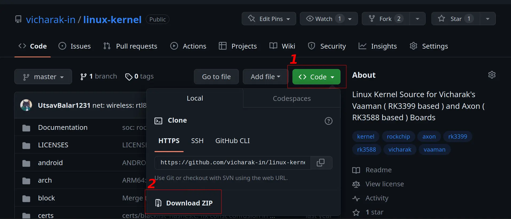

(build-linux-kernel)=

# Build Vicharak Kernel from source

Vicharak provides multiple revisions of Linux kernels for Vaaman board. These
revisions incorporate bug fixes, upstream improvements, and specific
optimizations for Vaaman.

## Types of kernels available for Vaaman

Vicharak offers four versions of the Linux kernel for the Vaaman board,
with each version based on a higher iteration of the Linux kernel.

These kernel revisions are based on the sources of Rockchip RK3399 SoC with
necessary changes and optimizations for Vaaman. Take a look at the following
table for the available kernels.

```{list-table}
:header-rows: 1
:class: feature-table

* - Kernel version
  - Status
  - Git Link

* - Kernel 4.4
  - Stable but deprecated
  - https://github.com/vicharak-in/rockchip-linux-kernel/tree/vaaman-4.4

* - Kernel 4.19
  - Stable but deprecated
  - https://github.com/vicharak-in/rockchip-linux-kernel/tree/vaaman-4.19

* - Kernel 5.10
  - Stable (Recommended)
  - https://github.com/vicharak-in/rockchip-linux-kernel/tree/master

* - Kernel Mainline
  - Experimental
  - https://github.com/vicharak-in/rockchip-linux-kernel/tree/vicharak-mainline
```

:::{warning}
Some of the kernel versions might not contain all the features supported or required by Vaaman.
Please take a look at the [Vaaman Kernel Status](vaaman-kernel-status) table
for the status of the different kernels available for Vaaman.
:::

## Build Linux Kernel

### Installing the system dependencies

To build the Linux kernel successfully, your system needs certain dependencies.
These tools and libraries are essential for compiling, linking, and generating
the necessary files to create a functional kernel for your Vaaman board.

Ensure that your system has the following dependencies installed...

:::{warning}
It is recommended to use **Ubuntu 20.04** and Higher or **Debian 11**
and Higher environment for building.
:::

```bash
sudo apt-get update

sudo apt-get install build-essential python3 python-is-python3 libssl-dev \
git-core gcc-arm-linux-gnueabihf u-boot-tools device-tree-compiler \
gcc-aarch64-linux-gnu mtools parted pv bc bison flex gawk
```

### Getting the kernel source

You can obtain the kernel source either by cloning the repository using
Git, allowing easy updates, or by downloading it as an archive, providing a
snapshot of the source code at a specific point in time.

Download the kernel source from
[Vicharak's GitHub](https://github.com/vicharak-in/rockchip-linux-kernel)

::::{tab-set}

:::{tab-item} Using Git Clone

```bash
git clone https://github.com/vicharak-in/rockchip-linux-kernel -b master
```

:::

:::{tab-item} Using Web browser



**Follow the steps in above image.**

1. Open the [GitHub page](https://github.com/vicharak-in/rockchip-linux-kernel)
   and click on the `< > Code` button.

2. Select the "Download ZIP" option.

3. After successful download, unpack the archive using any archiver tool
   (7zip, unzip, etc).

:::

:::{tab-item} Using Terminal

```bash
wget https://github.com/vicharak-in/linux-kernel/archive/refs/heads/master.zip

unzip master.zip
mv linux-kernel-master linux-kernel
```

:::
::::

### Compiling the Linux kernel

#### Enter the kernel directory

```bash
cd linux-kernel
```

#### Compile Rockchip Linux config

Before compiling the Linux kernel, it's crucial to set up the Rockchip
Linux config. This configuration specifies the parameters required for the
Linux kernel to run on the Rockchip RK3399 SoC, ensuring compatibility with
your Vaaman board.

```bash
export CROSS_COMPILE=aarch64-linux-gnu-

make O=out ARCH=arm64 rockchip_linux_defconfig
```

:::{tip}

You can also use custom toolchain for compilation.

1. Clone your custom toolchain from the internet.

2. Export `LD_LIBRARY_PATH` and `PATH` variables

```bash
export LD_LIBRARY_PATH=<path-to-custom-toolchain>/lib:$LD_LIBRARY_PATH
export PATH=<path-to-custom-toolchain>/bin:$PATH
```

3. Build the kernel using the normal steps

:::

#### Copy Vaaman specific configs to .config

To customize the kernel for Vaaman, it's essential to merge Vaaman-specific
configurations into the existing `.config` file. This ensures that the kernel
is tailored to the hardware specifications of your Vaaman board.

```bash
./scripts/kconfig/merge_config.sh -m out/.config arch/arm64/configs/rk3399_vaaman.config
```

or

```bash
cat arch/arm64/configs/rk3399_vaaman.config >> out/.config
```

:::{warning}

When using Vaaman kernel version **4.4**, please note that the file
`arch/arm64/configs/rk3399_vaaman.config` will not be available.

Consequently, you should refrain from using the provided commands to merge
Vaaman-specific configurations into the .config file.

:::

#### Finally compile the kernel

```bash
make O=out ARCH=arm64 CROSS_COMPILE=aarch64-linux-gnu- -j$(nproc --all)
```

**Upon successful compilation, confirm that you have following files.**

```bash
out/arch/arm64/boot/dts/rockchip/rk3399-vaaman-linux.dtb
out/arch/arm64/boot/Image
```

:::{warning}
On Vaaman kernel version 4.4 you will not have
`out/arch/arm64/boot/dts/rockchip/rk3399-vaaman-linux.dtb`.
Instead you might find `rk3399-vaaman.dtb` which is perfectly fine to use.
:::

## Vicharak's Kernel build script

Vicharak's Kernel build script simplifies the compilation process and ensures
that your kernel is built with the correct configurations.

Enabling support for this script using the provided command allows for
effortless updates to the kernel source and smoother integration with
Vicharak's development environment.

```bash
git submodule update --init
```

:::{admonition} Reference
:class: tip

More information on
[Vicharak kernel building script](../linux-usage-guide/vicharak-kernel-building-script.md).
:::

## Compiling Kernel Modules

In addition to compiling the Linux kernel, you can also build kernel modules.
These modules are pieces of code that can be loaded and unloaded into the
kernel as needed, allowing you to add or remove specific functionalities
without recompiling the entire kernel.

This section guides you through the process of compiling and installing
these modules for your Vaaman board.

```bash
make O=out ARCH=arm64 modules_install INSTALL_MOD_DIR=out/modules -j$(nproc --all)
```

**Confirm the modules files in `out/modules/lib` folder**

:::{tip}
Set the specific driver that you want to build as module to `CONFIG_<XXXX>=m` inside .config
:::

## How to flash compiled Linux Kernel

::::{tab-set}

:::{tab-item} Copy images to boot partition

### Copy the compiled kernel images to the device

<br/>

```bash

scp out/arch/arm64/boot/Image <user>@<device-ip>:~/
scp out/arch/arm64/boot/dts/rockchip/rk3399-vaaman-linux.dtb <user>@<device-ip>:~/
scp -vr out/arch/arm64/boot/dts/rockchip/overlays <user>@<device-ip>:~/
scp out/modules_rk3399_vaaman.tar.gz <user>@<device-ip>:~/

```

```{tip}
Replace `user` with the appropriate username for Vaaman and
`device-ip` with the actual IP address of your board.

You can find your username using `whoami` command and, hostname using
`cat /etc/hostname`
```

### Flash the kernel image

1. **ssh** login into the device or open the terminal on the device running linux
   system and run the following commands

```bash
sudo rm -rf /boot/Image
sudo rm -rf /boot/rk3399-vaaman-linux.dtb
sudo rm -rf /boot/overlays
sudo cp Image /boot/Image
sudo cp rk3399-vaaman-linux.dtb /boot/rk3399-vaaman-linux.dtb
sudo cp -r overlays /boot
```

2. Copy modules to the device

```bash
sudo tar -xvf modules_rk3399_vaaman.tar.gz -C /
```

### Reboot the device

```bash
sudo reboot
```

:::

:::{tab-item} Installing as a debian package

```{note}
You can also install the linux kernel as a debian package
```

Vicharak has created a custom debian package configuration for building a fully
functional debian package for the linux kernel.

Assuming that you have compiled the kernel as a debian package, you can install
it using the following command.

```{seealso}
Refer to [How to build linux kernel debian package](#build-linux-kernel-debian-package)
```

```bash
sudo apt install linux-image-rk3399-vaaman-XXXXXX.deb
```

After successful installation you can safely reboot your board.

### Reboot the device

```bash
sudo reboot
```

:::

:::{tab-item} Flashing using **dd** tool

#### You can also flash the boot image using the following commands

Assuming that you have compiled the kernel using the
[Vicharak kernel building scripts](../linux-usage-guide/vicharak-kernel-building-script.md)
as it will generate a boot image in the `out/` folder. You can install it using
the following command.

```{seealso}
Refer to [How to build linux kernel image](#build-linux-kernel-image)
```

```bash
sudo dd if=boot.img of=/dev/mmcblkXp4 status=progress; sync
```

```{note}
Here `mmcblkXp4` is the boot partition of the device. Replace `X` with the device number

0. SD-card
1. eMMC
```

:::
::::

:::{seealso}
For flashing the boot image using Rockchip upgrade tool refer to
[Rockchip Linux Upgrade Tool](./rockchip-upgrade-tool-misc.rst)
:::

:::{seealso}

[How to compile u-boot from source](#build-u-boot)

[How to flash u-boot](#flash-u-boot)

:::
