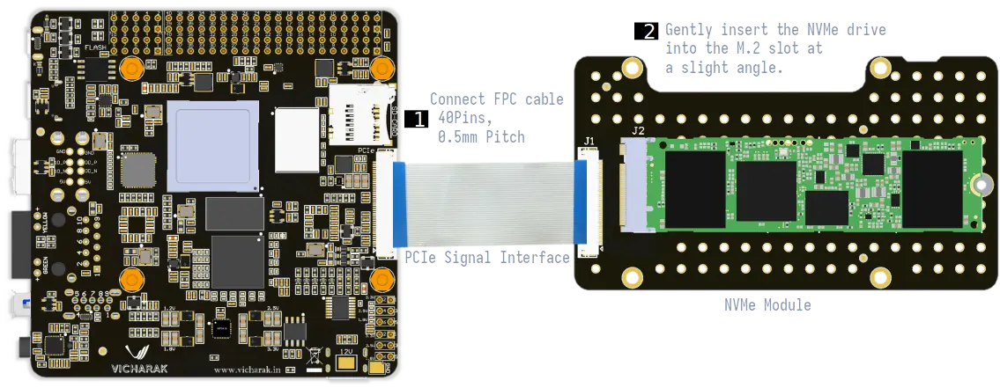
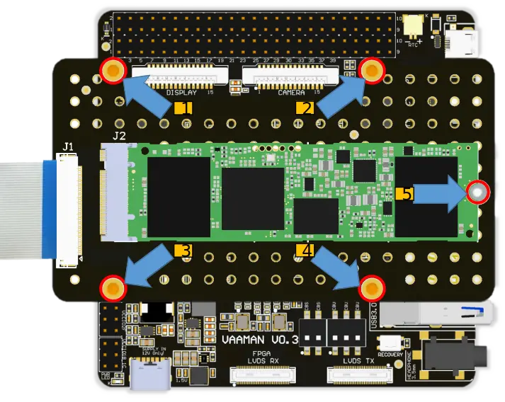
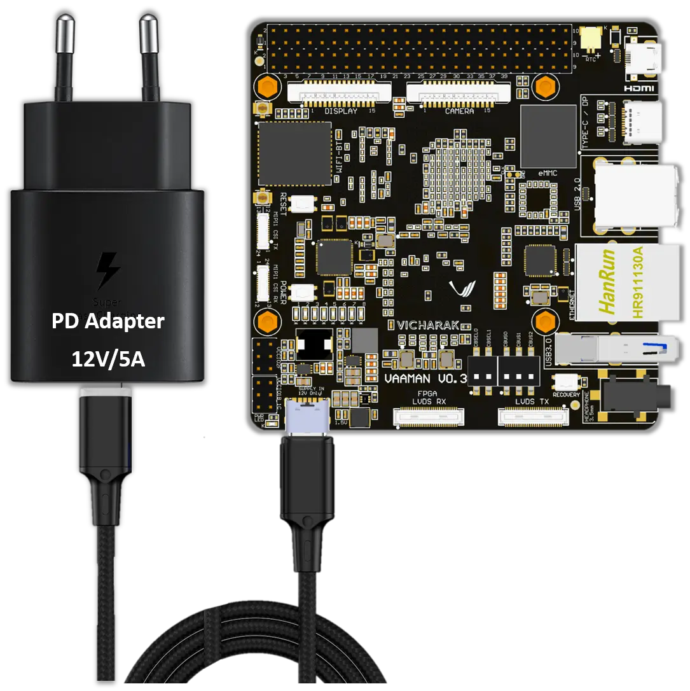

:orphan:

.. _booting-from-nvme:

#########################
 Booting from NVMe drive
#########################

**To make a NVMe bootable, follow these steps:**

***********************
 Format the NVMe drive
***********************

Using a suitable file system (such as FAT32 or EXT4) format the NVMe.

.. tab-set::

   .. tab-item:: Windows

       1. Insert the **NVMe** into your computer. You can use a USB-to-NVMe adapter if required.

       2. Open the **File Explorer** and right-click on the NVMe drive.

       3. Select **Format** from the drop-down menu.

       4. Select the desired file system (e.g., FAT32) and click **Start**.

       5. Click **OK** to confirm the formatting.

   .. tab-item:: Linux

       .. tab-set::

           .. tab-item:: Gnome Disks (GUI)

               1. Insert the **NVMe** into your computer. Use USB-to-NVMe adapter if required. You can use the **lsblk** command to list the available disks.

               2. Open the **Disks** application if you are using a GUI.

               3. Select the **NVMe** from the left panel.

               4. Click on the **Additional partition options** icon and select **Format Partition**.

               5. Select the desired file system (e.g., FAT32) and click **Next**.

               6. Click **Format** to confirm the formatting.

           .. tab-item:: GNU parted (CLI)

               1. Insert the **NVMe** into your computer.

               2. Open the **terminal** and run the following command to list the available disks:

               .. code-block:: console

                   sudo parted /dev/nvmeXn1

               .. note::
                   | You can use the **lsblk** command to list the available disks.
                   | In the above command, ``nvme``**X**``n1`` is the name of the NVMe drive.
                   | **`X`** is the number of the NVMe drive, it starts from 0.

               .. image:: ../../_static/images/parted-overview.webp
                  :width: 50%

               |

               3. the following command to **print** the partition table:

               .. code-block:: console

                   (parted) print

               |

               .. image:: ../../_static/images/parted-partitions-list.webp
                  :width: 50%

               4. **Delete** the existing partitions using the following command:

               .. code-block:: console

                   (parted) rm 1
                   (parted) rm 2
                   ...

               5. After deleting all the partitions, the partition table should look like this:

               .. image:: ../../_static/images/parted-deleted-partitions.webp
                  :width: 50%

               |

               6. Finally, **quit** the parted tool using the following command:

               .. code-block:: console

                   (parted) quit

           .. tab-item:: UNIX fdisk utility (CLI)

               1. Insert the **NVMe** into your computer.

               2. Open the **terminal** and run the following command to list the available disks:

               .. code-block:: console

                   sudo fdisk /dev/nvmeXn1

               .. note::
                   | You can use the **lsblk** command to list the available disks.
                   | In the above command, ``nvme``**X**``n1`` is the name of the NVMe drive.
                   | **`X`** is the number of the NVMe drive, it starts from 0.

               3. Press **d** to delete the existing partition. Do this for all the partitions.

               4. After deleting all the partitions, the partition table should be empty.

               5. Finally, press **w** to write the changes to the disk.

*****************************
 Download the bootable image
*****************************

Obtain the bootable image or operating system files for your desired
platform.

.. note::

   |  For Vaaman, you can download the bootable image from the
      :ref:`Downloads <downloads>` page.
   |  The bootable image is available in the `RAW images` section.

*****************************
 Write the image to the NVMe
*****************************

.. warning::

   |  Make sure you have selected the correct NVMe drive before writing
      the image.
   |  Writing the image to the wrong NVMe will erase all the data on the
      NVMe.

You can use any disk imaging tool such as **Etcher or Win32 Disk
Imager** to write the image to the NVMe.

For demonstration purposes, we will use the **Balena Etcher tool** to
write the image to the NVMe.

.. tab-set::

   .. tab-item:: Balena Etcher (GUI)

	   1. Open the **Balena Etcher** tool.

	   .. image:: ../../_static/images/balena-start.webp
		  :width: 50%

	   |

	   2. Click on **Select Image** and select the image file.

	   .. image:: ../../_static/images/balena-select-image.webp
		  :width: 50%

	   |

	   3. Click on **Select Target** and select the NVMe.

	   .. image:: ../../_static/images/balena-select-storage.webp
		  :width: 50%

	   |

	   4. Click on **Flash** to start writing the image to the NVMe.

	   .. image:: ../../_static/images/balena-start-flash.webp
		  :width: 50%

	   |

	   5. Once the writing process is complete, click on **Done**.

	   .. image:: ../../_static/images/balena-flash-complete.webp
		  :width: 50%

   .. tab-item:: UNIX **dd** command (CLI)

	   1. Open the **terminal** and run the following command to write the image to the NVMe:

	   .. code-block:: console

		   sudo dd if=/path/to/image of=/dev/nvmeX bs=4M status=progress; sync

	   .. note::
		   | Replace **/path/to/image** with the path to the image file.
		   | You can use the **lsblk** command to list the available disks.
		   | In the above command, ``nvme``**X**``n1`` is the name of the NVMe drive.
		   | **`X`** is the number of the NVMe drive, it starts from 0.

	   2. Wait for the writing process to complete.

	   3. Once the writing process is complete, Safely eject the **NVMe** from your computer.

********************
 Boot from the NVMe
********************

After writing the image to the **NVMe**, follow these steps to boot from the
NVMe:

#. Safely eject the **NVMe** from your computer.
#. Insert the **NVMe** into your Vaaman SBC.

**Place the NVMe board on top of Vaaman and secure it by tightening the
nuts.**

|

3. **Power-on** the device to initiate the boot process from the NVMe.

Connect the PD cable to the Vaaman SBC and the PD adapter to the power
socket. Once the power is connected, the board will automatically turn
on.

.. danger::

   12V Power Input only! Do not use 5V power input.

..
   FIXME
   | Add instructions for formatting the NVMe on Windows.
   | Add instructions for formatting the NVMe on Linux.
