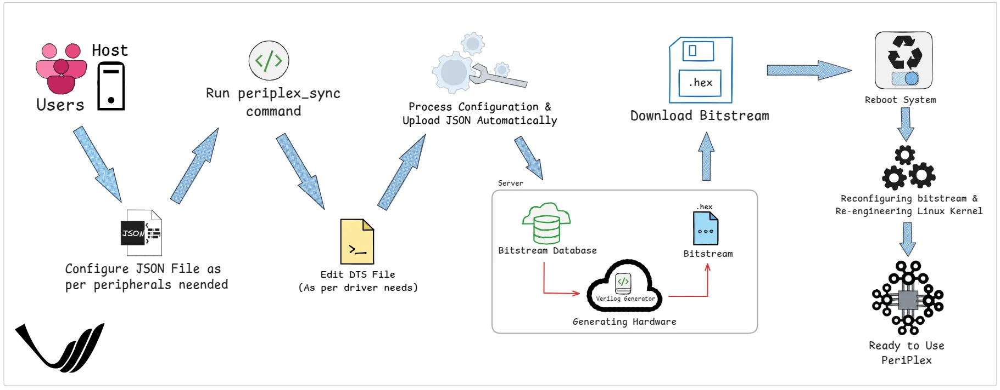

########
Periplex
########

This documentation provides detailed information about Periplex on the Vaaman board, including its installation and usage. Periplex enables quick generation of hardware peripherals and offers a simple API for use on Vaaman, a single-board computer with an onboard FPGA. It can link Linux device trees and drivers to the generated hardware, using custom or default DTSOs.Unlike off-the-shelf solutions, Periplex supports an unusually high number of peripherals, such as 26 UARTs, 10 I2Cs, and 12 PWMs, along with their drivers.

.. toctree::
   :glob:
   :caption: Contents
   :titlesonly:

   .. toctree::

      Installation <install>
      Usage <usage>
