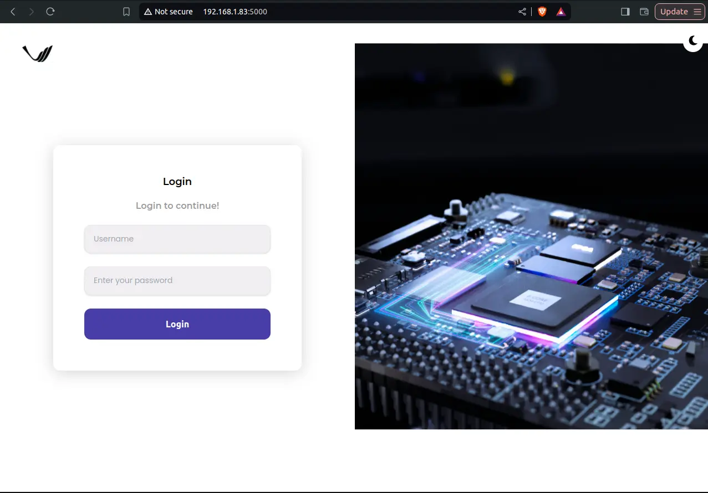
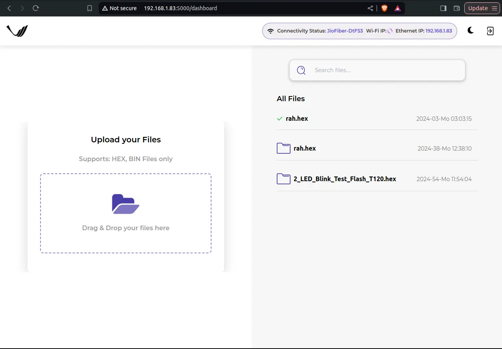
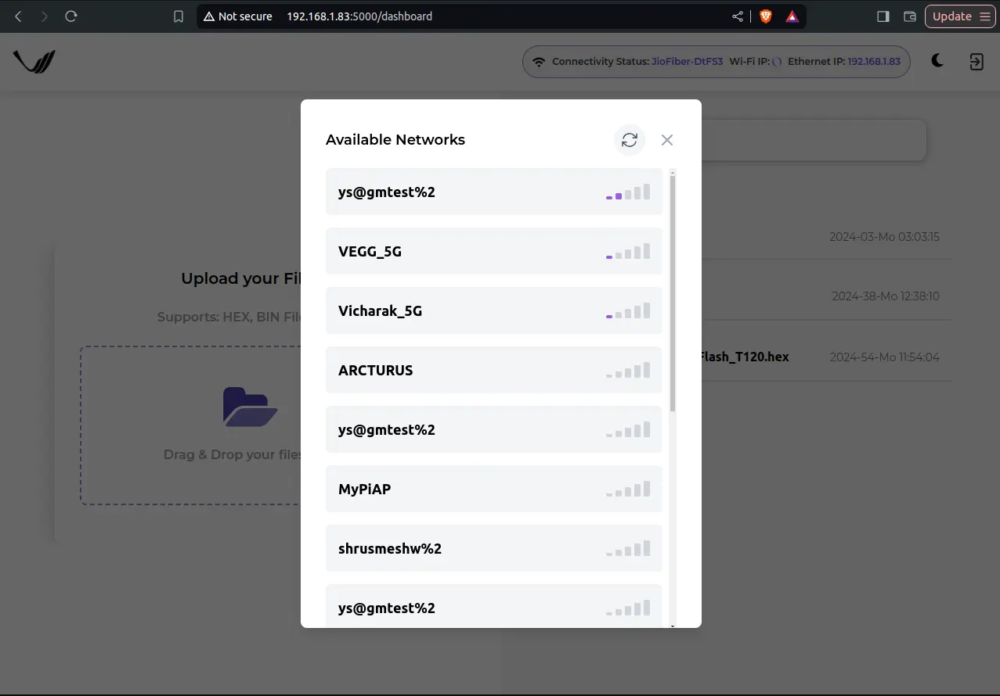
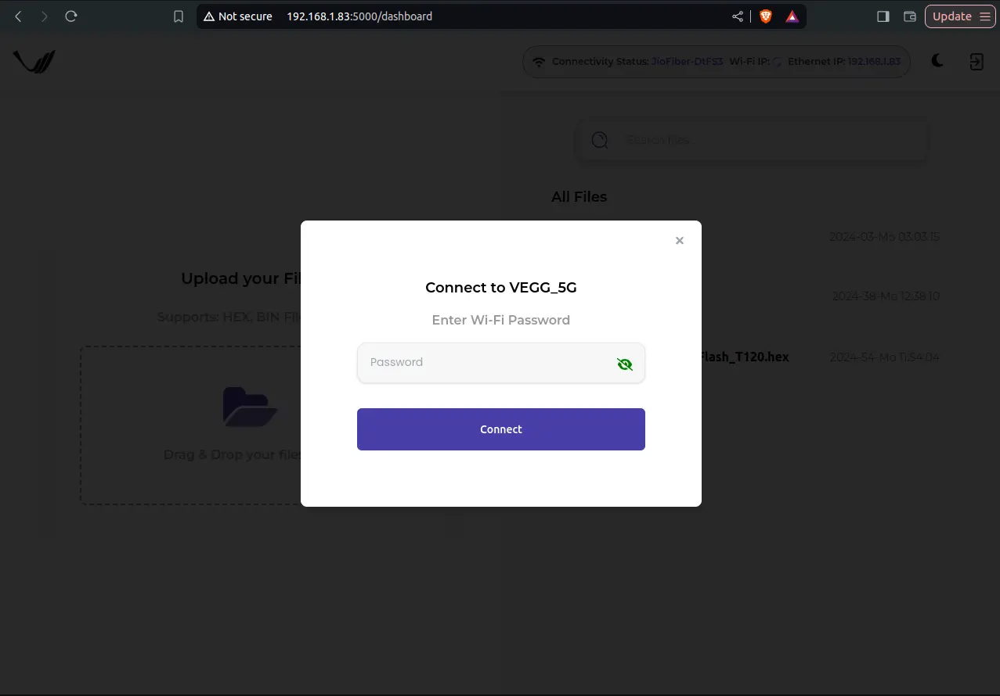

.. _vaaman-remote-upload:

##########################
Vaaman remote upload
##########################

==============
Introduction
==============

Vaaman Remote Upload is a file uploading server application that enables users to remotely upload files to a device. It offers a user-friendly interface accessible through a web browser. Users can upload HEX files from their personal computers to the target device using this application. The process involves obtaining the device's IP address, accessing the application's login page, and then uploading files.

Overall, Vaaman Remote Upload simplifies the process of transferring files to a device, making it a practical tool for remote file management and device programming.

=================
Getting Started:
=================

**Obtaining the IP Address for Vaaman Remote Upload:**

When Vaaman is connected to internet, you need to get ip address of the Vaaman for working with Vaaman-Remote-Upload. You can get IP address of the device with following command:

``$ ip a``

Running this command will provide you with the necessary IP address information to proceed with Vaaman Remote Upload.

The output will list all available network interfaces on your device and their corresponding IP addresses. Look for the interface that corresponds to your network connection (such as Ethernet or Wi-Fi) to find its IP address.

**Accessing Vaaman Remote Upload:**

Once you have obtained the IP address of your device, open your preferred web browser. In the browser's address bar, enter the device's IP address followed by the port number 5000. For example:

``http://<IP>:5000``

After entering the URL, press Enter. You will be directed to the login page of the Vaaman Remote Upload application. If you are using the board for the first time, please note that the default login credentials are username and password of the board:

.. Tip::

   **Username**: ``vicharak``

   **Password**: ``12345``

Enter the provided credentials (username and password) into the respective fields on the login page.Click the login button to access the application. You should now be logged in and able to use the Vaaman Remote Upload application.

**Using Vaaman Remote Upload:**

After successfully logging in, you will be directed to the home page of Vaaman Remote Upload. If this is your first time using the application, you will not see any files listed in the "Recent Uploads" field.

.. note::

   Ensure that you have turned on the FPGA communication overlay from the "Vicharak-Config".

To upload a HEX file from your computer, click on the "Folder-icon(File Upload Area)".Once you've selected the file for upload, the uploading process will begin. You can monitor the progress of the file upload as it takes place.

To connect to a Wi-Fi network, follow these steps:

1. Click on the **“Connectivity”** option in the application.
2. A small popup will appear displaying a list of available Wi-Fi networks.
3. Select the **SSID** of the network you want to connect to.

4. A new popup window will open where you’ll need to enter the network’s password.
5. After entering the password, proceed to connect to the network.

.. _vaaman-remote-upload-mobile:

===========================================
Accessing Vaaman Remote Upload (Mobile)
===========================================

Once you are connect to VaamanHost, open your smartphone's web browser and enter the IP address followed by the port number 5000. For example:

``http://10.9.8.7:5000``

.. list-table::
   :widths: 50 50
   :align: center

   * - .. image:: ../../_static/images/vaaman_remote_home_mob.webp
        :width: 100%
        :height: 700px
        :alt: Screenshot 1
     - .. image:: ../../_static/images/vaaman_remote_home_mob_dark.webp
        :width: 100%
        :height: 700px
        :alt: Screenshot 2

After entering the URL, press Enter, and you'll be taken to the login page. For first-time users, the default credentials are:

.. tip::

   **Username**: ``vicharak``

   **Password**: ``12345``

Enter the credentials in the login fields and tap the "Login" button. You should now be logged into the Vaaman Remote Upload application.

**Using Vaaman Remote Upload (Mobile):**

After logging in, you'll see the home screen of Vaaman Remote Upload. If this is your first time using the application, the "Recent Uploads" section will be empty.

.. note::

   Ensure that you have turned on the FPGA communication overlay from the "Vicharak-Config".

**Uploading Files:**

1. Tap the ``Folder-icon (File Upload Area)``.
2. Select the HEX file you want to upload from your phone’s storage.
3. The upload process will start, and you can monitor its progress on the screen.

.. list-table::
    :widths: 50 50
    :align: center
 
    * - .. image:: ../../_static/images/vaaman_remote_upload_file.webp
         :width: 100%
         :height: 700px
         :alt: Screenshot 1
      - .. image:: ../../_static/images/vaaman_remote_upload_file_upload.webp
         :width: 100%
         :height: 700px
         :alt: Screenshot 2
 

