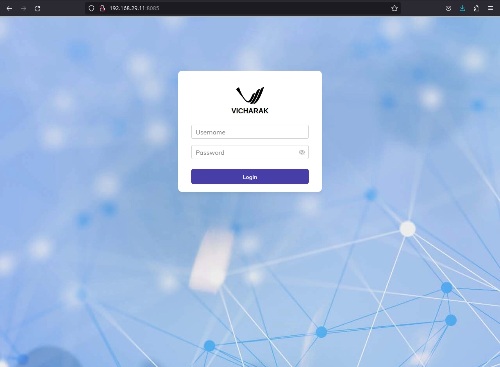
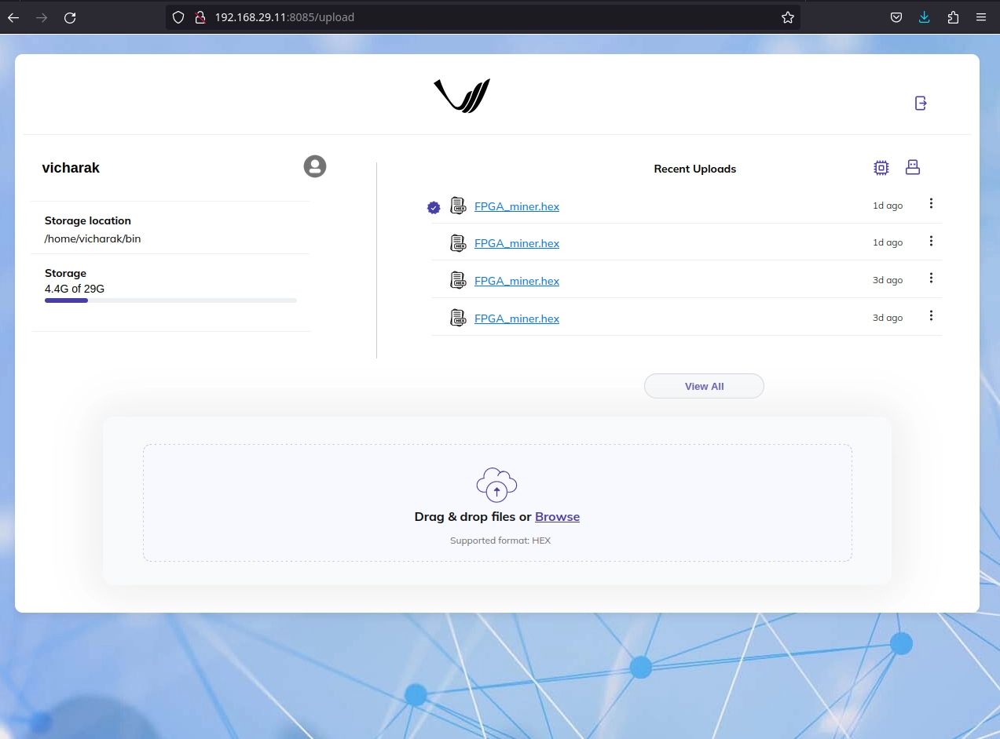
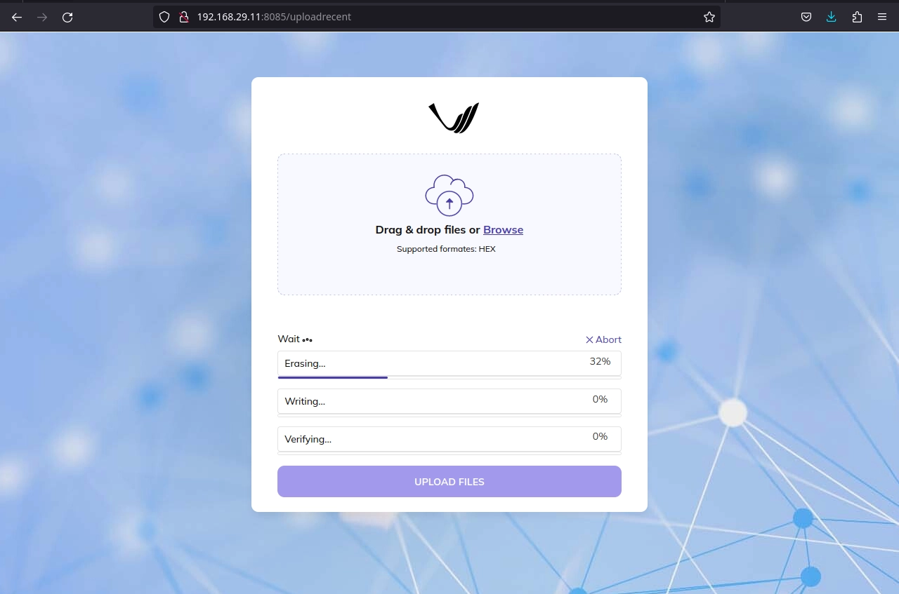
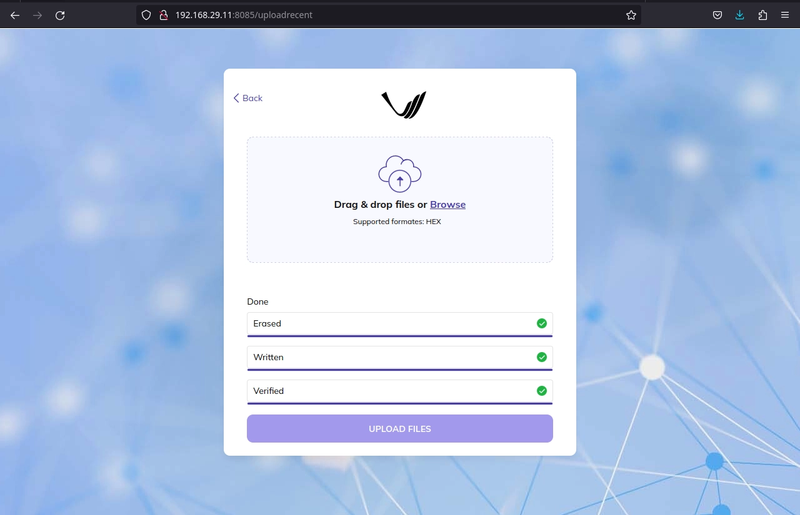

.. _vaaman-remote-upload:

##########################
Vaaman remote upload guide
##########################

==============
Introduction
==============

Vaaman Remote Upload is a file uploading server application that enables users to remotely upload files to a device. It offers a user-friendly interface accessible through a web browser. Users can upload HEX files from their personal computers to the target device using this application. The process involves obtaining the device's IP address, accessing the application's login page, and then uploading files.

Additionally, Vaaman Remote Upload provides options for reading HEX files, including reading from the device's flash memory and reading from an external cable. Users can conveniently switch between these reading modes based on their specific requirements.

Overall, Vaaman Remote Upload simplifies the process of transferring files to a device, making it a practical tool for remote file management and device programming.

=================
Getting Started:
=================

**Obtaining the IP Address for Vaaman Remote Upload:**

To start with vaaman remote upload first you need to get ip address of the device. You can get IP address of the device with following command: 

``$ ip addr``

Running this command will provide you with the necessary IP address information to proceed with Vaaman Remote Upload.

The output will list all available network interfaces on your device and their corresponding IP addresses. Look for the interface that corresponds to your network connection (such as Ethernet or Wi-Fi) to find its IP address.

**Accessing Vaaman Remote Upload:**

Once you have obtained the IP address of your device, open your preferred web browser. In the browser's address bar, enter the device's IP address followed by the port number 5000. For example:

``http://192.168.29.11:5000``

After entering the URL, press Enter. You will be directed to the login page of the Vaaman Remote Upload application. If you are using the board for the first time, please note that the default username is ``vicharak``, and the default password is ``12345``.

Enter the provided credentials (username and password) into the respective fields on the login page.Click the login button to access the application.You should now be logged in and able to use the Vaaman Remote Upload application.

**Using Vaaman Remote Upload:**

After successfully logging in, you will be directed to the home page of Vaaman Remote Upload. If this is your first time using the application, you will not see any files listed in the "Recent Uploads" field.

Ensure that you have turned on the FPGA communication overlay from the "Vicharak Config".

To upload a HEX file from your computer, click on the "Browse" button.Once you've selected the file for upload, the uploading process will begin. You can monitor the progress of the file upload as it takes place.

**Reading HEX Files:**
 
To read a HEX file, you have two options: "Read from Flash" and "Read from External Cable." These options can be found on the top right side of the home page. By default, the "Read from Flash" option is set. If you prefer to read the HEX file from an external cable, click on the cable icon to switch to this mode accordingly.
 
This feature allows you to choose the source from which you want to read HEX files, either from the device's flash memory or an external cable. You can easily toggle between these options as needed.
